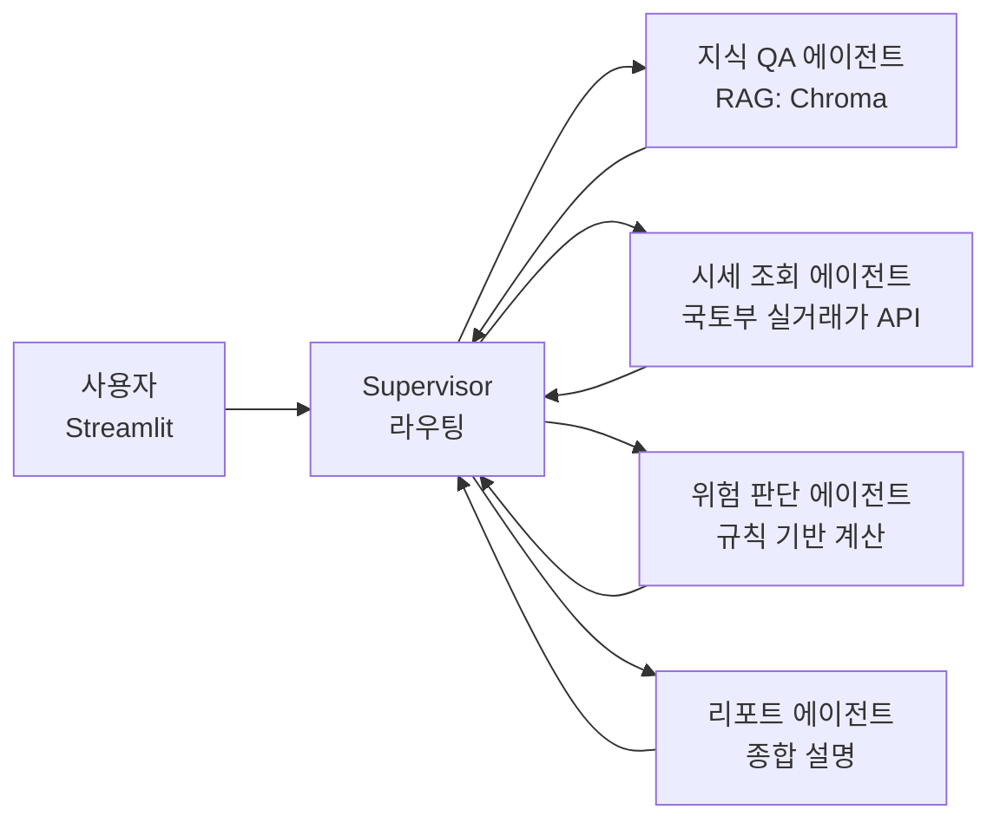

# rent-agent

사회초년생·무주택자를 위한 **전세 리스크 판단 멀티에이전트**.
부동산 법령/제도/전세사기 예방 지식을 RAG로 답하고, 전세 매물 정보를 입력하면 위험도를 근거와 함께 판정합니다.

## 아키텍처



- **Supervisor 패턴** (LangGraph `create_supervisor`): 요청 유형에 따라 전문 에이전트에 위임.
- **위험 판단은 LLM이 아닌 순수 Python 규칙**으로 계산 → 재현 가능, 유닛 테스트 100%. LLM은 설명만 담당.
- **RAG 소스**: 주택임대차보호법, 소액임차인 최우선변제 기준, HUG 전세보증, 청년 전세대출, 전세사기 예방 체크리스트.
- 모든 설계 결정의 근거는 [`docs/adr/`](docs/adr/)에 기록.

## 실행

```bash
uv sync
cp .env.example .env   # 키 입력
uv run python scripts/ingest.py          # 지식 베이스 적재
uv run streamlit run src/rent_agent/app/streamlit_app.py
```

## 테스트 / 평가

```bash
uv run pytest                 # 유닛 테스트 (외부 API 불필요)
uv run pytest -m integration  # 실제 LLM 호출 통합 테스트
uv run python scripts/eval_rag.py   # RAGAS 평가 → eval/results/
```
