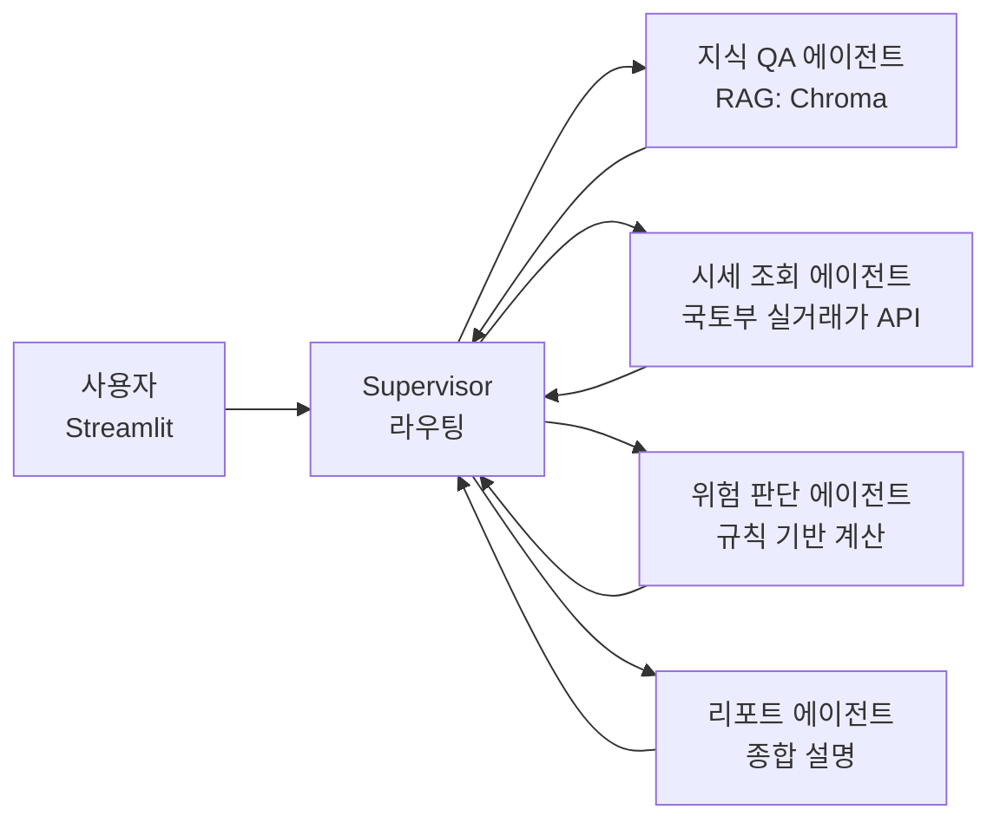

# rent-agent

[](https://github.com/waffle-sh/rent-agent/actions/workflows/ci.yml)

사회초년생·무주택자를 위한 **전세 리스크 판단 멀티에이전트**. 부동산 법령·제도·전세사기 예방 지식을 RAG로 답하고(지식 QA), 보증금·매매시세·선순위 근저당·자기자금을 입력하면 전세가율·총 부담률·경매 회수액을 계산해 위험도를 근거와 함께 판정한다(전세 진단). LangGraph Supervisor 패턴으로 4개 전문 에이전트를 라우팅하고, **위험 판정은 LLM이 아닌 순수 Python 규칙 함수**가 계산해 같은 입력이 항상 같은 답을 내도록 만들었다. 모든 설계 결정의 근거는 [`docs/adr/`](docs/adr/)에 남아 있다.

## 아키텍처



컴파일된 supervisor 팀은 다시 외부 `StateGraph`의 서브그래프 노드로 감싸여 있고, 그 뒤에 두 개의 **결정적 후처리 노드**가 붙는다 ([`agents/supervisor.py`](src/rent_agent/agents/supervisor.py)).

```
START → team ─┬─(위험 도구는 돌았는데 리포트가 없다)→ report ─┐
              └─(그 외)───────────────────────────────────────┴→ preserve_worker_answer → END
```

- **Supervisor 패턴** (`langgraph-supervisor`의 `create_supervisor`, `output_mode="full_history"`): 리포트 에이전트가 앞선 에이전트의 도구 결과(수치)를 직접 봐야 하고, UI에서 호출 흐름을 그대로 보여 주기 위함.
- **위험 판단은 LLM이 아닌 순수 Python 규칙**([`domain/risk.py`](src/rent_agent/domain/risk.py)) → 재현 가능·유닛 테스트 가능. LLM은 계산된 수치를 설명만 한다.
- **RAG 소스**: 주택임대차보호법 핵심 조문, 소액임차인 최우선변제 기준표, 전세사기 예방 체크리스트, HUG 전세보증금반환보증, 주택도시기금 전세자금대출 — 5개 문서 53청크, `k=6` 유사도 검색.

### 그래프가 보장하는 것

프롬프트 지시는 확률적이다. 실제로 통합 테스트에서 supervisor가 지시를 어기는 것을 관측했고, 결과의 완결성·충실성은 LLM 판단에 맡기지 않고 그래프가 보장하도록 바꿨다 ([ADR-0003](docs/adr/0003-multi-agent-supervisor.md)).

| 후처리 노드 | 관측된 문제 | 관측 빈도 (2026-09-02 통합 테스트) | 보장 |
|---|---|---|---|
| `ensure_report` (`needs_report` → `report`) | supervisor가 risk_agent 결과를 받은 뒤 report_agent를 건너뛰고 직접 답함 | 2회 중 1회 | 이번 턴에 `assess_jeonse_risk`가 **유효한** 결과를 냈는데 report_agent 답이 없으면 그래프가 report_agent를 직접 실행 |
| `preserve_worker_answer` | supervisor가 report/knowledge 에이전트의 답을 재작성해 "## 종합 판정" 헤더·면책 문구를 유실함 (`forward_message` 도구도 호출하지 않음) | 3회 중 1회 | 마지막 사용자 턴 이후 워커의 최종 답이 있으면 supervisor의 마지막 메시지를 원문으로 교체 |

## 실행 방법

```bash
uv sync                                        # Python 3.12 + 의존성 (uv.lock 고정)
cp .env.example .env                           # 키 입력
uv run python scripts/ingest.py                # data/raw → Chroma 적재 (data/chroma/)
uv run streamlit run src/rent_agent/app/streamlit_app.py
```

`.env`에 필요한 값은 [`.env.example`](.env.example) 참고 — `OPENAI_API_KEY`, 공공데이터포털 `APARTMENT_OPENAPI_KEY`(Encoding 키 그대로; 키 하나로 아파트·연립다세대·오피스텔 3개 API 호출), LangSmith 트레이싱(`LANGSMITH_TRACING`, `LANGSMITH_API_KEY`, `LANGSMITH_PROJECT`). 실거래가 키 없이 개발하려면 `MOLIT_USE_MOCK=true`(픽스처 XML 사용).

## 테스트 / 평가

```bash
uv run pytest                        # 유닛 117개 — 외부 API·키 불필요 (integration은 기본 제외)
uv run pytest -m integration         # 통합 52개 — 실제 LLM·실거래가 API 호출
uv run ruff check . && uv run ruff format --check .
uv run python scripts/eval_rag.py    # RAGAS 평가 → eval/results/
```

CI([`.github/workflows/ci.yml`](.github/workflows/ci.yml))는 `ruff check` + `ruff format --check` + 유닛 테스트를 돌린다. 통합 테스트는 마커로 제외되고, 유닛 테스트는 더미 키로 동작하므로 CI에 실제 시크릿이 필요하지 않다.

## RAG 평가 결과

RAGAS 0.4.3, gpt-4.1-mini 판정, `k=6`, `n=10` ([전문](eval/results/2026-09-03.md)).

| 지표 | 평균 |
|---|---|
| faithfulness | **0.961** |
| answer_relevancy | 0.425 |
| context_precision | 0.851 |

1→6차 변화([`eval/results/history.md`](eval/results/history.md)): 헤더 우선 분할·`chunk_size` 1000·`k` 4→6·faithfulness 컨텍스트를 에이전트의 실제 `ToolMessage`로 교체하며 F 0.881 → 0.961로 올랐다(P는 k 변경 전후를 비교하지 않는다).

**평가 한계**: n=10, 문서 작성자가 만든 질문(독립 평가셋 아님); 단일 실행, 판정 변동 ≈ ±0.05; 판정 모델 = 에이전트 모델(자기 선호 위험); P는 k·청크 크기 변경 전후 비교 불가; answer_relevancy는 한국어+small 임베딩에서 절대값 의미 약함; 질문 2건이 코퍼스 어휘 보강(사실 불변)을, 1건이 reference 수정을 유발함(테스트셋 튜닝 공개).

## 에이전트 동작 예시

아래는 실제 실행 출력이다(2026-09-03, `tests/agents/test_graph_integration.py::test_jeonse_diagnosis_calls_risk_and_report`와 같은 질문).

> 서울 강남구 까치마을 39.6㎡ 전세를 보려고 합니다. 보증금 4억 5천, 매매 시세 6억, 근저당 채권최고액 1억 2천, 자기자금 2억, 연소득 4천만원입니다. 괜찮은 계약인가요?

실행 흐름 (Streamlit "에이전트 실행 흐름" expander와 같은 형식):

```
🧭 supervisor → transfer_to_risk_agent
🧭 risk_agent → assess_jeonse_risk
🔧 assess_jeonse_risk 결과 수신
🧭 risk_agent → transfer_back_to_supervisor
🧭 supervisor → transfer_to_knowledge_agent
🧭 knowledge_agent → search_real_estate_knowledge
🧭 knowledge_agent → search_real_estate_knowledge
🧭 knowledge_agent → search_real_estate_knowledge
🧭 knowledge_agent → search_real_estate_knowledge
🧭 knowledge_agent → search_real_estate_knowledge
🔧 search_real_estate_knowledge 결과 수신
🔧 search_real_estate_knowledge 결과 수신
🔧 search_real_estate_knowledge 결과 수신
🔧 search_real_estate_knowledge 결과 수신
🔧 search_real_estate_knowledge 결과 수신
🧭 knowledge_agent → transfer_back_to_supervisor
🧭 supervisor → transfer_to_report_agent
🧭 report_agent → transfer_back_to_supervisor
📝 최종 답변 작성: supervisor
📎 report_agent 원문 그대로 전달 (supervisor 재작성 대체)
```

knowledge_agent가 `search_real_estate_knowledge`를 5회 병렬 호출한 것(등기부 확인·HUG 보증·소액임차인 등 서로 다른 질의)까지 그대로다. 마지막 줄이 `preserve_worker_answer`가 실제로 동작한 흔적이다 — supervisor가 리포트를 재작성했지만 그래프가 원문으로 되돌렸다.

최종 답변 (앞 두 절):

```markdown
## 종합 판정: 위험
전세가율과 총 부담률이 높고, 경매 시 보증금 회수에 부족액이 발생할 가능성이 있어 위험한 계약입니다.

## 핵심 수치
- 전세가율: 75.0% (안전 기준은 70% 이하, HUG 보증 한도는 90%)
- 총 부담률(선순위 근저당 포함): 95.0%
- 경매 시 회수 가능액(낙찰가율 80% 가정): 3억 6천만 원, 부족액 9천만 원
- 소액임차인 해당 여부: 해당 안 됨 (서울 기준 보증금 1억 6,500만 원 이하가 기준)
- 필요 대출금: 2억 5천만 원
- 예상 월 이자(금리 3.5% 기준): 약 72.9만 원 (연소득 대비 약 21.9%)
- HUG 전세보증금반환보증 가입 제한 가능성 있음 (선순위 채권과 보증금 규모 영향)
- 시세 비교: 시장가 대비 전세가율 75.0%로 주의 구간에 해당함
```

이어지는 절은 `## 이렇게 판단한 이유`, `## 계약 전 꼭 할 것`, `## 참고한 제도/문서`, 그리고 면책 문구다.

## 프로젝트 구조

```
├── src/rent_agent/
│   ├── config.py                  # Settings (pydantic-settings)
│   ├── domain/                    # 외부 의존 없음 (LLM·HTTP 금지)
│   │   ├── models.py              # JeonseInput, RiskAssessment, RiskLevel, Region, HousingType
│   │   └── risk.py                # 순수 함수: 전세가율·부담률·경매 회수액·소액임차인·판정
│   ├── tools/                     # I/O 경계
│   │   ├── lawd_code.py           # 시군구 법정동코드(5자리)
│   │   ├── molit_rent.py          # 국토부 실거래가 API + XML 파서 + Mock
│   │   └── market_stats.py        # 동일 단지·면적 전세 시세 통계
│   ├── rag/                       # loader / ingest(청킹·Chroma 적재) / retriever
│   ├── agents/                    # tools·domain을 LangChain tool로 감싸고 프롬프트만 가짐
│   │   ├── llm.py  prompts.py
│   │   ├── knowledge_agent.py  market_agent.py  risk_agent.py  report_agent.py
│   │   └── supervisor.py          # build_graph(): 팀 + 결정적 후처리 2개
│   └── app/streamlit_app.py
├── tests/                         # 유닛 117 + 통합 52 (도메인·툴·RAG·에이전트·UI 스모크)
├── data/raw/                      # RAG 원문 5건 (markdown + frontmatter: source·effective_date)
├── eval/                          # dataset.jsonl + results/ (회차별 md, history.md)
├── scripts/                       # ingest.py, eval_rag.py
├── docs/adr/                      # 설계 결정 기록 6건
└── .github/workflows/ci.yml
```

**책임 분리 원칙**: `domain/`은 외부 의존 없음 → 위험 판단 로직이 LLM·네트워크 없이 100% 유닛 테스트된다. `tools/`가 I/O 경계, `agents/`는 그 위의 얇은 래퍼와 프롬프트만 갖는다.

## 설계 결정

프로젝트 규칙: 기술·아키텍처·구현 방식 결정에 모두 설명 가능한 근거가 있어야 한다. 수치는 모두 실측이며, 실측이 초기 결정을 뒤집은 경우 원래 선택·관측·변경을 함께 남겼다.

| ADR | 결정 | 한 줄 근거 |
|---|---|---|
| [0001](docs/adr/0001-llm-openai.md) | LLM `gpt-4.1-mini` / 임베딩 `text-embedding-3-small` | supervisor 라우팅이 tool calling에 걸려 있어 도구 호출 안정성 + 한국어 + 포트폴리오 비용의 균형. 모델명은 `Settings`로 격리 |
| [0002](docs/adr/0002-vector-store-chroma.md) | 벡터 스토어 Chroma(로컬 persist) + 검색 전략 | 53청크·메타데이터 인용·서버 불필요. 헤더 우선 분할, `chunk_size` 1000, `similarity`, `k=6`은 임베딩 거리·RAGAS 실측이 초기 선택을 뒤집은 결과 |
| [0003](docs/adr/0003-multi-agent-supervisor.md) | LangGraph Supervisor + 결정적 후처리 노드 2개 | 네 갈래 요청을 단일 ReAct에 몰면 프롬프트·도구 목록이 비대해져 라우팅 품질과 테스트 가능성이 함께 떨어진다. 프롬프트로 보장되지 않는 부분은 그래프가 보장 |
| [0004](docs/adr/0004-jeonse-risk-rules.md) | 전세 위험 판단을 LLM 비의존 순수 함수로 | 사용자가 계약 여부를 판단하는 수치 → 같은 입력은 항상 같은 판정, 기준마다 출처. 단위는 전부 만원 |
| [0005](docs/adr/0005-ragas-langchain-community-pin.md) | `langchain-community==0.3.31` 고정 | `ragas==0.4.3`이 0.4.x에서 제거된 `langchain_community.chat_models.vertexai`를 하드 import → import 자체가 실패 |
| [0006](docs/adr/0006-uv-python312-streamlit.md) | uv / Python 3.12 / Streamlit | 평가자가 클론해서 명령 세 줄로 같은 결과를 재현할 수 있어야 하고, 의존 범위가 겹치는 패키지를 `uv.lock`으로 잠가야 한다 |

## 데이터 출처

| 구분 | 출처 |
|---|---|
| 실거래가 | 국토교통부 전월세 실거래가 3종 (공공데이터포털) — 아파트 `RTMSDataSvcAptRent`, 연립다세대 `RTMSDataSvcRHRent`, 오피스텔 `RTMSDataSvcOffiRent` |
| 법령 | 국가법령정보센터 — [주택임대차보호법](https://www.law.go.kr/법령/주택임대차보호법)(시행 2023-07-19), [시행령 제10조·제11조](https://www.law.go.kr/법령/주택임대차보호법시행령)(시행 2023-02-21) |
| 보증·예방 | 주택도시보증공사(HUG) — [전세보증금반환보증](https://www.khug.or.kr/hug/web/ig/dr/igdr000001.jsp), [전세사기 예방](https://www.khug.or.kr/jeonse/web/s01/s010001.jsp) |
| 대출 | 주택도시기금 — [버팀목·청년전용·중기청·신혼부부 전세자금대출](https://nhuf.molit.go.kr) |
| 법정동코드 | 행정안전부 법정동코드 (https://www.code.go.kr) — 서울 25개 자치구 + 경기 주요 시 |

각 RAG 문서는 frontmatter에 `source`·`effective_date`를 갖고, 답변에 출처 URL과 시행일이 함께 인용된다.

## 한계와 다음 단계

- **주거 유형**: 실거래가 API가 아파트·연립다세대·오피스텔 3종만 지원한다. **단독·다가구 전월세 API 추가**가 필요하다.
- **매매 시세는 사용자 입력**이다. 매매 실거래가 API(`RTMSDataSvcAptTrade`)를 추가 신청하면 자동화할 수 있다.
- **월세·매매 계약 확장**: 현재 판정 규칙은 전세 전용이다.
- **등기부등본 파싱**: 선순위 근저당·소유자를 사용자가 직접 입력해야 한다. 등기부 PDF 파싱으로 대체 가능.
- **전국 법정동코드**: [`lawd_code.py`](src/rent_agent/tools/lawd_code.py)가 서울 25개 자치구 + 경기 주요 시만 담고 있다. 행정안전부 법정동코드 전체를 CSV로 내려받아 확장 가능.
- **낙찰가율**: 경매 회수액 계산의 `auction_ratio` 기본값이 0.8 단일 가정이다. 지역별 실제 낙찰가율 데이터로 대체해야 한다.
- **평가**: 위 "평가 한계" 참고 — n=10 자체 제작 평가셋, 단일 실행.

본 서비스는 참고 정보를 제공하며 법률·금융 자문이 아니다.
