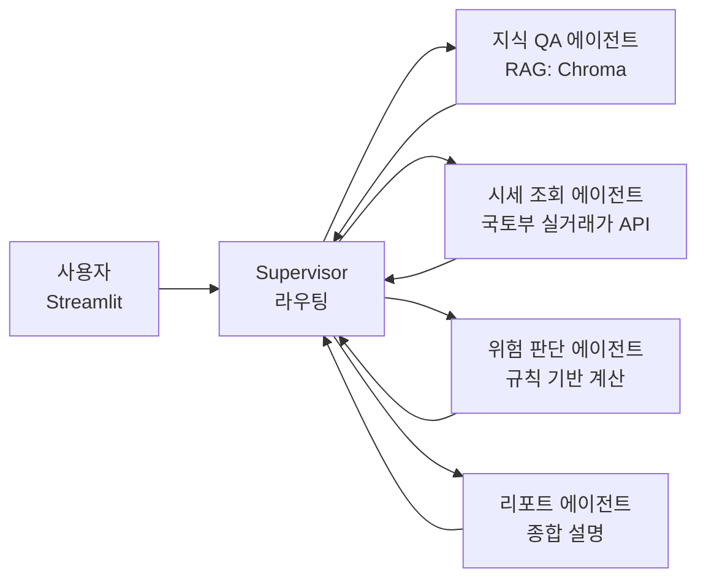

# rent-agent MVP (전세 멀티에이전트) Implementation Plan

> **For agentic workers:** REQUIRED SUB-SKILL: Use superpowers:subagent-driven-development (recommended) or superpowers:executing-plans to implement this plan task-by-task. Steps use checkbox (`- [ ]`) syntax for tracking.

**Goal:** 사회초년생/무주택자가 (1) 부동산 법령·제도·전세사기 예방 지식을 질문하고, (2) 전세 매물 정보(보증금·시세·근저당·자산)를 입력하면 위험도를 근거와 함께 판정받는 LangGraph 멀티에이전트 서비스를 Streamlit UI로 제공한다.

**Architecture:** LangGraph `create_supervisor` 패턴. Supervisor(라우터)가 사용자 요청을 4개 전문 에이전트(지식 QA / 시세 조회 / 위험 판단 / 리포트)에 위임한다. 지식 QA는 Chroma RAG, 시세 조회는 국토부 아파트 전월세 실거래가 API, 위험 판단은 **LLM이 아닌 순수 Python 규칙 함수**(재현 가능·테스트 가능)로 계산하고 LLM은 설명만 담당한다. 리포트 에이전트가 앞 에이전트들의 결과를 종합한다.

**Tech Stack:** Python 3.12, uv, langchain 1.3.x / langgraph 1.2.x / langgraph-supervisor 0.0.31, langchain-openai (gpt-4.1-mini + text-embedding-3-small), langchain-chroma + chromadb, httpx + xmltodict, pydantic-settings, Streamlit, pytest, ruff, RAGAS 0.4.3 (langchain-community 0.3.31 고정 — ADR-0005), LangSmith 트레이싱, GitHub Actions CI.

---

## 0. 사전 확인 사항 (2026-09-02 실측)

- `gh` 로그인 계정: `waffle-sh`. 원격 레포 `https://github.com/waffle-sh/rent-agent.git` (public, 비어 있음).
- `.env` 존재. 키 이름: `APARTMENT_OPENAPI_KEY`, `APARTMENT_OPENAPI_ENDPOINT`(=`https://apis.data.go.kr/1613000/RTMSDataSvcAptRent`), `OPENAI_API_KEY`, `LANGSMITH_API_KEY`.
- **`APARTMENT_OPENAPI_KEY`는 URL 인코딩된 "Encoding 키"** (`%` 포함, 98자). httpx `params=`로 넘기면 이중 인코딩되어 `SERVICE_KEY_IS_NOT_REGISTERED_ERROR`가 난다. → `urllib.parse.unquote` 후 사용 (Task 2).
- 실거래가 API 응답은 XML. 실제 필드명: `aptNm, buildYear, dealYear, dealMonth, dealDay, deposit("100,000" 만원·콤마), monthlyRent("0"이면 전세), excluUseAr, floor, umdNm, jibun, sggCd, contractType, useRRRight`, body에 `totalCount`. 에러 시 루트가 `OpenAPI_ServiceResponse`이고 `cmmMsgHeader/errMsg`에 메시지.
- `ragas==0.4.3`은 `langchain_community.chat_models.vertexai`를 하드 import → `langchain-community>=0.4`와 충돌. `langchain-community==0.3.31`로 고정하면 langchain 1.3.18과 함께 정상 동작 확인.
- 프로젝트 루트는 `/mnt/d/MetaM/00.etc/agent` (CLAUDE.md 있음). 이 안에 바로 스캐폴딩한다.

## 1. 파일 구조

```
agent/                                   # 레포 루트 (GitHub: waffle-sh/rent-agent)
├── CLAUDE.md
├── README.md                            # 아키텍처·실행법·설계 근거 요약 (한국어)
├── pyproject.toml                       # uv 프로젝트, ruff/pytest 설정
├── .python-version                      # 3.12
├── .gitignore
├── .env.example
├── .github/workflows/ci.yml             # ruff + pytest(unit)
├── docs/
│   ├── adr/                             # 설계 결정 기록 (규칙: 모든 결정에 근거)
│   │   ├── 0001-llm-openai.md
│   │   ├── 0002-vector-store-chroma.md
│   │   ├── 0003-multi-agent-supervisor.md
│   │   ├── 0004-jeonse-risk-rules.md
│   │   ├── 0005-ragas-langchain-community-pin.md
│   │   └── 0006-uv-python312-streamlit.md
│   └── superpowers/plans/2026-09-02-rent-agent-mvp.md
├── data/
│   ├── raw/                             # RAG 원문 (markdown + frontmatter)
│   └── chroma/                          # 벡터 DB (gitignore)
├── eval/
│   ├── dataset.jsonl                    # RAG 평가 질문/정답
│   └── results/                         # 평가 결과 (gitignore 제외: 결과 md는 커밋)
├── scripts/
│   ├── ingest.py                        # data/raw → Chroma
│   └── eval_rag.py                      # RAGAS 평가
├── src/rent_agent/
│   ├── __init__.py
│   ├── config.py                        # Settings (pydantic-settings)
│   ├── domain/
│   │   ├── __init__.py
│   │   ├── models.py                    # JeonseInput, RiskAssessment, RiskLevel, Region
│   │   └── risk.py                      # 순수 함수: 전세가율/선순위 부담/회수액/소액임차인/판정
│   ├── tools/
│   │   ├── __init__.py
│   │   ├── lawd_code.py                 # 시군구 법정동코드(5자리) 조회
│   │   ├── molit_rent.py                # 실거래가 API 클라이언트 + XML 파서 + Mock
│   │   └── market_stats.py              # 동일 단지/면적 전세 시세 통계
│   ├── rag/
│   │   ├── __init__.py
│   │   ├── loader.py                    # markdown+frontmatter → Document
│   │   ├── ingest.py                    # 청킹 + Chroma 적재
│   │   └── retriever.py                 # retriever 팩토리
│   ├── agents/
│   │   ├── __init__.py
│   │   ├── llm.py                       # ChatOpenAI 팩토리
│   │   ├── prompts.py                   # 모든 시스템 프롬프트 (한 곳에서 관리)
│   │   ├── knowledge_agent.py
│   │   ├── market_agent.py
│   │   ├── risk_agent.py
│   │   ├── report_agent.py
│   │   └── supervisor.py                # build_graph()
│   └── app/
│       └── streamlit_app.py
└── tests/
    ├── conftest.py
    ├── fixtures/rent_response.xml
    ├── fixtures/rent_error.xml
    ├── domain/test_risk.py
    ├── tools/test_lawd_code.py
    ├── tools/test_molit_rent.py
    ├── tools/test_market_stats.py
    ├── rag/test_loader.py
    ├── rag/test_ingest.py
    ├── agents/test_risk_tool.py
    ├── agents/test_market_tool.py
    └── agents/test_graph_integration.py  # @integration (OPENAI 키 필요, CI 제외)
```

**책임 분리 원칙:** `domain/`은 외부 의존 없음(LLM·HTTP 금지). `tools/`는 I/O 경계. `agents/`는 tools/domain을 LangChain tool로 감싸고 프롬프트만 가진다. 이 구조 덕분에 위험 판단 로직은 LLM 없이 100% 유닛 테스트된다.

---

## 2. Tasks

### Task 1: 프로젝트 스캐폴딩 + Git/GitHub 연동

**Files:**
- Create: `pyproject.toml`, `.python-version`, `.gitignore`, `.env.example`, `README.md`, `src/rent_agent/__init__.py`, `tests/__init__.py`, `tests/conftest.py`

- [ ] **Step 1: uv 프로젝트 초기화 및 의존성 파일 작성**

Run: `cd /mnt/d/MetaM/00.etc/agent && echo "3.12" > .python-version`

Write `pyproject.toml`:

```toml
[project]
name = "rent-agent"
version = "0.1.0"
description = "사회초년생/무주택자를 위한 전세 리스크 판단 멀티에이전트 (LangGraph + RAG)"
readme = "README.md"
requires-python = ">=3.12,<3.13"
dependencies = [
    "langchain>=1.3,<2",
    "langchain-core>=1.6,<2",
    "langchain-openai>=1.6,<2",
    "langchain-chroma>=1.1,<2",
    "langchain-text-splitters>=1.1,<2",
    # ragas 0.4.3이 langchain_community.chat_models.vertexai를 import함 → 0.4.x와 충돌. ADR-0005
    "langchain-community==0.3.31",
    "langgraph>=1.2,<2",
    "langgraph-supervisor>=0.0.31,<0.1",
    "langgraph-checkpoint>=4.2,<5",
    "chromadb>=1.5,<2",
    "langsmith>=0.12,<1",
    "streamlit>=1.63,<2",
    "pydantic>=2.13,<3",
    "pydantic-settings>=2.15,<3",
    "httpx>=0.28,<1",
    "xmltodict>=1.0,<2",
    "python-frontmatter>=1.1,<2",
    "ragas==0.4.3",
    "openai>=1.60",
]

[dependency-groups]
dev = [
    "pytest>=9.1,<10",
    "pytest-asyncio>=1.4,<2",
    "ruff>=0.16,<1",
]

[build-system]
requires = ["hatchling"]
build-backend = "hatchling.build"

[tool.hatch.build.targets.wheel]
packages = ["src/rent_agent"]

[tool.pytest.ini_options]
testpaths = ["tests"]
markers = ["integration: 외부 API(OpenAI 등) 호출이 필요한 테스트. CI에서는 제외"]
addopts = "-m 'not integration'"

[tool.ruff]
line-length = 100
target-version = "py312"
src = ["src", "tests", "scripts"]

[tool.ruff.lint]
select = ["E", "F", "I", "B", "UP"]
```

- [ ] **Step 2: .gitignore / .env.example 작성**

`.gitignore`:
```
.venv/
__pycache__/
*.pyc
.pytest_cache/
.ruff_cache/
.env
data/chroma/
eval/results/*.json
.streamlit/secrets.toml
dist/
```

`.env.example`:
```
# OpenAI
OPENAI_API_KEY=sk-...
OPENAI_MODEL=gpt-4.1-mini
OPENAI_EMBEDDING_MODEL=text-embedding-3-small

# 공공데이터포털 - 국토교통부 아파트 전월세 실거래가 (Encoding 키 그대로 붙여넣기)
APARTMENT_OPENAPI_KEY=...
APARTMENT_OPENAPI_ENDPOINT=https://apis.data.go.kr/1613000/RTMSDataSvcAptRent
# true면 API 대신 tests/fixtures/rent_response.xml 사용 (키 없이 개발용)
MOLIT_USE_MOCK=false

# LangSmith 트레이싱
LANGSMITH_TRACING=true
LANGSMITH_API_KEY=lsv2_...
LANGSMITH_PROJECT=rent-agent
```

- [ ] **Step 3: 패키지 골격 + conftest**

`src/rent_agent/__init__.py`:
```python
"""rent-agent: 전세 리스크 판단 멀티에이전트."""

__version__ = "0.1.0"
```

`tests/__init__.py`: 빈 파일.

`tests/conftest.py` (Settings가 필수 키를 요구하므로 테스트에서는 더미 값을 주입한다):
```python
import pytest


@pytest.fixture(autouse=True)
def _dummy_env(monkeypatch: pytest.MonkeyPatch) -> None:
    """유닛 테스트는 실제 키 없이 돌아야 한다. .env 파일도 읽지 않게 한다."""
    monkeypatch.setenv("OPENAI_API_KEY", "sk-test")
    monkeypatch.setenv("APARTMENT_OPENAPI_KEY", "test%2Bkey%3D%3D")
    monkeypatch.setenv("LANGSMITH_TRACING", "false")
    monkeypatch.setenv("MOLIT_USE_MOCK", "true")
```

- [ ] **Step 4: 의존성 설치 및 도구 동작 확인**

Run: `cd /mnt/d/MetaM/00.etc/agent && uv sync`
Expected: `uv.lock` 생성, `.venv` 생성, 에러 없음. `langchain-community==0.3.31`, `ragas==0.4.3` 포함.

Run: `uv run python -c "from ragas.metrics.collections import Faithfulness; from langgraph_supervisor import create_supervisor; from langchain.agents import create_agent; print('ok')"`
Expected: `ok`

Run: `uv run ruff check . && uv run pytest`
Expected: ruff 통과, pytest `no tests ran` (exit 5여도 무방).

- [ ] **Step 5: README 초안**

`README.md`:
````markdown
# rent-agent

사회초년생·무주택자를 위한 **전세 리스크 판단 멀티에이전트**.
부동산 법령/제도/전세사기 예방 지식을 RAG로 답하고, 전세 매물 정보를 입력하면 위험도를 근거와 함께 판정합니다.

## 아키텍처



- **Supervisor 패턴** (LangGraph `create_supervisor`): 요청 유형에 따라 전문 에이전트에 위임.
- **위험 판단은 LLM이 아닌 순수 Python 규칙**으로 계산 → 재현 가능, 유닛 테스트 100%. LLM은 설명만 담당.
- **RAG 소스**: 주택임대차보호법, 소액임차인 최우선변제 기준, HUG 전세보증, 청년 전세대출, 전세사기 예방 체크리스트.
- 모든 설계 결정의 근거는 [`docs/adr/`](docs/adr/)에 기록.

## 실행

```bash
uv sync
cp .env.example .env   # 키 입력
uv run python scripts/ingest.py          # 지식 베이스 적재
uv run streamlit run src/rent_agent/app/streamlit_app.py
```

## 테스트 / 평가

```bash
uv run pytest                 # 유닛 테스트 (외부 API 불필요)
uv run pytest -m integration  # 실제 LLM 호출 통합 테스트
uv run python scripts/eval_rag.py   # RAGAS 평가 → eval/results/
```
````

- [ ] **Step 6: git init, 원격 연결, 첫 커밋 & 푸시**

주의: 전역 git 이메일이 회사 계정(`suhyun.lee@meta-m.co.kr`)이고 레포는 개인 계정(`waffle-sh`)의 공개 포트폴리오다. 사용자 결정(2026-09-02): 개인 이메일 사용. **첫 커밋 전에** 레포 로컬 설정으로 지정한다(전역 설정은 건드리지 않음):

```bash
git config user.email "suhyunlee.1117@gmail.com"
git config user.name "waffle-sh"
```

Run:
```bash
cd /mnt/d/MetaM/00.etc/agent
git init -b main
git remote add origin https://github.com/waffle-sh/rent-agent.git
git add .
git commit -m "chore: uv 프로젝트 스캐폴딩 및 의존성 고정

- langchain 1.3 / langgraph 1.2 / langgraph-supervisor
- ragas 0.4.3 호환을 위해 langchain-community 0.3.31 고정
- ruff, pytest(integration 마커) 설정

Co-Authored-By: Claude Fable 5.1 <noreply@anthropic.com>"
git push -u origin main
```
Expected: 푸시 성공. `gh repo view waffle-sh/rent-agent --json isEmpty` → `false`.

---

### Task 2: Settings (config.py)

**Files:**
- Create: `src/rent_agent/config.py`
- Modify: `tests/conftest.py` (테스트 격리 보강 — Task 1 코드 리뷰 지적)
- Modify: `.env.example`
- Test: `tests/test_config.py`

**테스트 격리 원칙:** 유닛 테스트는 실제 `.env`를 절대 읽지 않는다. `Settings`는 env 파일 경로를 `RENT_AGENT_ENV_FILE` 환경변수로 바꿔 끼울 수 있게 하고, conftest가 이를 존재하지 않는 경로로 고정한다. `get_settings()`의 `lru_cache`는 테스트마다 비운다.

- [ ] **Step 1: 실패 테스트 작성**

`tests/test_config.py`:
```python
from rent_agent.config import Settings, get_settings


def test_settings_reads_env(monkeypatch):
    monkeypatch.setenv("OPENAI_API_KEY", "sk-abc")
    monkeypatch.setenv("APARTMENT_OPENAPI_KEY", "abc%2Bdef%3D%3D")
    s = Settings(_env_file=None)
    assert s.openai_api_key == "sk-abc"
    assert s.openai_model == "gpt-4.1-mini"
    assert s.apartment_openapi_endpoint.endswith("/RTMSDataSvcAptRent")
    assert s.multi_house_openapi_endpoint.endswith("/RTMSDataSvcRHRent")
    assert s.office_openapi_endpoint.endswith("/RTMSDataSvcOffiRent")


def test_apartment_key_is_url_decoded(monkeypatch):
    """data.go.kr 'Encoding 키'를 그대로 넣어도 httpx가 재인코딩하지 않도록 디코딩된 값을 제공."""
    monkeypatch.setenv("APARTMENT_OPENAPI_KEY", "abc%2Bdef%3D%3D")
    s = Settings(_env_file=None)
    assert s.apartment_openapi_key_decoded == "abc+def=="


def test_get_settings_is_cached():
    assert get_settings() is get_settings()


def test_real_env_file_is_not_read_in_tests():
    """conftest가 RENT_AGENT_ENV_FILE을 없는 경로로 고정하므로, .env에만 있는 값은 비어 있어야 한다."""
    s = Settings()
    assert s.langsmith_api_key is None
    assert s.apartment_openapi_key == "test%2Bkey%3D%3D"  # conftest 더미
```

- [ ] **Step 2: 실패 확인**

Run: `uv run pytest tests/test_config.py -v`
Expected: FAIL — `ModuleNotFoundError: No module named 'rent_agent.config'`

- [ ] **Step 3: 구현**

`src/rent_agent/config.py`:
```python
"""환경 변수 기반 설정. .env 파일은 pydantic-settings가 읽는다."""

import os
from functools import lru_cache
from pathlib import Path
from urllib.parse import unquote

from pydantic_settings import BaseSettings, SettingsConfigDict

PROJECT_ROOT = Path(__file__).resolve().parents[2]
# 테스트가 실제 .env를 읽지 않도록 경로를 환경변수로 바꿔 끼울 수 있게 한다 (conftest 참고).
ENV_FILE = os.getenv("RENT_AGENT_ENV_FILE", str(PROJECT_ROOT / ".env"))


class Settings(BaseSettings):
    model_config = SettingsConfigDict(env_file=ENV_FILE, env_file_encoding="utf-8", extra="ignore")

    # OpenAI
    openai_api_key: str
    openai_model: str = "gpt-4.1-mini"
    openai_embedding_model: str = "text-embedding-3-small"

    # 국토부 전월세 실거래가 (공공데이터포털). 서비스 키 하나로 세 API 모두 호출한다.
    apartment_openapi_key: str
    apartment_openapi_endpoint: str = "https://apis.data.go.kr/1613000/RTMSDataSvcAptRent"
    multi_house_openapi_endpoint: str = "https://apis.data.go.kr/1613000/RTMSDataSvcRHRent"  # 연립·다세대
    office_openapi_endpoint: str = "https://apis.data.go.kr/1613000/RTMSDataSvcOffiRent"  # 오피스텔
    molit_use_mock: bool = False

    # RAG
    raw_docs_dir: Path = PROJECT_ROOT / "data" / "raw"
    chroma_dir: Path = PROJECT_ROOT / "data" / "chroma"
    chroma_collection: str = "real_estate_knowledge"
    retriever_k: int = 4

    # LangSmith (환경변수만 있으면 langchain이 자동 트레이싱)
    langsmith_api_key: str | None = None
    langsmith_project: str = "rent-agent"

    @property
    def apartment_openapi_key_decoded(self) -> str:
        """공공데이터포털은 'Encoding/Decoding' 두 키를 준다. 어떤 것을 넣어도 동작하도록
        항상 디코딩하고, HTTP 클라이언트가 한 번만 인코딩하게 한다."""
        return unquote(self.apartment_openapi_key)


@lru_cache(maxsize=1)
def get_settings() -> Settings:
    return Settings()
```

`tests/conftest.py` 전체를 아래로 교체한다. 모듈 최상단에서 `RENT_AGENT_ENV_FILE`을 설정하는 이유: `rent_agent.config`가 import되는 시점(테스트 모듈 수집)에 이미 값이 있어야 하기 때문.

```python
import os
from pathlib import Path

import pytest

# rent_agent.config가 import될 때 실제 .env 대신 존재하지 않는 파일을 보게 한다
# (fixture보다 먼저 실행되어야 하므로 모듈 최상단).
os.environ["RENT_AGENT_ENV_FILE"] = str(Path(__file__).parent / "does-not-exist.env")


@pytest.fixture(autouse=True)
def _dummy_env(request: pytest.FixtureRequest, monkeypatch: pytest.MonkeyPatch) -> None:
    """유닛 테스트는 실제 키 없이 돌아야 한다.
    - 필수 키는 더미로 채운다.
    - .env 파일은 위 RENT_AGENT_ENV_FILE 덕분에 읽히지 않는다.
    - get_settings()의 lru_cache를 매 테스트 전에 비워 테스트 간 오염을 막는다.
    - @pytest.mark.integration 테스트는 실제 키가 필요하므로 더미를 주입하지 않는다
      (환경변수는 .env보다 우선하므로 더미가 있으면 Settings(_env_file=...)도 더미를 받는다).
      통합 테스트는 get_settings() 대신 Settings(_env_file=PROJECT_ROOT / ".env")로 실제 .env를 읽어야 한다."""
    from rent_agent.config import get_settings

    get_settings.cache_clear()
    if request.node.get_closest_marker("integration"):
        return
    monkeypatch.setenv("OPENAI_API_KEY", "sk-test")
    monkeypatch.setenv("APARTMENT_OPENAPI_KEY", "test%2Bkey%3D%3D")
    monkeypatch.setenv("LANGSMITH_TRACING", "false")
    monkeypatch.setenv("MOLIT_USE_MOCK", "true")
```

- [ ] **Step 4: 통과 확인**

Run: `uv run pytest tests/test_config.py -v`
Expected: 4 passed

- [ ] **Step 5: `.env.example`에 추가 엔드포인트 반영**

`.env.example`의 공공데이터포털 블록을 아래로 교체한다:
```
# 공공데이터포털 - 국토교통부 전월세 실거래가 (Encoding 키 그대로 붙여넣기. 키 하나로 세 API 모두 호출)
APARTMENT_OPENAPI_KEY=...
APARTMENT_OPENAPI_ENDPOINT=https://apis.data.go.kr/1613000/RTMSDataSvcAptRent
MULTI_HOUSE_OPENAPI_ENDPOINT=https://apis.data.go.kr/1613000/RTMSDataSvcRHRent
OFFICE_OPENAPI_ENDPOINT=https://apis.data.go.kr/1613000/RTMSDataSvcOffiRent
# true면 API 대신 tests/fixtures/rent_response*.xml 사용 (키 없이 개발용)
MOLIT_USE_MOCK=false
```

- [ ] **Step 6: 커밋**

```bash
git add src/rent_agent/config.py tests/test_config.py tests/conftest.py .env.example
git commit -m "feat: pydantic-settings 기반 Settings 및 공공데이터 키 디코딩

- RENT_AGENT_ENV_FILE로 env 파일 경로 주입, 테스트는 실제 .env를 읽지 않음
- get_settings lru_cache를 테스트마다 초기화

Co-Authored-By: Claude Fable 5.1 <noreply@anthropic.com>"
```

---

### Task 3: 도메인 모델 + 전세 위험 판단 규칙 (LLM 비의존)

**Files:**
- Create: `src/rent_agent/domain/__init__.py`, `src/rent_agent/domain/models.py`, `src/rent_agent/domain/risk.py`
- Test: `tests/domain/__init__.py`, `tests/domain/test_risk.py`

**판단 기준 근거 (ADR-0004에 기록):**
- **전세가율** = 보증금 / 매매가(시세). HUG 전세보증금반환보증 가입 요건이 2023.5.1부터 **90% 이하**. 업계 통용 안전권 **70% 이하**. → ≤70 안전, 70~80 주의, 80~90 위험, >90 매우 위험(보증 가입 불가).
- **선순위 부담률** = (선순위 근저당 채권최고액 + 선순위 임차보증금 + 내 보증금) / 매매가. 100% 초과면 집을 팔아도 전액 회수 불가(깡통).
- **경매 시 예상 회수액**: 낙찰가 = 매매가 × 낙찰가율(기본 0.8, 서울 아파트 평균 수준 가정, 보수적으로 절사). 배당 순서는 ① 소액임차인 최우선변제액(낙찰가의 1/2 한도, 시행령 제10조 제2항) → ② 선순위 근저당·선순위 보증금 → ③ 내 보증금 잔여분. 회수액 < 보증금이면 부족액 발생.
- **총 부담률 경계 80/90%**: 전세가율 경계(70/80/90)에서 한 단계씩 보수적으로 올린 값. 선순위 채권이 있으면 같은 전세가율이라도 회수 위험이 커지므로 별도 축으로 본다(ADR-0004에 기록).
- **소액임차인 최우선변제** (주택임대차보호법 시행령 제10·11조, 2023.2.21 개정): 서울 보증금 1억6,500만 이하 → 5,500만 우선변제 / 과밀억제권역·세종·용인·화성·김포 1억4,500만 → 4,800만 / 광역시 등 8,500만 → 2,800만 / 그 외 7,500만 → 2,500만.
- **자금 부담**: 필요 대출 = 보증금 − 자기자금, 월 이자 = 대출 × 금리 / 12. 월 이자 / 월소득 > 30%면 경고(주거비 30% 규칙).

- [ ] **Step 1: 실패 테스트 작성**

`tests/domain/__init__.py`: 빈 파일.

`tests/domain/test_risk.py`:
```python
import pytest

from rent_agent.domain.models import JeonseInput, Region, RiskLevel
from rent_agent.domain.risk import (
    assess,
    classify,
    expected_recovery,
    jeonse_ratio,
    small_tenant_protection,
    total_burden_ratio,
)


def test_jeonse_ratio_percent():
    assert jeonse_ratio(deposit=35000, market_price=50000) == pytest.approx(70.0)


def test_total_burden_includes_senior_claims():
    # 근저당 1억 + 선순위 보증금 5천 + 내 보증금 3억 / 매매가 5억 = 90%
    assert total_burden_ratio(
        deposit=30000, senior_liens=10000, senior_deposits=5000, market_price=50000
    ) == pytest.approx(90.0)


def test_expected_recovery_and_shortfall():
    # 5억 * 0.8 = 4억 낙찰, 선순위 1억 → 회수 가능 3억, 보증금 3.5억 → 부족 5천
    recovery, shortfall = expected_recovery(
        market_price=50000, auction_ratio=0.8, senior_liens=10000, senior_deposits=0, deposit=35000
    )
    assert recovery == 30000
    assert shortfall == 5000


def test_expected_recovery_no_shortfall_is_zero():
    _, shortfall = expected_recovery(
        market_price=50000, auction_ratio=0.8, senior_liens=0, senior_deposits=0, deposit=30000
    )
    assert shortfall == 0


def test_expected_recovery_when_proceeds_below_seniors():
    # 낙찰 8,000 < 선순위 9,000 → 회수 0, 전액 부족
    assert expected_recovery(10000, 0.8, 9000, 0, 3000) == (0, 3000)


def test_expected_recovery_priority_paid_before_liens():
    # 서울 소액임차인: 보증금 5,000, 매매가 10,000, 근저당 7,000
    # 낙찰 8,000 → 최우선변제 min(5,000, 8,000/2)=4,000 먼저 → 잔여 8,000-4,000-7,000<0 → 0
    # 회수 4,000, 부족 1,000 (최우선변제 없이 계산하면 회수 1,000이었을 것)
    assert expected_recovery(10000, 0.8, 7000, 0, 5000, priority_amount=5000) == (4000, 1000)


@pytest.mark.parametrize(
    "region,deposit,eligible,amount",
    [
        (Region.SEOUL, 16500, True, 5500),
        (Region.SEOUL, 16501, False, 0),
        (Region.METRO_OVER, 14500, True, 4800),
        (Region.METRO_CITY, 8500, True, 2800),
        (Region.OTHER, 7500, True, 2500),
        (Region.OTHER, 9000, False, 0),
    ],
)
def test_small_tenant_protection(region, deposit, eligible, amount):
    assert small_tenant_protection(region, deposit) == (eligible, amount)


def test_small_tenant_priority_capped_by_deposit():
    # 보증금 3천만이면 우선변제액도 3천만 (5,500만 아님)
    assert small_tenant_protection(Region.SEOUL, 3000) == (True, 3000)


@pytest.mark.parametrize(
    "jr,tb,shortfall,expected",
    [
        (60.0, 60.0, 0, RiskLevel.SAFE),
        (75.0, 75.0, 0, RiskLevel.CAUTION),
        (65.0, 85.0, 0, RiskLevel.CAUTION),
        (85.0, 85.0, 0, RiskLevel.DANGER),
        (65.0, 65.0, 1000, RiskLevel.DANGER),
        (95.0, 95.0, 0, RiskLevel.CRITICAL),
        (60.0, 105.0, 0, RiskLevel.CRITICAL),
    ],
)
def test_classify(jr, tb, shortfall, expected):
    assert classify(jr, tb, shortfall) == expected


@pytest.mark.parametrize(
    "jr,tb,expected",
    [
        (70.0, 70.0, RiskLevel.SAFE),  # "70% 이하 안전권" → 70.0 포함
        (80.0, 80.0, RiskLevel.CAUTION),
        (90.0, 90.0, RiskLevel.DANGER),  # HUG 한도 90% 이하 → 90.0은 보증 가입 가능
        (60.0, 100.0, RiskLevel.DANGER),  # 100% 초과부터 깡통
    ],
)
def test_classify_boundaries_are_inclusive(jr, tb, expected):
    assert classify(jr, tb, 0) == expected


def test_assess_full_case_danger():
    inp = JeonseInput(
        deposit=35000,
        market_price=50000,
        senior_liens=10000,
        region=Region.SEOUL,
        own_capital=15000,
        annual_income=4800,
        loan_rate=4.0,
    )
    result = assess(inp)
    assert result.jeonse_ratio == pytest.approx(70.0)
    assert result.total_burden_ratio == pytest.approx(90.0)
    assert result.shortfall == 5000
    assert result.level == RiskLevel.DANGER
    assert result.small_tenant_protected is False
    assert result.required_loan == 20000
    assert result.monthly_interest == pytest.approx(20000 * 0.04 / 12, abs=1)
    # 월소득 400만, 월이자 약 66.7만 → 약 16.7%
    assert result.interest_to_income_ratio == pytest.approx(16.7, abs=0.1)
    assert any("근저당" in r or "선순위" in r for r in result.reasons)


def test_assess_without_income_has_none_ratio():
    inp = JeonseInput(deposit=20000, market_price=50000)
    result = assess(inp)
    assert result.interest_to_income_ratio is None
    assert result.level == RiskLevel.SAFE


def test_assess_small_tenant_priority_improves_recovery():
    inp = JeonseInput(deposit=5000, market_price=10000, senior_liens=7000, region=Region.SEOUL)
    result = assess(inp)
    assert result.small_tenant_protected is True
    assert result.small_tenant_priority_amount == 5000
    assert result.expected_recovery == 4000
    assert result.shortfall == 1000
    assert any("최우선변제" in r and "먼저" in r for r in result.reasons)


def test_income_ratio_warning_uses_unrounded_value():
    # 월이자 30040*12%/12 = 300.4만원, 월소득 1,000만원 → 30.04% → 표시는 30.0이지만 경고는 나와야 함
    inp = JeonseInput(deposit=30040, market_price=100000, own_capital=0, annual_income=12000, loan_rate=12.0)
    result = assess(inp)
    assert result.interest_to_income_ratio == 30.0
    assert any("30%" in r for r in result.reasons)


def test_no_loan_needed_has_no_loan_reason():
    result = assess(JeonseInput(deposit=20000, market_price=50000, own_capital=25000))
    assert result.required_loan == 0
    assert not any("대출" in r for r in result.reasons)


def test_assess_interest_burden_adds_reason():
    # 보증금 3억 전부 대출, 금리 5%, 연소득 3천 → 월이자 125만 / 월소득 250만 = 50%
    inp = JeonseInput(deposit=30000, market_price=60000, own_capital=0, annual_income=3000, loan_rate=5.0)
    result = assess(inp)
    assert result.interest_to_income_ratio == pytest.approx(50.0)
    assert any("30%" in r for r in result.reasons)


def test_input_validation_rejects_zero_price():
    with pytest.raises(ValueError):
        JeonseInput(deposit=1000, market_price=0)
```

- [ ] **Step 2: 실패 확인**

Run: `uv run pytest tests/domain -v`
Expected: FAIL — `ModuleNotFoundError: No module named 'rent_agent.domain'`

- [ ] **Step 3: 모델 구현**

`src/rent_agent/domain/__init__.py`: 빈 파일.

`src/rent_agent/domain/models.py`:
```python
"""전세 위험 판단 입출력 모델. 금액 단위는 모두 '만원'."""

from enum import StrEnum

from pydantic import BaseModel, Field


class Region(StrEnum):
    """소액임차인 최우선변제 기준 지역 구분 (주택임대차보호법 시행령 제10조·제11조)."""

    SEOUL = "seoul"  # 서울특별시
    METRO_OVER = "metro_over"  # 과밀억제권역(서울 제외), 세종, 용인, 화성, 김포
    METRO_CITY = "metro_city"  # 광역시(과밀억제권역·군 제외), 안산, 광주, 파주, 이천, 평택
    OTHER = "other"  # 그 밖의 지역


class JeonseInput(BaseModel):
    deposit: int = Field(..., gt=0, description="전세 보증금 (만원)")
    market_price: int = Field(..., gt=0, description="해당 주택 매매 시세 (만원)")
    senior_liens: int = Field(0, ge=0, description="등기부 을구 선순위 근저당 채권최고액 합계 (만원)")
    senior_deposits: int = Field(0, ge=0, description="나보다 먼저 들어온 임차인 보증금 합계 (만원, 다가구 등)")
    region: Region = Field(Region.SEOUL, description="소액임차인 기준 지역")
    own_capital: int = Field(0, ge=0, description="자기자금 (만원)")
    annual_income: int | None = Field(None, gt=0, description="연소득 (만원)")
    loan_rate: float = Field(3.5, ge=0, description="전세대출 예상 금리 (연 %)")
    auction_ratio: float = Field(0.8, gt=0, le=1, description="경매 낙찰가율 가정 (0~1)")


class RiskLevel(StrEnum):
    SAFE = "안전"
    CAUTION = "주의"
    DANGER = "위험"
    CRITICAL = "매우 위험"


class RiskAssessment(BaseModel):
    jeonse_ratio: float = Field(description="전세가율 (%)")
    total_burden_ratio: float = Field(description="선순위 포함 총 부담률 (%)")
    expected_recovery: int = Field(description="경매 시 예상 회수 가능액 (만원)")
    shortfall: int = Field(description="보증금 대비 회수 부족액 (만원, 0이면 전액 회수 가정)")
    small_tenant_protected: bool = Field(description="소액임차인 최우선변제 대상 여부")
    small_tenant_priority_amount: int = Field(description="최우선변제 가능액 (만원)")
    required_loan: int = Field(description="필요 대출액 (만원)")
    monthly_interest: float = Field(description="월 이자 (만원)")
    interest_to_income_ratio: float | None = Field(description="월 이자 / 월 소득 (%)")
    level: RiskLevel
    reasons: list[str] = Field(description="판정 근거 (사람이 읽는 문장)")
```

- [ ] **Step 4: 규칙 함수 구현**

`src/rent_agent/domain/risk.py`:
```python
"""전세 위험 판단 규칙. 외부 의존 없음 — LLM/HTTP 금지.

기준 출처 요약 (상세: docs/adr/0004-jeonse-risk-rules.md)
- 전세가율 90%: HUG 전세보증금반환보증 가입 요건 (2023.5.1~)
- 전세가율 70%: 업계 통용 안전권
- 소액임차인 표: 주택임대차보호법 시행령 제10조·제11조 (2023.2.21 개정)
- 주거비 30% 규칙: 월 주거비가 월소득의 30%를 넘으면 부담 과중으로 보는 통용 기준
"""

from rent_agent.domain.models import JeonseInput, Region, RiskAssessment, RiskLevel

# (보증금 상한, 최우선변제 한도) 단위: 만원
SMALL_TENANT_TABLE: dict[Region, tuple[int, int]] = {
    Region.SEOUL: (16500, 5500),
    Region.METRO_OVER: (14500, 4800),
    Region.METRO_CITY: (8500, 2800),
    Region.OTHER: (7500, 2500),
}

JEONSE_RATIO_SAFE = 70.0
JEONSE_RATIO_CAUTION = 80.0
JEONSE_RATIO_HUG_LIMIT = 90.0
BURDEN_CAUTION = 80.0
BURDEN_DANGER = 90.0
BURDEN_CRITICAL = 100.0
HOUSING_COST_INCOME_LIMIT = 30.0


def jeonse_ratio(deposit: int, market_price: int) -> float:
    return deposit / market_price * 100


def total_burden_ratio(deposit: int, senior_liens: int, senior_deposits: int, market_price: int) -> float:
    return (deposit + senior_liens + senior_deposits) / market_price * 100


def expected_recovery(
    market_price: int,
    auction_ratio: float,
    senior_liens: int,
    senior_deposits: int,
    deposit: int,
    priority_amount: int = 0,
) -> tuple[int, int]:
    """경매 시 (회수 가능액, 부족액).

    배당 순서 가정: ① 소액임차인 최우선변제액(낙찰가의 1/2 한도) → ② 선순위 근저당·보증금 → ③ 내 보증금 잔여분.
    낙찰가는 보수적으로 절사한다.
    """
    proceeds = int(market_price * auction_ratio)
    priority = min(priority_amount, proceeds // 2)
    remainder = max(0, proceeds - priority - senior_liens - senior_deposits)
    recovery = min(deposit, priority + remainder)
    return recovery, deposit - recovery


def small_tenant_protection(region: Region, deposit: int) -> tuple[bool, int]:
    limit, priority = SMALL_TENANT_TABLE[region]
    if deposit > limit:
        return False, 0
    return True, min(priority, deposit)


def classify(jr: float, burden: float, shortfall: int) -> RiskLevel:
    if jr > JEONSE_RATIO_HUG_LIMIT or burden > BURDEN_CRITICAL:
        return RiskLevel.CRITICAL
    if jr > JEONSE_RATIO_CAUTION or burden > BURDEN_DANGER or shortfall > 0:
        return RiskLevel.DANGER
    if jr > JEONSE_RATIO_SAFE or burden > BURDEN_CAUTION:
        return RiskLevel.CAUTION
    return RiskLevel.SAFE


def assess(inp: JeonseInput) -> RiskAssessment:
    jr = jeonse_ratio(inp.deposit, inp.market_price)
    burden = total_burden_ratio(inp.deposit, inp.senior_liens, inp.senior_deposits, inp.market_price)
    protected, priority_amount = small_tenant_protection(inp.region, inp.deposit)
    recovery, shortfall = expected_recovery(
        inp.market_price,
        inp.auction_ratio,
        inp.senior_liens,
        inp.senior_deposits,
        inp.deposit,
        priority_amount=priority_amount,
    )
    required_loan = max(0, inp.deposit - inp.own_capital)
    monthly_interest = required_loan * inp.loan_rate / 100 / 12
    # 비교는 반올림 전 값으로, 표시는 소수 1자리로 (30.04% → 표시 30.0, 경고는 발생)
    ratio_raw = monthly_interest / (inp.annual_income / 12) * 100 if inp.annual_income else None
    ratio_to_income = round(ratio_raw, 1) if ratio_raw is not None else None
    level = classify(jr, burden, shortfall)

    reasons: list[str] = []
    reasons.append(f"전세가율 {jr:.1f}% (안전권 {JEONSE_RATIO_SAFE:.0f}% 이하, HUG 보증 한도 {JEONSE_RATIO_HUG_LIMIT:.0f}%)")
    if inp.senior_liens or inp.senior_deposits:
        reasons.append(
            f"선순위 근저당 {inp.senior_liens:,}만원·선순위 보증금 {inp.senior_deposits:,}만원 포함 "
            f"총 부담률 {burden:.1f}%"
        )
    if shortfall > 0:
        reasons.append(
            f"낙찰가율 {inp.auction_ratio:.0%} 가정 경매 시 회수 가능액 {recovery:,}만원, "
            f"보증금 대비 {shortfall:,}만원 부족"
        )
    else:
        reasons.append(f"낙찰가율 {inp.auction_ratio:.0%} 가정 경매 시에도 보증금 전액 회수 가능")
    if protected:
        reasons.append(
            f"소액임차인 최우선변제 대상: 최대 {priority_amount:,}만원을 선순위 채권보다 먼저 변제 "
            "(위 회수액 계산에 반영, 낙찰가의 1/2 한도)"
        )
    else:
        reasons.append("보증금이 소액임차인 기준을 초과하여 최우선변제 대상 아님")
    if required_loan:
        reasons.append(
            f"필요 대출 {required_loan:,}만원, 금리 {inp.loan_rate:g}% 기준 월 이자 약 {monthly_interest:,.1f}만원"
        )
    if ratio_raw is not None and ratio_raw > HOUSING_COST_INCOME_LIMIT:
        reasons.append(f"월 이자가 월소득의 {ratio_to_income}%로 권고 상한 {HOUSING_COST_INCOME_LIMIT:.0f}% 초과")

    return RiskAssessment(
        jeonse_ratio=round(jr, 1),
        total_burden_ratio=round(burden, 1),
        expected_recovery=recovery,
        shortfall=shortfall,
        small_tenant_protected=protected,
        small_tenant_priority_amount=priority_amount,
        required_loan=required_loan,
        monthly_interest=round(monthly_interest, 1),
        interest_to_income_ratio=ratio_to_income,
        level=level,
        reasons=reasons,
    )
```

- [ ] **Step 5: 통과 확인**

Run: `uv run pytest tests/domain -v`
Expected: 전부 passed (parametrize 포함 약 30개)

- [ ] **Step 6: 커밋**

```bash
git add src/rent_agent/domain tests/domain
git commit -m "feat: 전세 위험 판단 도메인 규칙 (전세가율·선순위 부담·회수액·소액임차인)

Co-Authored-By: Claude Fable 5.1 <noreply@anthropic.com>"
```

---

### Task 4: 법정동 시군구 코드 조회 (lawd_code.py)

**Files:**
- Create: `src/rent_agent/tools/__init__.py`, `src/rent_agent/tools/lawd_code.py`
- Test: `tests/tools/__init__.py`, `tests/tools/test_lawd_code.py`

실거래가 API는 `LAWD_CD`(법정동코드 앞 5자리 = 시군구)를 요구한다. MVP는 서울 25개 자치구 + 경기 주요 시를 내장 dict로 두고, 이후 행안부 법정동코드 전체 파일로 확장한다(README 다음 단계에 기록).

**주의 (2026-09-02 API 실측):** 일반구가 있는 시는 **구 단위 코드로만** 데이터가 나온다. 부천시는 2024-01-01 원미·소사·오정구를 부활시켰고(41190은 0건), 화성시는 2025-01-01 만세·효행·병점·동탄구를 신설했다(41590은 0건). 정적 dict는 이런 행정구역 개편에 취약하므로 docstring에 검증일을 남기고, 통합 테스트로 전 코드가 1건 이상 반환하는지 확인한다.

- [ ] **Step 1: 실패 테스트**

`tests/tools/__init__.py`: 빈 파일.

`tests/tools/test_lawd_code.py`:
```python
from rent_agent.tools.lawd_code import find_lawd_codes


def test_exact_gu_name():
    assert find_lawd_codes("강남구") == [("서울특별시 강남구", "11680")]


def test_partial_match_returns_multiple():
    results = find_lawd_codes("서울")
    assert len(results) == 25
    assert ("서울특별시 종로구", "11110") in results


def test_dong_name_not_supported_returns_empty():
    assert find_lawd_codes("역삼동") == []


def test_whitespace_tolerant():
    assert find_lawd_codes(" 강남 ") == [("서울특별시 강남구", "11680")]


def test_multi_token_query_requires_all_tokens():
    # 사용자는 "서울 강남구", "성남 분당"처럼 띄어 쓴다 — 모든 토큰이 이름에 포함되면 매칭
    assert find_lawd_codes("서울 강남구") == [("서울특별시 강남구", "11680")]
    assert find_lawd_codes("성남 분당") == [("경기도 성남시 분당구", "41135")]
    assert find_lawd_codes("부산 중구") == []


def test_city_with_districts_returns_all_districts():
    assert len(find_lawd_codes("성남시")) == 3
    assert len(find_lawd_codes("부천")) == 3
    assert len(find_lawd_codes("화성")) == 4


def test_codes_are_unique_five_digits():
    from rent_agent.tools.lawd_code import LAWD_CODES

    codes = list(LAWD_CODES.values())
    assert len(codes) == len(set(codes)) == 50
    assert all(len(c) == 5 and c.isdigit() for c in codes)
```

- [ ] **Step 2: 실패 확인**

Run: `uv run pytest tests/tools/test_lawd_code.py -v`
Expected: FAIL — ModuleNotFoundError

- [ ] **Step 3: 구현**

`src/rent_agent/tools/__init__.py`: 빈 파일.

`src/rent_agent/tools/lawd_code.py`:
```python
"""시군구 법정동코드(5자리) 조회. 출처: 행정안전부 법정동코드 (https://www.code.go.kr).

MVP 범위: 서울 25개 자치구 + 경기 주요 시(50개). 전체 코드는 행안부 파일을 CSV로 내려받아 확장 가능.

주의: 일반구가 있는 시(수원·성남·고양·용인·안양·부천·화성)는 국토부 실거래가 API가 **구 단위 코드**만 인식한다.
부천시(2024-01 구 부활), 화성시(2025-01 구 신설)처럼 행정구역 개편이 있으면 시 코드는 0건을 반환한다.
전 코드가 실거래가 API에서 1건 이상 반환하는지 2026-09-02 확인함 (tests/tools/test_lawd_code_live.py 로 재검증).
"""

LAWD_CODES: dict[str, str] = {
    "서울특별시 종로구": "11110",
    "서울특별시 중구": "11140",
    "서울특별시 용산구": "11170",
    "서울특별시 성동구": "11200",
    "서울특별시 광진구": "11215",
    "서울특별시 동대문구": "11230",
    "서울특별시 중랑구": "11260",
    "서울특별시 성북구": "11290",
    "서울특별시 강북구": "11305",
    "서울특별시 도봉구": "11320",
    "서울특별시 노원구": "11350",
    "서울특별시 은평구": "11380",
    "서울특별시 서대문구": "11410",
    "서울특별시 마포구": "11440",
    "서울특별시 양천구": "11470",
    "서울특별시 강서구": "11500",
    "서울특별시 구로구": "11530",
    "서울특별시 금천구": "11545",
    "서울특별시 영등포구": "11560",
    "서울특별시 동작구": "11590",
    "서울특별시 관악구": "11620",
    "서울특별시 서초구": "11650",
    "서울특별시 강남구": "11680",
    "서울특별시 송파구": "11710",
    "서울특별시 강동구": "11740",
    "경기도 수원시 장안구": "41111",
    "경기도 수원시 권선구": "41113",
    "경기도 수원시 팔달구": "41115",
    "경기도 수원시 영통구": "41117",
    "경기도 성남시 수정구": "41131",
    "경기도 성남시 중원구": "41133",
    "경기도 성남시 분당구": "41135",
    "경기도 고양시 덕양구": "41281",
    "경기도 고양시 일산동구": "41285",
    "경기도 고양시 일산서구": "41287",
    "경기도 용인시 처인구": "41461",
    "경기도 용인시 기흥구": "41463",
    "경기도 용인시 수지구": "41465",
    "경기도 부천시 원미구": "41192",
    "경기도 부천시 소사구": "41194",
    "경기도 부천시 오정구": "41196",
    "경기도 안양시 만안구": "41171",
    "경기도 안양시 동안구": "41173",
    "경기도 화성시 만세구": "41591",
    "경기도 화성시 효행구": "41593",
    "경기도 화성시 병점구": "41595",
    "경기도 화성시 동탄구": "41597",
    "경기도 하남시": "41450",
    "경기도 광명시": "41210",
    "경기도 과천시": "41290",
}


def find_lawd_codes(query: str) -> list[tuple[str, str]]:
    """지역명으로 (정식 명칭, 코드) 목록 반환. 공백으로 나눈 모든 토큰이 이름에 포함되면 매칭.
    "서울 강남구" → 강남구, "성남 분당" → 분당구, "수원" → 수원시 4개 구. 동(洞) 단위는 지원하지 않는다."""
    tokens = query.split()
    if not tokens:
        return []
    return [(name, code) for name, code in LAWD_CODES.items() if all(t in name for t in tokens)]
```

`tests/tools/test_lawd_code_live.py` (통합 테스트 — 실제 API로 전 코드 검증. 행정구역 개편 감지용):
```python
"""실행: uv run pytest -m integration tests/tools/test_lawd_code_live.py"""

import pytest

from rent_agent.config import PROJECT_ROOT, Settings
from rent_agent.tools.lawd_code import LAWD_CODES
from rent_agent.tools.molit_rent import HousingType, MolitRentClient

pytestmark = pytest.mark.integration


@pytest.mark.parametrize("name,code", list(LAWD_CODES.items()))
def test_every_code_returns_apartment_rent_data(name, code):
    s = Settings(_env_file=PROJECT_ROOT / ".env")
    client = MolitRentClient({HousingType.APARTMENT: s.apartment_openapi_endpoint}, s.apartment_openapi_key_decoded)
    # num_of_rows 기본값(1,000) 사용: 1로 두면 페이지네이션이 MAX_PAGES까지 돌아 20배 느려진다
    records = client.fetch(code, "202607")
    assert records, f"{name}({code}) 실거래 0건 — 행정구역 개편으로 코드가 바뀌었을 수 있음"
```
이 파일은 `MolitRentClient`가 생기는 **Task 5에서 추가**한다(Task 5 커밋에 포함).

- [ ] **Step 4: 통과 확인**

Run: `uv run pytest tests/tools/test_lawd_code.py -v`
Expected: 7 passed

- [ ] **Step 5: 커밋**

```bash
git add src/rent_agent/tools tests/tools
git commit -m "feat: 시군구 법정동코드 조회 도구

Co-Authored-By: Claude Fable 5.1 <noreply@anthropic.com>"
```

---

### Task 5: 실거래가 API 클라이언트 + XML 파서 + Mock (molit_rent.py) — 아파트·연립다세대·오피스텔

**Files:**
- Create: `src/rent_agent/tools/molit_rent.py`, `tests/fixtures/rent_response.xml`, `tests/fixtures/rent_response_rh.xml`, `tests/fixtures/rent_response_offi.xml`, `tests/fixtures/rent_error.xml`
- Test: `tests/tools/test_molit_rent.py`, `tests/tools/test_lawd_code_live.py` (Task 4에 정의된 통합 테스트 — 여기서 파일 생성)
- Modify: `tests/conftest.py` — `integration` 마커 테스트에는 더미 키를 주입하지 않도록 (Task 2의 conftest 코드가 이미 이 버전으로 갱신됨; 그 코드로 교체)

**배경 (2026-09-02 실측):** 국토부 전월세 실거래가 API는 주거 유형별로 서비스가 나뉜다. 세 API 모두 같은 서비스 키, 같은 파라미터(`LAWD_CD`, `DEAL_YMD`, `pageNo`, `numOfRows`), 같은 XML 골격을 쓰고 **건물명 필드만 다르다**. 사회초년생 임차 수요는 빌라·오피스텔이 많아 세 유형을 모두 지원한다.

| 유형 | 서비스 경로 | 오퍼레이션 | 건물명 필드 | 특이 필드 |
|---|---|---|---|---|
| 아파트 | `RTMSDataSvcAptRent` | `getRTMSDataSvcAptRent` | `aptNm` | — |
| 연립·다세대 | `RTMSDataSvcRHRent` | `getRTMSDataSvcRHRent` | `mhouseNm` | `houseType`(연립/다세대) |
| 오피스텔 | `RTMSDataSvcOffiRent` | `getRTMSDataSvcOffiRent` | `offiNm` | `sggNm` |

공통 필드: `buildYear, dealYear, dealMonth, dealDay, deposit("100,000" 만원·콤마), monthlyRent("0"이면 전세), excluUseAr, floor, umdNm, jibun, sggCd, contractType, useRRRight`, body의 `totalCount`. 에러 시 루트가 `OpenAPI_ServiceResponse`, `cmmMsgHeader/errMsg`.

- [ ] **Step 1: 픽스처 작성 (실제 응답 기반, 필드명 그대로)**

`tests/fixtures/rent_response.xml` (아파트):
```xml
<?xml version="1.0" encoding="utf-8" standalone="yes"?><response><header><resultCode>000</resultCode><resultMsg>OK</resultMsg></header><body><items><item><aptNm>디에이치자이개포</aptNm><aptSeq>11680-4988</aptSeq><buildYear>2021</buildYear><contractTerm> </contractTerm><contractType> </contractType><dealDay>24</dealDay><dealMonth>7</dealMonth><dealYear>2026</dealYear><deposit>100,000</deposit><excluUseAr>76.46</excluUseAr><floor>12</floor><jibun>743</jibun><monthlyRent>200</monthlyRent><preDeposit> </preDeposit><preMonthlyRent> </preMonthlyRent><sggCd>11680</sggCd><umdNm>일원동</umdNm><useRRRight> </useRRRight></item><item><aptNm>까치마을</aptNm><aptSeq>11680-314</aptSeq><buildYear>1993</buildYear><contractTerm>26.08~28.08</contractTerm><contractType>신규</contractType><dealDay>18</dealDay><dealMonth>7</dealMonth><dealYear>2026</dealYear><deposit>20,000</deposit><excluUseAr>39.6</excluUseAr><floor>11</floor><jibun>746</jibun><monthlyRent>90</monthlyRent><preDeposit> </preDeposit><preMonthlyRent> </preMonthlyRent><sggCd>11680</sggCd><umdNm>수서동</umdNm><useRRRight> </useRRRight></item><item><aptNm>까치마을</aptNm><aptSeq>11680-314</aptSeq><buildYear>1993</buildYear><contractTerm>26.08~28.08</contractTerm><contractType>갱신</contractType><dealDay>10</dealDay><dealMonth>7</dealMonth><dealYear>2026</dealYear><deposit>45,000</deposit><excluUseAr>39.6</excluUseAr><floor>5</floor><jibun>746</jibun><monthlyRent>0</monthlyRent><preDeposit>40,000</preDeposit><preMonthlyRent>0</preMonthlyRent><sggCd>11680</sggCd><umdNm>수서동</umdNm><useRRRight>사용</useRRRight></item><item><aptNm>까치마을</aptNm><aptSeq>11680-314</aptSeq><buildYear>1993</buildYear><contractTerm> </contractTerm><contractType>신규</contractType><dealDay>3</dealDay><dealMonth>7</dealMonth><dealYear>2026</dealYear><deposit>47,000</deposit><excluUseAr>49.5</excluUseAr><floor>8</floor><jibun>746</jibun><monthlyRent>0</monthlyRent><preDeposit> </preDeposit><preMonthlyRent> </preMonthlyRent><sggCd>11680</sggCd><umdNm>수서동</umdNm><useRRRight> </useRRRight></item></items><numOfRows>4</numOfRows><pageNo>1</pageNo><totalCount>1265</totalCount></body></response>
```

`tests/fixtures/rent_response_rh.xml` (연립·다세대, 순수 전세 2건 포함: 52,500 / 50,000):
```xml
<?xml version="1.0" encoding="utf-8" standalone="yes"?><response><header><resultCode>000</resultCode><resultMsg>OK</resultMsg></header><body><items><item><buildYear>2018</buildYear><contractTerm> </contractTerm><contractType> </contractType><dealDay>5</dealDay><dealMonth>7</dealMonth><dealYear>2026</dealYear><deposit>31,300</deposit><excluUseAr>27.72</excluUseAr><floor>4</floor><houseType>다세대</houseType><jibun>1193-5</jibun><mhouseNm>개포비버리하임</mhouseNm><monthlyRent>10</monthlyRent><preDeposit> </preDeposit><preMonthlyRent> </preMonthlyRent><sggCd>11680</sggCd><umdNm>개포동</umdNm><useRRRight> </useRRRight></item><item><buildYear>1997</buildYear><contractTerm> </contractTerm><contractType> </contractType><dealDay>13</dealDay><dealMonth>7</dealMonth><dealYear>2026</dealYear><deposit>10,000</deposit><excluUseAr>37.8</excluUseAr><floor>1</floor><houseType>연립</houseType><jibun>698-27</jibun><mhouseNm>하이레지던스</mhouseNm><monthlyRent>40</monthlyRent><preDeposit> </preDeposit><preMonthlyRent> </preMonthlyRent><sggCd>11680</sggCd><umdNm>역삼동</umdNm><useRRRight> </useRRRight></item><item><buildYear>2020</buildYear><contractTerm> </contractTerm><contractType> </contractType><dealDay>18</dealDay><dealMonth>7</dealMonth><dealYear>2026</dealYear><deposit>52,500</deposit><excluUseAr>53.15</excluUseAr><floor>6</floor><houseType>다세대</houseType><jibun>1195-2</jibun><mhouseNm>안트레</mhouseNm><monthlyRent>0</monthlyRent><preDeposit> </preDeposit><preMonthlyRent> </preMonthlyRent><sggCd>11680</sggCd><umdNm>개포동</umdNm><useRRRight> </useRRRight></item><item><buildYear>1987</buildYear><contractTerm> </contractTerm><contractType> </contractType><dealDay>4</dealDay><dealMonth>7</dealMonth><dealYear>2026</dealYear><deposit>50,000</deposit><excluUseAr>72.15</excluUseAr><floor>1</floor><houseType>연립</houseType><jibun>984-9</jibun><mhouseNm>경일빌라비동</mhouseNm><monthlyRent>0</monthlyRent><preDeposit> </preDeposit><preMonthlyRent> </preMonthlyRent><sggCd>11680</sggCd><umdNm>대치동</umdNm><useRRRight> </useRRRight></item></items><numOfRows>4</numOfRows><pageNo>1</pageNo><totalCount>590</totalCount></body></response>
```

`tests/fixtures/rent_response_offi.xml` (오피스텔, 전부 월세 → 순수 전세 0건):
```xml
<?xml version="1.0" encoding="utf-8" standalone="yes"?><response><header><resultCode>000</resultCode><resultMsg>OK</resultMsg></header><body><items><item><buildYear>2014</buildYear><contractTerm> </contractTerm><contractType> </contractType><dealDay>29</dealDay><dealMonth>7</dealMonth><dealYear>2026</dealYear><deposit>1,000</deposit><excluUseAr>25.16</excluUseAr><floor>2</floor><jibun>662</jibun><monthlyRent>85</monthlyRent><offiNm>강남 지웰홈스</offiNm><preDeposit> </preDeposit><preMonthlyRent> </preMonthlyRent><sggCd>11680</sggCd><sggNm>강남구</sggNm><umdNm>자곡동</umdNm><useRRRight> </useRRRight></item><item><buildYear>2014</buildYear><contractTerm> </contractTerm><contractType> </contractType><dealDay>31</dealDay><dealMonth>7</dealMonth><dealYear>2026</dealYear><deposit>15,700</deposit><excluUseAr>25.16</excluUseAr><floor>5</floor><jibun>662</jibun><monthlyRent>20</monthlyRent><offiNm>강남 지웰홈스</offiNm><preDeposit> </preDeposit><preMonthlyRent> </preMonthlyRent><sggCd>11680</sggCd><sggNm>강남구</sggNm><umdNm>자곡동</umdNm><useRRRight> </useRRRight></item><item><buildYear>2014</buildYear><contractTerm> </contractTerm><contractType> </contractType><dealDay>9</dealDay><dealMonth>7</dealMonth><dealYear>2026</dealYear><deposit>15,500</deposit><excluUseAr>26.71</excluUseAr><floor>3</floor><jibun>662</jibun><monthlyRent>15</monthlyRent><offiNm>강남 지웰홈스</offiNm><preDeposit> </preDeposit><preMonthlyRent> </preMonthlyRent><sggCd>11680</sggCd><sggNm>강남구</sggNm><umdNm>자곡동</umdNm><useRRRight> </useRRRight></item><item><buildYear>2014</buildYear><contractTerm>26.09~28.08</contractTerm><contractType>신규</contractType><dealDay>25</dealDay><dealMonth>7</dealMonth><dealYear>2026</dealYear><deposit>20,000</deposit><excluUseAr>50.31</excluUseAr><floor>1</floor><jibun>662</jibun><monthlyRent>100</monthlyRent><offiNm>강남 지웰홈스</offiNm><preDeposit> </preDeposit><preMonthlyRent> </preMonthlyRent><sggCd>11680</sggCd><sggNm>강남구</sggNm><umdNm>자곡동</umdNm><useRRRight> </useRRRight></item></items><numOfRows>4</numOfRows><pageNo>1</pageNo><totalCount>339</totalCount></body></response>
```

`tests/fixtures/rent_error.xml`:
```xml
<?xml version="1.0" encoding="UTF-8"?>
<OpenAPI_ServiceResponse>
<cmmMsgHeader>
  <errMsg>SERVICE_KEY_IS_NOT_REGISTERED_ERROR</errMsg>
  <returnAuthMsg>등록되지 않은 서비스키</returnAuthMsg>
  <returnReasonCode>30</returnReasonCode>
</cmmMsgHeader>
</OpenAPI_ServiceResponse>
```

- [ ] **Step 2: 실패 테스트**

`tests/tools/test_molit_rent.py`:
```python
from datetime import date
from pathlib import Path

import httpx
import pytest

from rent_agent.tools.molit_rent import (
    HOUSING_SPECS,
    HousingType,
    MockMolitRentClient,
    MolitApiError,
    MolitRentClient,
    RentRecord,
    parse_rent_xml,
)

FIXTURES = Path(__file__).parent.parent / "fixtures"
ENDPOINTS = {
    HousingType.APARTMENT: "https://apis.data.go.kr/1613000/RTMSDataSvcAptRent",
    HousingType.MULTI_HOUSE: "https://apis.data.go.kr/1613000/RTMSDataSvcRHRent",
    HousingType.OFFICETEL: "https://apis.data.go.kr/1613000/RTMSDataSvcOffiRent",
}


def _xml(name: str) -> str:
    return (FIXTURES / name).read_text(encoding="utf-8")


def test_parse_apartment_records_and_total():
    records, total = parse_rent_xml(_xml("rent_response.xml"), HousingType.APARTMENT)
    assert total == 1265
    assert len(records) == 4
    assert records[0] == RentRecord(
        housing_type=HousingType.APARTMENT,
        building_name="디에이치자이개포",
        sub_type="",
        dong="일원동",
        area_m2=76.46,
        floor=12,
        build_year=2021,
        deal_date=date(2026, 7, 24),
        deposit=100000,
        monthly_rent=200,
        contract_type="",
        renewal_right_used=False,
    )


def test_parse_handles_comma_deposit_and_renewal_flag():
    records, _ = parse_rent_xml(_xml("rent_response.xml"), HousingType.APARTMENT)
    renewed = records[2]
    assert renewed.deposit == 45000
    assert renewed.monthly_rent == 0
    assert renewed.is_jeonse is True
    assert renewed.renewal_right_used is True
    assert renewed.contract_type == "갱신"


def test_parse_multi_house_uses_mhouseNm_and_houseType():
    records, total = parse_rent_xml(_xml("rent_response_rh.xml"), HousingType.MULTI_HOUSE)
    assert total > 0 and len(records) == 4
    first = records[0]
    assert first.housing_type == HousingType.MULTI_HOUSE
    assert first.building_name == "개포비버리하임"
    assert first.sub_type == "다세대"
    assert first.deposit == 31300
    jeonse = [r for r in records if r.is_jeonse]
    assert sorted(r.deposit for r in jeonse) == [50000, 52500]


def test_parse_officetel_uses_offiNm():
    records, _ = parse_rent_xml(_xml("rent_response_offi.xml"), HousingType.OFFICETEL)
    assert len(records) == 4
    assert records[0].housing_type == HousingType.OFFICETEL
    assert records[0].building_name == "강남 지웰홈스"
    assert records[0].sub_type == ""
    assert not any(r.is_jeonse for r in records)


def test_parse_error_response_raises():
    with pytest.raises(MolitApiError, match="SERVICE_KEY_IS_NOT_REGISTERED_ERROR"):
        parse_rent_xml(_xml("rent_error.xml"), HousingType.APARTMENT)


def test_parse_empty_items():
    xml = (
        "<response><header><resultCode>000</resultCode><resultMsg>OK</resultMsg></header>"
        "<body><items/><numOfRows>10</numOfRows><pageNo>1</pageNo><totalCount>0</totalCount></body></response>"
    )
    records, total = parse_rent_xml(xml, HousingType.APARTMENT)
    assert records == [] and total == 0


def _response(items_xml: str, total: int) -> str:
    return (
        "<response><header><resultCode>000</resultCode><resultMsg>OK</resultMsg></header>"
        f"<body><items>{items_xml}</items><numOfRows>1000</numOfRows><pageNo>1</pageNo>"
        f"<totalCount>{total}</totalCount></body></response>"
    )


def _item(name: str = "A", day: str = "1", deposit: str = "10,000") -> str:
    return (
        f"<item><aptNm>{name}</aptNm><buildYear>2000</buildYear><dealYear>2026</dealYear><dealMonth>7</dealMonth>"
        f"<dealDay>{day}</dealDay><deposit>{deposit}</deposit><monthlyRent>0</monthlyRent><excluUseAr>59.9</excluUseAr>"
        "<floor>3</floor><umdNm>역삼동</umdNm></item>"
    )


def test_parse_single_item_dict():
    # 결과가 1건이면 xmltodict가 list 대신 dict를 준다
    records, total = parse_rent_xml(_response(_item(), 1), HousingType.APARTMENT)
    assert total == 1 and len(records) == 1 and records[0].building_name == "A"


def test_parse_result_code_error_raises():
    xml = (
        "<response><header><resultCode>99</resultCode><resultMsg>LIMITED NUMBER OF SERVICE REQUESTS EXCEEDS</resultMsg>"
        "</header><body/></response>"
    )
    with pytest.raises(MolitApiError, match="resultCode=99"):
        parse_rent_xml(xml, HousingType.APARTMENT)


def test_parse_invalid_date_raises_molit_error():
    with pytest.raises(MolitApiError, match="거래일"):
        parse_rent_xml(_response(_item(day=" "), 1), HousingType.APARTMENT)


def test_parse_non_xml_raises_molit_error():
    with pytest.raises(MolitApiError):
        parse_rent_xml("<html><body>Bad Gateway</body></html>", HousingType.APARTMENT)
    with pytest.raises(MolitApiError):
        parse_rent_xml("not xml at all", HousingType.APARTMENT)


def test_client_paginates_until_total_count():
    # 총 3건, 페이지당 2건 → 2페이지 요청. 강남구 아파트는 한 달 1,265건으로 1,000건 상한을 넘는다.
    pages = {
        "1": _response(_item("A", "1") + _item("B", "2"), 3),
        "2": _response(_item("C", "3"), 3),
    }
    seen: list[str] = []

    def handler(request: httpx.Request) -> httpx.Response:
        page_no = request.url.params["pageNo"]
        seen.append(page_no)
        return httpx.Response(200, text=pages[page_no])

    client = MolitRentClient(ENDPOINTS, service_key="k", http=httpx.Client(transport=httpx.MockTransport(handler)))
    records = client.fetch("11680", "202607", num_of_rows=2)
    assert [r.building_name for r in records] == ["A", "B", "C"]
    assert seen == ["1", "2"]


def test_client_stops_on_empty_page_even_if_total_larger():
    # totalCount가 잘못 크게 와도 빈 페이지에서 멈춘다 (무한 루프 방지)
    calls = 0

    def handler(request: httpx.Request) -> httpx.Response:
        nonlocal calls
        calls += 1
        body = _response(_item("A"), 999) if calls == 1 else _response("", 999)
        return httpx.Response(200, text=body)

    client = MolitRentClient(ENDPOINTS, service_key="k", http=httpx.Client(transport=httpx.MockTransport(handler)))
    assert len(client.fetch("11680", "202607", num_of_rows=1)) == 1
    assert calls == 2


def test_client_sends_decoded_key_once_and_uses_operation_per_type():
    captured: list[str] = []

    def handler(request: httpx.Request) -> httpx.Response:
        captured.append(str(request.url))
        if request.url.params["pageNo"] != "1":  # 픽스처 totalCount는 실제값(1,265)이라 2페이지째는 비운다
            return httpx.Response(200, text=_response("", 1265))
        body = "rent_response_rh.xml" if "RHRent" in str(request.url) else "rent_response.xml"
        return httpx.Response(200, text=_xml(body))

    client = MolitRentClient(ENDPOINTS, service_key="abc+def==", http=httpx.Client(transport=httpx.MockTransport(handler)))

    apt = client.fetch(lawd_cd="11680", deal_ymd="202607")
    rh = client.fetch(lawd_cd="11680", deal_ymd="202607", housing_type=HousingType.MULTI_HOUSE)

    assert len(apt) == 4 and apt[0].housing_type == HousingType.APARTMENT
    assert len(rh) == 4 and rh[0].housing_type == HousingType.MULTI_HOUSE
    # 호출 순서: apt p1, apt p2(빈 페이지), rh p1, rh p2(빈 페이지)
    assert captured[0].startswith("https://apis.data.go.kr/1613000/RTMSDataSvcAptRent/getRTMSDataSvcAptRent?")
    assert captured[2].startswith("https://apis.data.go.kr/1613000/RTMSDataSvcRHRent/getRTMSDataSvcRHRent?")
    # httpx가 한 번만 인코딩: '+' → %2B, '=' → %3D
    assert "serviceKey=abc%2Bdef%3D%3D" in captured[0]
    assert "LAWD_CD=11680" in captured[0] and "DEAL_YMD=202607" in captured[0]


def test_client_http_error_wrapped():
    transport = httpx.MockTransport(lambda req: httpx.Response(500, text="boom"))
    client = MolitRentClient(ENDPOINTS, service_key="k", http=httpx.Client(transport=transport))
    with pytest.raises(MolitApiError):
        client.fetch(lawd_cd="11680", deal_ymd="202607")


def test_client_missing_endpoint_for_type():
    client = MolitRentClient({HousingType.APARTMENT: "https://x"}, service_key="k")
    with pytest.raises(MolitApiError, match="officetel"):
        client.fetch("11680", "202607", housing_type=HousingType.OFFICETEL)


@pytest.mark.parametrize("housing_type", list(HousingType))
def test_mock_client_returns_fixture_per_type(housing_type):
    records = MockMolitRentClient().fetch(lawd_cd="11680", deal_ymd="202607", housing_type=housing_type)
    assert len(records) == 4
    assert all(r.housing_type == housing_type for r in records)


def test_housing_specs_cover_all_types():
    assert set(HOUSING_SPECS) == set(HousingType)
```

- [ ] **Step 3: 실패 확인**

Run: `uv run pytest tests/tools/test_molit_rent.py -v`
Expected: FAIL — ModuleNotFoundError

- [ ] **Step 4: 구현**

`src/rent_agent/tools/molit_rent.py`:
```python
"""국토교통부 전월세 실거래가 API 클라이언트 (아파트 / 연립·다세대 / 오피스텔).

- 문서: 공공데이터포털 "국토교통부_{아파트|연립다세대|오피스텔} 전월세 실거래가 자료" (docs/*.hwp)
- 요청: GET {endpoint}/{operation}?serviceKey&LAWD_CD(5자리)&DEAL_YMD(YYYYMM)&pageNo&numOfRows
- 응답: XML. 세 API의 골격은 같고 건물명 필드만 다르다. 금액은 '만원' 단위 문자열에 콤마 포함 ("100,000").
"""

from __future__ import annotations

from dataclasses import dataclass
from datetime import date
from enum import StrEnum
from pathlib import Path
from typing import Protocol

import httpx
import xmltodict
from xml.parsers.expat import ExpatError

FIXTURE_DIR = Path(__file__).resolve().parents[3] / "tests" / "fixtures"
MAX_PAGES = 20  # 안전장치: 1,000건 × 20페이지. 서울 자치구 한 달 전월세는 최대 수천 건.


class HousingType(StrEnum):
    APARTMENT = "apartment"
    MULTI_HOUSE = "multi_house"  # 연립·다세대 (빌라)
    OFFICETEL = "officetel"


@dataclass(frozen=True)
class HousingSpec:
    operation: str  # API 오퍼레이션 이름
    name_field: str  # 건물명 XML 필드
    fixture: str  # Mock용 픽스처 파일명


HOUSING_SPECS: dict[HousingType, HousingSpec] = {
    HousingType.APARTMENT: HousingSpec("getRTMSDataSvcAptRent", "aptNm", "rent_response.xml"),
    HousingType.MULTI_HOUSE: HousingSpec("getRTMSDataSvcRHRent", "mhouseNm", "rent_response_rh.xml"),
    HousingType.OFFICETEL: HousingSpec("getRTMSDataSvcOffiRent", "offiNm", "rent_response_offi.xml"),
}


class MolitApiError(RuntimeError):
    """API 오류(키 미등록, 서비스 없음, 쿼터 초과, HTTP 오류 등)."""


@dataclass(frozen=True)
class RentRecord:
    housing_type: HousingType
    building_name: str
    sub_type: str  # 연립·다세대만 "연립" | "다세대", 그 외 ""
    dong: str
    area_m2: float
    floor: int
    build_year: int
    deal_date: date
    deposit: int  # 만원
    monthly_rent: int  # 만원, 0이면 전세
    contract_type: str  # "신규" | "갱신" | ""
    renewal_right_used: bool

    @property
    def is_jeonse(self) -> bool:
        return self.monthly_rent == 0


def _to_int(value: str | None) -> int:
    if value is None:
        return 0
    cleaned = value.replace(",", "").strip()
    return int(cleaned) if cleaned else 0


def _to_float(value: str | None) -> float:
    return float(value.strip()) if value and value.strip() else 0.0


def _clean(value: str | None) -> str:
    return (value or "").strip()


def _to_date(item: dict) -> date:
    try:
        return date(_to_int(item.get("dealYear")), _to_int(item.get("dealMonth")), _to_int(item.get("dealDay")))
    except ValueError as e:
        raise MolitApiError(
            f"거래일 필드 오류: {item.get('dealYear')}-{item.get('dealMonth')}-{item.get('dealDay')}"
        ) from e


def parse_rent_xml(xml_text: str, housing_type: HousingType) -> tuple[list[RentRecord], int]:
    """XML → (레코드 목록, totalCount). 모든 실패는 MolitApiError로 통일한다."""
    try:
        data = xmltodict.parse(xml_text)
    except ExpatError as e:
        raise MolitApiError(f"XML 파싱 실패: {e}") from e
    if "OpenAPI_ServiceResponse" in data:
        header = data["OpenAPI_ServiceResponse"].get("cmmMsgHeader", {})
        raise MolitApiError(f"{header.get('errMsg')}: {header.get('returnAuthMsg')}")
    if "response" not in data:
        raise MolitApiError(f"알 수 없는 응답 형식: 루트={list(data)[:1]}")

    response = data["response"]
    result_code = _clean(response.get("header", {}).get("resultCode"))
    if result_code not in ("000", "00"):
        raise MolitApiError(f"resultCode={result_code}: {response.get('header', {}).get('resultMsg')}")

    body = response.get("body") or {}
    total = _to_int(body.get("totalCount"))
    items = (body.get("items") or {}).get("item") or []
    if isinstance(items, dict):  # 결과가 1건이면 dict로 옴
        items = [items]

    name_field = HOUSING_SPECS[housing_type].name_field
    records = [
        RentRecord(
            housing_type=housing_type,
            building_name=_clean(it.get(name_field)),
            sub_type=_clean(it.get("houseType")),
            dong=_clean(it.get("umdNm")),
            area_m2=_to_float(it.get("excluUseAr")),
            floor=_to_int(it.get("floor")),
            build_year=_to_int(it.get("buildYear")),
            deal_date=_to_date(it),
            deposit=_to_int(it.get("deposit")),
            monthly_rent=_to_int(it.get("monthlyRent")),
            contract_type=_clean(it.get("contractType")),
            renewal_right_used=_clean(it.get("useRRRight")) == "사용",
        )
        for it in items
    ]
    return records, total


class RentClient(Protocol):
    def fetch(
        self,
        lawd_cd: str,
        deal_ymd: str,
        housing_type: HousingType = HousingType.APARTMENT,
        num_of_rows: int = 1000,
    ) -> list[RentRecord]: ...


class MolitRentClient:
    def __init__(
        self, endpoints: dict[HousingType, str], service_key: str, http: httpx.Client | None = None
    ) -> None:
        self._endpoints = {k: v.rstrip("/") for k, v in endpoints.items()}
        self._key = service_key  # 디코딩된 키. httpx가 params로 한 번만 인코딩한다.
        self._http = http or httpx.Client(timeout=15.0)

    def fetch(
        self,
        lawd_cd: str,
        deal_ymd: str,
        housing_type: HousingType = HousingType.APARTMENT,
        num_of_rows: int = 1000,
    ) -> list[RentRecord]:
        """해당 월 전체를 가져온다. totalCount가 numOfRows를 넘으면 페이지를 이어서 요청한다
        (강남구 아파트 한 달 1,265건처럼 1,000건 상한을 넘는 경우 중위값이 달라지므로 필수)."""
        endpoint = self._endpoints.get(housing_type)
        if not endpoint:
            raise MolitApiError(f"{housing_type.value} 유형의 엔드포인트가 설정되지 않았습니다")
        url = f"{endpoint}/{HOUSING_SPECS[housing_type].operation}"
        records: list[RentRecord] = []
        for page_no in range(1, MAX_PAGES + 1):
            page, total = self._get_page(url, lawd_cd, deal_ymd, page_no, num_of_rows, housing_type)
            records.extend(page)
            if not page or len(records) >= total:
                break
        return records

    def _get_page(
        self, url: str, lawd_cd: str, deal_ymd: str, page_no: int, num_of_rows: int, housing_type: HousingType
    ) -> tuple[list[RentRecord], int]:
        params = {
            "serviceKey": self._key,
            "LAWD_CD": lawd_cd,
            "DEAL_YMD": deal_ymd,
            "pageNo": page_no,
            "numOfRows": num_of_rows,
        }
        try:
            resp = self._http.get(url, params=params)
            resp.raise_for_status()
        except httpx.HTTPError as e:
            raise MolitApiError(f"HTTP 오류: {e}") from e
        return parse_rent_xml(resp.text, housing_type)


class MockMolitRentClient:
    """키 없이 개발/테스트용. 유형별 픽스처 XML을 그대로 반환한다."""

    def fetch(
        self,
        lawd_cd: str,
        deal_ymd: str,
        housing_type: HousingType = HousingType.APARTMENT,
        num_of_rows: int = 1000,
    ) -> list[RentRecord]:
        xml_text = (FIXTURE_DIR / HOUSING_SPECS[housing_type].fixture).read_text(encoding="utf-8")
        records, _ = parse_rent_xml(xml_text, housing_type)
        return records
```

- [ ] **Step 5: 통과 확인**

Run: `uv run pytest tests/tools/test_molit_rent.py -v`
Expected: 19 passed (17개 함수, parametrize 3건 포함)

- [ ] **Step 6: 실제 API 스모크 (수동, 세 유형 각 1회)**

Run:
```bash
uv run python -c "
from rent_agent.config import get_settings
from rent_agent.tools.molit_rent import HousingType, MolitRentClient
s = get_settings()
eps = {HousingType.APARTMENT: s.apartment_openapi_endpoint, HousingType.MULTI_HOUSE: s.multi_house_openapi_endpoint, HousingType.OFFICETEL: s.office_openapi_endpoint}
c = MolitRentClient(eps, s.apartment_openapi_key_decoded)
for t in HousingType:
    r = c.fetch('11680', '202607', housing_type=t, num_of_rows=2)
    print(t.value, len(r), r[0].building_name, r[0].deposit)"
```
Expected: 세 줄 출력(`apartment 2 ...`, `multi_house 2 ...`, `officetel 2 ...`). `MolitApiError`가 나면 `.env`의 키/엔드포인트 확인.

Run: `uv run pytest -m integration tests/tools/test_lawd_code_live.py -q`
Expected: 50 passed (전 법정동코드가 실거래 데이터를 반환).

- [ ] **Step 7: 커밋**

```bash
git add src/rent_agent/tools/molit_rent.py tests/tools/test_molit_rent.py tests/tools/test_lawd_code_live.py tests/fixtures tests/conftest.py
git commit -m "feat: 국토부 전월세 실거래가 클라이언트 (아파트·연립다세대·오피스텔) 및 XML 파서

Co-Authored-By: Claude Fable 5.1 <noreply@anthropic.com>"
```

---

### Task 6: 전세 시세 통계 (market_stats.py)

**Files:**
- Create: `src/rent_agent/tools/market_stats.py`
- Test: `tests/tools/test_market_stats.py`

- [ ] **Step 1: 실패 테스트**

`tests/tools/test_market_stats.py`:
```python
from datetime import date

from rent_agent.tools.market_stats import JeonseMarketSummary, summarize_jeonse
from rent_agent.tools.molit_rent import HousingType, RentRecord


def rec(apt="까치마을", area=39.6, deposit=40000, rent=0, day=1, contract="신규") -> RentRecord:
    return RentRecord(
        housing_type=HousingType.APARTMENT,
        building_name=apt,
        sub_type="",
        dong="수서동",
        area_m2=area,
        floor=5,
        build_year=1993,
        deal_date=date(2026, 7, day),
        deposit=deposit,
        monthly_rent=rent,
        contract_type=contract,
        renewal_right_used=contract == "갱신",
    )


def test_filters_pure_jeonse_and_apt_and_area():
    records = [
        rec(deposit=40000, day=1),
        rec(deposit=45000, day=2),
        rec(deposit=50000, day=3),
        rec(deposit=20000, rent=90),  # 월세 → 제외
        rec(apt="다른단지", deposit=99999),  # 단지 다름 → 제외
        rec(area=59.9, deposit=70000),  # 면적 차이 > 허용치 → 제외
    ]
    s = summarize_jeonse(records, building_name="까치마을", area_m2=39.6, area_tolerance=5.0)
    assert s.count == 3
    assert s.median_deposit == 45000
    assert s.min_deposit == 40000 and s.max_deposit == 50000
    assert [r.deposit for r in s.recent] == [50000, 45000, 40000]  # 최신순


def test_building_name_partial_match_and_no_area_filter():
    records = [rec(apt="까치마을1단지"), rec(apt="까치마을2단지", area=59.9)]
    s = summarize_jeonse(records, building_name="까치마을")
    assert s.count == 2


def test_building_name_ignores_whitespace_and_case():
    # 실제 API 표기 "강남 지웰홈스"(공백 포함)를 "강남지웰홈스"로 찾을 수 있어야 한다
    records = [rec(apt="강남 지웰홈스"), rec(apt="Raemian Blesstige")]
    assert summarize_jeonse(records, building_name="강남지웰홈스").count == 1
    assert summarize_jeonse(records, building_name=" 강남  지웰홈스 ").count == 1
    assert summarize_jeonse(records, building_name="raemian").count == 1


def test_empty_building_name_means_no_filter():
    records = [rec(apt="A"), rec(apt="B")]
    assert summarize_jeonse(records, building_name="").count == 2
    assert summarize_jeonse(records, building_name="   ").count == 2


def test_new_contract_median_excludes_renewals():
    # 갱신 계약은 5% 상한 때문에 2년 전 가격 → 시세 신호가 아님. 전체 중위값과 별도로 신규 중위값 제공
    records = [
        rec(deposit=40000, contract="갱신"),
        rec(deposit=41000, contract="갱신"),
        rec(deposit=50000, contract="신규"),
        rec(deposit=52000, contract=""),  # 계약구분 미기재(2021년 이전 등)는 신규로 간주
    ]
    s = summarize_jeonse(records)
    assert s.count == 4 and s.median_deposit == 45500
    assert s.new_contract_count == 2
    assert s.new_contract_median == 51000


def test_new_contract_median_none_when_all_renewals():
    s = summarize_jeonse([rec(deposit=40000, contract="갱신")])
    assert s.count == 1 and s.new_contract_count == 0 and s.new_contract_median is None


def test_empty_summary():
    s = summarize_jeonse([], building_name="없는단지")
    assert s == JeonseMarketSummary(
        count=0, median_deposit=None, min_deposit=None, max_deposit=None, recent=[]
    )
    assert s.ratio_to_median(30000) is None


def test_recent_ties_broken_by_deposit_desc():
    records = [rec(deposit=40000, day=3), rec(deposit=48000, day=3), rec(deposit=44000, day=3)]
    assert [r.deposit for r in summarize_jeonse(records).recent] == [48000, 44000, 40000]


def test_compare_ratio():
    s = summarize_jeonse([rec(deposit=40000), rec(deposit=50000)])
    assert s.median_deposit == 45000
    assert s.ratio_to_median(54000) == 120.0
```

- [ ] **Step 2: 실패 확인**

Run: `uv run pytest tests/tools/test_market_stats.py -v`
Expected: FAIL — ModuleNotFoundError

- [ ] **Step 3: 구현**

`src/rent_agent/tools/market_stats.py`:
```python
"""실거래 레코드 → 전세 시세 요약.

- 중위값을 쓰는 이유: 소수 고가/저가 거래에 덜 민감. (짝수 개면 두 중앙값 평균을 절사 — 만원 단위 오차 0.5 이하)
- 갱신 계약은 증액 상한 5% 때문에 2년 전 가격을 반영하므로, 신규 계약만의 중위값을 별도로 제공한다.
  계약구분이 비어 있는 행(2021년 이전 계약 등)은 신규로 간주한다.
"""

from __future__ import annotations

from dataclasses import dataclass, field
from statistics import median

from rent_agent.tools.molit_rent import RentRecord

RENEWAL = "갱신"


def _norm(text: str) -> str:
    """공백 제거 + 대소문자 무시. API 표기("강남 지웰홈스")와 사용자 입력("강남지웰홈스") 차이를 흡수."""
    return "".join(text.split()).casefold()


@dataclass(frozen=True)
class JeonseMarketSummary:
    count: int
    median_deposit: int | None
    min_deposit: int | None
    max_deposit: int | None
    new_contract_count: int = 0
    new_contract_median: int | None = None  # 갱신 제외 중위값. 시세 비교 시 우선 사용
    recent: list[RentRecord] = field(default_factory=list)  # 최신순, 최대 5건

    def ratio_to_median(self, deposit: int) -> float | None:
        if not self.median_deposit:
            return None
        return round(deposit / self.median_deposit * 100, 1)


def summarize_jeonse(
    records: list[RentRecord],
    building_name: str | None = None,
    area_m2: float | None = None,
    area_tolerance: float = 5.0,
) -> JeonseMarketSummary:
    """순수 전세(월세 0)만 대상으로 건물명 부분일치(정규화)·전용면적 ±허용치로 필터 후 요약.
    주거 유형은 호출자가 이미 분리해 넘긴다. building_name이 빈 문자열이면 필터하지 않는다."""
    name_key = _norm(building_name) if building_name else ""
    filtered = [
        r
        for r in records
        if r.is_jeonse
        and (not name_key or name_key in _norm(r.building_name))
        and (area_m2 is None or abs(r.area_m2 - area_m2) <= area_tolerance)
    ]
    if not filtered:
        return JeonseMarketSummary(count=0, median_deposit=None, min_deposit=None, max_deposit=None)

    deposits = [r.deposit for r in filtered]
    new_deposits = [r.deposit for r in filtered if r.contract_type != RENEWAL]
    # 같은 날 거래가 많으므로 (거래일, 보증금) 내림차순으로 결정적 정렬
    recent = sorted(filtered, key=lambda r: (r.deal_date, r.deposit), reverse=True)[:5]
    return JeonseMarketSummary(
        count=len(filtered),
        median_deposit=int(median(deposits)),
        min_deposit=min(deposits),
        max_deposit=max(deposits),
        new_contract_count=len(new_deposits),
        new_contract_median=int(median(new_deposits)) if new_deposits else None,
        recent=recent,
    )
```

- [ ] **Step 4: 통과 확인**

Run: `uv run pytest tests/tools -v`
Expected: 모두 passed (market_stats 9개)

- [ ] **Step 5: 커밋**

```bash
git add src/rent_agent/tools/market_stats.py tests/tools/test_market_stats.py
git commit -m "feat: 동일 건물·면적 전세 시세 요약 통계

Co-Authored-By: Claude Fable 5.1 <noreply@anthropic.com>"
```

---

### Task 7: RAG 원문 지식 문서 작성 (data/raw)

**Files:**
- Create: `data/raw/01-jutaek-imdaecha-boho-beop.md`, `data/raw/02-small-tenant-priority.md`, `data/raw/03-jeonse-sagi-checklist.md`, `data/raw/04-hug-jeonse-bojeung.md`, `data/raw/05-youth-jeonse-loan.md`

각 문서는 아래 frontmatter를 갖는다. 수치는 **반드시 source URL의 현재 원문과 대조**해 최신값으로 기입하고 `effective_date`에 기준일을 적는다(법령·대출 조건은 매년 바뀜). 문서 하단에 "출처" 섹션을 둔다.

```markdown
---
title: 주택임대차보호법 핵심 조문
source: https://www.law.go.kr/법령/주택임대차보호법
effective_date: 2024-01-01
category: law
---
```

- [ ] **Step 1: `01-jutaek-imdaecha-boho-beop.md`** — 항목별로 `## 조문명 (제N조)` 헤더 + 요건/효과/실무 팁. 필수 포함:
  - 대항력(제3조): 주택 인도 + 전입신고(주민등록) → 다음 날 0시부터 효력. 이사 당일 전입신고의 중요성.
  - 우선변제권(제3조의2): 대항력 요건 + 확정일자 → 경매 시 후순위 권리자보다 우선 배당.
  - 최우선변제권(제8조): 소액임차인은 확정일자 없어도 일정액 최우선 변제(경매개시결정 등기 전 대항력 필요). 상세 표는 02 문서 참조.
  - 임차권등기명령(제3조의3): 계약 종료 후 보증금 미반환 시 단독 신청, 이사 후에도 대항력·우선변제권 유지.
  - 최단 존속기간 2년(제4조), 묵시적 갱신(제6조), 계약갱신요구권(제6조의3): 1회, 2년, 거절 사유(임대인 실거주, 2기 차임 연체 등), 임대인 실거주 거절 후 제3자 임대 시 손해배상.
  - 차임·보증금 증액 상한 5%(제7조), 전월세 전환율(제7조의2).
  - 임대인 정보 제시 의무(제3조의7, 2023.4 신설): 선순위 보증금·납세증명서 요구 가능.

- [ ] **Step 2: `02-small-tenant-priority.md`** — 시행령 제10조·제11조 표 (2023.2.21 개정) 를 markdown 표로. Task 3의 `SMALL_TENANT_TABLE`과 **수치 동일해야 함**(서울 16,500/5,500 · 과밀억제권역 등 14,500/4,800 · 광역시 등 8,500/2,800 · 그 외 7,500/2,500). 각 지역 구분에 속하는 도시 목록, 우선변제액이 주택가액의 1/2 한도임을 명시.

- [ ] **Step 3: `03-jeonse-sagi-checklist.md`** — 계약 전/계약 시/계약 후 3단계 체크리스트 + 대표 사기 유형(깡통전세, 신탁등기 부동산, 이중계약, 무자본 갭투자, 대리인 계약 사기). 계약 전: 등기부등본 갑구(소유자·가압류·신탁) / 을구(근저당 채권최고액), 시세 대비 전세가율, 건축물대장(위반건축물·주택 용도), 임대인 국세·지방세 완납증명, 다가구 선순위 보증금 확인, 공인중개사 등록 확인(국가공간정보포털). 계약 시: 임대인 신분증 대조, 대리인이면 위임장+인감증명, 특약(잔금일 전 근저당 설정 금지, 보증보험 미가입 시 계약 해제 등). 계약 후: 당일 전입신고+확정일자, 전세보증금반환보증 가입, 잔금일 등기부 재확인. 출처: 국토교통부 전세사기 피해 예방 안내, HUG 안심전세포털.

- [ ] **Step 4: `04-hug-jeonse-bojeung.md`** — HUG 전세보증금반환보증: 가입 요건(전세가율 90% 이하, 주택가격 산정 방식—공시가격 126% 등, 선순위채권 한도), 보증 한도(수도권 7억·그 외 5억 이하 보증금), 신청 시기(계약기간 1/2 경과 전), 보증료율 개요, 대상 주택 유형, SGI·HF 상품과의 차이 한 줄. 출처: https://www.khug.or.kr.

- [ ] **Step 5: `05-youth-jeonse-loan.md`** — 주택도시기금 버팀목 전세자금(소득·순자산·보증금 한도·대출 한도·금리 범위), 청년전용 버팀목(만 19~34세 요건), 중소기업취업청년 전월세보증금 대출, 신혼부부 버팀목. 각 상품별 표 + "기준일" 명시. 출처: https://nhuf.molit.go.kr.

- [ ] **Step 6: 확인 및 커밋**

Run: `ls data/raw && head -6 data/raw/*.md`
Expected: 5개 파일, 모두 frontmatter 시작.

```bash
git add data/raw
git commit -m "docs(data): RAG 지식 원문 5종 (임대차보호법·소액임차인·전세사기·HUG보증·청년대출)

Co-Authored-By: Claude Fable 5.1 <noreply@anthropic.com>"
```

---

### Task 8: RAG 로더 + 인제스트 + 리트리버

**Files:**
- Create: `src/rent_agent/rag/__init__.py`, `src/rent_agent/rag/loader.py`, `src/rent_agent/rag/ingest.py`, `src/rent_agent/rag/retriever.py`, `scripts/ingest.py`
- Test: `tests/rag/__init__.py`, `tests/rag/test_loader.py`, `tests/rag/test_ingest.py`

**설계 근거 (2026-09-02 실측 기반, Task 8 리뷰):**
- **헤더 우선 분할**: `RecursiveCharacterTextSplitter`만 쓰면 `## ` 경계에서 자른 뒤 800자 미만 조각을 다시 병합해 "문서 서문 + 첫 조문"이 한 청크가 된다. 실제 저장소에서 "전입신고 대항력" 질의의 임베딩 거리가 병합 청크 1.23 vs 대항력 조문 단독 1.05로, 병합 때문에 1위를 놓쳤다. → `MarkdownHeaderTextSplitter`로 `#`/`##` 섹션을 먼저 나누고, 800자를 넘는 섹션만 문자 기준으로 추가 분할한다. 조문 하나가 대개 300~800자라 섹션 = 청크가 된다.
- **`## 출처` 섹션 제외**: URL 목록이 코퍼스의 10%를 차지하며 top-4에 끼어든다. 출처는 메타데이터 `source`로 이미 제공된다.
- **유사도 검색(MMR 아님)**: 코퍼스가 섹션당 1청크인 비중복 구조라 MMR의 다양성 항은 무관한 문서만 끌어온다(4개 질의 중 3개에서 관련 청크가 밀림). RAGAS 평가에서 중복이 문제로 나오면 그때 재검토.
- **결정적 ID 업서트**: `from_documents`에 `ids=f"{file}#{i}"`를 넘겨 재적재가 중복을 만들지 않게 한다(`--no-reset`이 실제로 "유지 후 갱신"이 되도록).
- 테스트 컬렉션명은 chromadb 1.5 제약(3~512자)으로 `test_col`. 테스트는 `DeterministicFakeEmbedding`으로 OpenAI 호출 없이 수행.

- [ ] **Step 1: 실패 테스트 (loader)**

`tests/rag/__init__.py`: 빈 파일.

`tests/rag/test_loader.py`:
```python
from pathlib import Path

from rent_agent.rag.loader import load_markdown_docs


def test_load_markdown_with_frontmatter(tmp_path: Path):
    (tmp_path / "a.md").write_text(
        "---\ntitle: 테스트 문서\nsource: https://example.com\neffective_date: 2024-01-01\ncategory: law\n---\n"
        "## 제1조\n본문입니다.",
        encoding="utf-8",
    )
    (tmp_path / "ignore.txt").write_text("not md", encoding="utf-8")
    docs = load_markdown_docs(tmp_path)
    assert len(docs) == 1
    d = docs[0]
    assert d.page_content.startswith("## 제1조")
    assert d.metadata["title"] == "테스트 문서"
    assert d.metadata["source"] == "https://example.com"
    assert d.metadata["effective_date"] == "2024-01-01"
    assert d.metadata["category"] == "law"
    assert d.metadata["file"] == "a.md"


def test_load_missing_frontmatter_uses_filename(tmp_path: Path):
    (tmp_path / "b.md").write_text("본문만", encoding="utf-8")
    docs = load_markdown_docs(tmp_path)
    assert docs[0].metadata["title"] == "b"
    assert docs[0].metadata["source"] == ""


def test_null_frontmatter_value_becomes_empty_string(tmp_path: Path):
    (tmp_path / "c.md").write_text("---\ntitle: 문서\nsource:\n---\n본문", encoding="utf-8")
    docs = load_markdown_docs(tmp_path)
    assert docs[0].metadata["source"] == ""  # "None" 문자열이 되면 안 됨
```

- [ ] **Step 2: 실패 테스트 (ingest + retriever)**

`tests/rag/test_ingest.py`:
```python
from pathlib import Path

from langchain_chroma import Chroma
from langchain_core.embeddings import DeterministicFakeEmbedding

from rent_agent.config import Settings
from rent_agent.rag.ingest import build_vectorstore, split_documents
from rent_agent.rag.loader import load_markdown_docs
from rent_agent.rag.retriever import get_retriever

REAL_RAW = Path(__file__).resolve().parents[2] / "data" / "raw"


def _write_docs(tmp_path: Path) -> Path:
    raw = tmp_path / "raw"
    raw.mkdir()
    (raw / "law.md").write_text(
        "---\ntitle: 임대차법\nsource: s\ncategory: law\n---\n"
        "# 주택임대차보호법 핵심\n이 문서는 개요입니다.\n"
        "## 대항력\n" + "주택 인도와 전입신고를 하면 다음 날부터 대항력이 생긴다. " * 30
        + "\n## 우선변제권\n" + "확정일자를 받으면 우선변제권이 생긴다. " * 30
        + "\n## 출처\n- https://law.go.kr\n",
        encoding="utf-8",
    )
    return raw


def test_each_section_is_its_own_chunk_and_preamble_not_merged(tmp_path: Path):
    raw = tmp_path / "raw"
    raw.mkdir()
    (raw / "a.md").write_text(
        "---\ntitle: 문서\n---\n# 제목\n서문 한 줄.\n## A 조문\n짧은 내용 A.\n## B 조문\n짧은 내용 B.\n## 출처\n- http://x",
        encoding="utf-8",
    )
    chunks = split_documents(load_markdown_docs(raw))
    sections = [c.metadata["section"] for c in chunks]
    # 서문(H1)과 각 ## 섹션이 병합되지 않고 각각 한 청크. 출처는 제외.
    assert sections == ["", "A 조문", "B 조문"]
    assert chunks[1].page_content == "[문서] ## A 조문\n짧은 내용 A."


def test_long_section_is_split_but_keeps_metadata(tmp_path: Path):
    docs = load_markdown_docs(_write_docs(tmp_path))
    chunks = split_documents(docs, chunk_size=800, chunk_overlap=100)
    assert len(chunks) >= 4  # 서문 1 + 대항력 ≥2 + 우선변제권 ≥2 (출처 제외)
    assert all(c.metadata["title"] == "임대차법" for c in chunks)
    assert {c.metadata["section"] for c in chunks} == {"", "대항력", "우선변제권"}
    assert all(c.page_content.startswith("[임대차법] ") for c in chunks)
    assert all(len(c.page_content) <= 800 + len("[임대차법] ") for c in chunks)
    assert not any("law.go.kr" in c.page_content for c in chunks)


def test_real_corpus_chunking_is_stable():
    # 실제 문서 5종에 대한 골든 값. 청킹 규칙이 바뀌면 의도적으로 갱신할 것.
    chunks = split_documents(load_markdown_docs(REAL_RAW))
    assert 40 <= len(chunks) <= 70
    assert not any(c.metadata["section"].startswith("출처") for c in chunks)
    assert all(len(c.page_content) <= 900 for c in chunks)


def test_build_vectorstore_persists_and_searches(tmp_path: Path):
    raw = _write_docs(tmp_path)
    chroma_dir = tmp_path / "chroma"
    emb = DeterministicFakeEmbedding(size=64)
    vs = build_vectorstore(raw_dir=raw, chroma_dir=chroma_dir, embedding=emb, collection="test_col", reset=True)
    n = vs._collection.count()
    assert n >= 4
    # 디스크에서 다시 열어도 같은 개수 → 실제로 persist 됨
    reopened = Chroma(collection_name="test_col", embedding_function=emb, persist_directory=str(chroma_dir))
    assert reopened._collection.count() == n
    results = reopened.similarity_search("대항력", k=1)
    assert results[0].metadata["title"] == "임대차법"


def test_reingest_is_idempotent_with_and_without_reset(tmp_path: Path):
    raw = _write_docs(tmp_path)
    chroma_dir = tmp_path / "chroma"
    emb = DeterministicFakeEmbedding(size=64)
    n = build_vectorstore(raw, chroma_dir, emb, "test_col", reset=True)._collection.count()
    assert build_vectorstore(raw, chroma_dir, emb, "test_col", reset=True)._collection.count() == n
    # 결정적 id(file#i) 업서트 → reset=False로 다시 적재해도 중복 없음
    assert build_vectorstore(raw, chroma_dir, emb, "test_col", reset=False)._collection.count() == n


def test_retriever_uses_plain_similarity_with_k(tmp_path: Path, monkeypatch):
    monkeypatch.setenv("CHROMA_DIR", str(tmp_path / "chroma"))
    monkeypatch.setenv("RETRIEVER_K", "3")
    retriever = get_retriever(Settings(), embedding=DeterministicFakeEmbedding(size=8))
    assert retriever.search_type == "similarity"
    assert retriever.search_kwargs == {"k": 3}
```

- [ ] **Step 3: 실패 확인**

Run: `uv run pytest tests/rag -v`
Expected: FAIL — ModuleNotFoundError

- [ ] **Step 4: 구현**

`src/rent_agent/rag/__init__.py`: 빈 파일.

`src/rent_agent/rag/loader.py`:
```python
"""data/raw/*.md → langchain Document. frontmatter를 metadata로 옮긴다."""

from pathlib import Path

import frontmatter
from langchain_core.documents import Document


def load_markdown_docs(raw_dir: Path) -> list[Document]:
    docs: list[Document] = []
    for path in sorted(raw_dir.glob("*.md")):
        post = frontmatter.load(path, encoding="utf-8")
        # Chroma 메타데이터는 str/int/float/bool만 허용 → 전부 str. 키가 있지만 값이 null이면 "None"이 아니라 ""로.
        meta = {
            "title": str(post.get("title") or path.stem),
            "source": str(post.get("source") or ""),
            "effective_date": str(post.get("effective_date") or ""),
            "category": str(post.get("category") or ""),
            "file": path.name,
        }
        docs.append(Document(page_content=post.content.strip(), metadata=meta))
    return docs
```

`src/rent_agent/rag/ingest.py`:
```python
"""청킹 + Chroma 적재. 임베딩을 주입받아 테스트에서는 Fake, 운영에서는 OpenAI를 쓴다.

청킹 전략(근거는 계획 Task 8 "설계 근거"):
1) MarkdownHeaderTextSplitter로 `#`/`##` 섹션 단위로 먼저 나눈다 — 서문과 첫 조문이 병합되지 않도록.
2) `## 출처` 섹션은 제외한다 — URL 목록은 검색 노이즈이고 source는 메타데이터에 있다.
3) chunk_size를 넘는 섹션만 문자 기준으로 추가 분할한다.
4) 모든 청크 앞에 "[문서 제목] "을 붙인다 — 맥락이 약한 헤더 청크도 어느 문서인지 알 수 있게.
"""

from pathlib import Path

from langchain_chroma import Chroma
from langchain_core.documents import Document
from langchain_core.embeddings import Embeddings
from langchain_openai import OpenAIEmbeddings
from langchain_text_splitters import MarkdownHeaderTextSplitter, RecursiveCharacterTextSplitter

from rent_agent.config import Settings
from rent_agent.rag.loader import load_markdown_docs

HEADERS = [("#", "h1"), ("##", "section")]
EXCLUDED_SECTION_PREFIXES = ("출처",)
FALLBACK_SEPARATORS = ["\n\n", "\n", ". ", " ", ""]


def split_documents(docs: list[Document], chunk_size: int = 800, chunk_overlap: int = 100) -> list[Document]:
    header_splitter = MarkdownHeaderTextSplitter(headers_to_split_on=HEADERS, strip_headers=False)
    char_splitter = RecursiveCharacterTextSplitter(
        chunk_size=chunk_size, chunk_overlap=chunk_overlap, separators=FALLBACK_SEPARATORS
    )
    chunks: list[Document] = []
    for doc in docs:
        for sec in header_splitter.split_text(doc.page_content):
            section = str(sec.metadata.get("section", ""))
            if section.startswith(EXCLUDED_SECTION_PREFIXES):
                continue
            meta = {**doc.metadata, "section": section}
            pieces = [sec] if len(sec.page_content) <= chunk_size else char_splitter.split_documents([sec])
            for piece in pieces:
                chunks.append(
                    Document(
                        page_content=f"[{meta['title']}] {piece.page_content.strip()}",
                        metadata=meta,
                    )
                )
    return chunks


def chunk_ids(chunks: list[Document]) -> list[str]:
    """파일명#순번. 같은 문서를 다시 적재하면 같은 id → Chroma upsert로 중복 없음."""
    counters: dict[str, int] = {}
    ids = []
    for c in chunks:
        f = c.metadata["file"]
        counters[f] = counters.get(f, 0) + 1
        ids.append(f"{f}#{counters[f]}")
    return ids


def build_vectorstore(
    raw_dir: Path, chroma_dir: Path, embedding: Embeddings, collection: str, reset: bool = False
) -> Chroma:
    chroma_dir.mkdir(parents=True, exist_ok=True)
    if reset:
        # 디렉터리를 지우는 대신 컬렉션만 비운다. 같은 경로를 이미 연 chromadb 클라이언트가 있으면
        # rmtree 후 쓰기에서 "attempt to write a readonly database"(code 1032)가 나기 때문.
        Chroma(
            collection_name=collection, embedding_function=embedding, persist_directory=str(chroma_dir)
        ).reset_collection()
    chunks = split_documents(load_markdown_docs(raw_dir))
    return Chroma.from_documents(
        documents=chunks,
        embedding=embedding,
        ids=chunk_ids(chunks),
        collection_name=collection,
        persist_directory=str(chroma_dir),
    )


def get_embedding(settings: Settings) -> Embeddings:
    return OpenAIEmbeddings(model=settings.openai_embedding_model, api_key=settings.openai_api_key)


def ingest(settings: Settings, reset: bool = True) -> int:
    vs = build_vectorstore(
        raw_dir=settings.raw_docs_dir,
        chroma_dir=settings.chroma_dir,
        embedding=get_embedding(settings),
        collection=settings.chroma_collection,
        reset=reset,
    )
    return vs._collection.count()
```

`src/rent_agent/rag/retriever.py`:
```python
"""리트리버 팩토리. 단순 유사도 top-k를 쓰는 이유: 코퍼스가 섹션당 1청크인 비중복 구조라
MMR의 다양성 항은 무관한 문서만 끌어온다(실측: 4개 질의 중 3개에서 관련 청크가 밀림). 계획 Task 8 설계 근거 참고."""

from langchain_chroma import Chroma
from langchain_core.embeddings import Embeddings
from langchain_core.vectorstores import VectorStoreRetriever

from rent_agent.config import Settings
from rent_agent.rag.ingest import get_embedding


def get_vectorstore(settings: Settings, embedding: Embeddings | None = None) -> Chroma:
    return Chroma(
        collection_name=settings.chroma_collection,
        embedding_function=embedding or get_embedding(settings),
        persist_directory=str(settings.chroma_dir),
    )


def get_retriever(settings: Settings, embedding: Embeddings | None = None) -> VectorStoreRetriever:
    return get_vectorstore(settings, embedding).as_retriever(
        search_type="similarity", search_kwargs={"k": settings.retriever_k}
    )
```

`scripts/ingest.py`:
```python
"""data/raw → Chroma 적재. 사용: uv run python scripts/ingest.py [--no-reset]"""

import argparse

from rent_agent.config import get_settings
from rent_agent.rag.ingest import ingest

if __name__ == "__main__":
    parser = argparse.ArgumentParser()
    parser.add_argument("--no-reset", action="store_true", help="기존 컬렉션 유지 후 추가")
    args = parser.parse_args()
    settings = get_settings()
    n = ingest(settings, reset=not args.no_reset)
    print(f"적재 완료: {n} chunks → {settings.chroma_dir}")
```

- [ ] **Step 5: 통과 확인**

Run: `uv run pytest tests/rag -v`
Expected: 9 passed (loader 3, ingest/retriever 6)

- [ ] **Step 6: 실제 적재 + 검색 스모크 (OpenAI 임베딩 사용, 소액 과금)**

Run: `uv run python scripts/ingest.py`
Expected: `적재 완료: N chunks → .../data/chroma` (N은 수십 개)

Run: `uv run python -c "
from rent_agent.config import get_settings
from rent_agent.rag.retriever import get_retriever
for d in get_retriever(get_settings()).invoke('전입신고 하면 언제부터 대항력이 생기나요'): print(d.metadata['title'], '|', d.page_content[:80].replace(chr(10),' '))"`
Expected: 1위가 주택임대차보호법 문서의 `## 대항력 (제3조)` 청크 (헤더 우선 분할 전에는 HUG 신청 시기가 1위였음).

- [ ] **Step 7: 커밋**

```bash
git add src/rent_agent/rag tests/rag scripts/ingest.py
git commit -m "feat: markdown 로더, 청킹, Chroma 인제스트 및 MMR 리트리버

Co-Authored-By: Claude Fable 5.1 <noreply@anthropic.com>"
```

---

### Task 9: LLM 팩토리 + 프롬프트 모음 + LangSmith 트레이싱 활성화

**Files:**
- Create: `src/rent_agent/agents/__init__.py`, `src/rent_agent/agents/llm.py`, `src/rent_agent/agents/prompts.py`
- Modify: `src/rent_agent/config.py` (LangSmith 필드 보정)
- Test: `tests/agents/__init__.py`, `tests/agents/test_llm.py`

**배경 (Task 2 리뷰 지적):** pydantic-settings는 `.env`를 `Settings` 객체로만 읽고 `os.environ`에 올리지 않는다. LangSmith 트레이서는 `os.environ`만 보므로, `.env`만 채운 사용자는 트레이스가 남지 않는다. → 진입점(Streamlit, 평가 스크립트, 통합 테스트)에서 `configure_tracing(settings)`를 호출해 환경변수로 올린다.

- [ ] **Step 1: 실패 테스트**

`tests/agents/__init__.py`: 빈 파일.

`tests/agents/test_llm.py`:
```python
import os

import pytest

from rent_agent.agents.llm import configure_tracing, get_llm
from rent_agent.config import Settings

LANGSMITH_KEYS = ("LANGSMITH_TRACING", "LANGSMITH_API_KEY", "LANGSMITH_PROJECT")


@pytest.fixture(autouse=True)
def _clean_langsmith_env():
    """configure_tracing은 의도적으로 os.environ을 직접 바꾼다(monkeypatch 추적 밖).
    테스트 후 남은 값이 다른 테스트로 누출되지 않게 정리한다."""
    yield
    for k in LANGSMITH_KEYS:
        os.environ.pop(k, None)


def test_get_llm_uses_settings(monkeypatch):
    monkeypatch.setenv("OPENAI_MODEL", "gpt-test")
    llm = get_llm(Settings(), temperature=0.3)
    assert llm.model_name == "gpt-test"
    assert llm.temperature == 0.3


def test_configure_tracing_exports_env_when_enabled(monkeypatch):
    for k in ("LANGSMITH_TRACING", "LANGSMITH_API_KEY", "LANGSMITH_PROJECT"):
        monkeypatch.delenv(k, raising=False)
    s = Settings(langsmith_tracing=True, langsmith_api_key="lsv2_test", langsmith_project="p")
    configure_tracing(s)
    import os

    assert os.environ["LANGSMITH_TRACING"] == "true"
    assert os.environ["LANGSMITH_API_KEY"] == "lsv2_test"
    assert os.environ["LANGSMITH_PROJECT"] == "p"


def test_configure_tracing_noop_when_disabled_or_no_key(monkeypatch):
    import os

    for k in ("LANGSMITH_TRACING", "LANGSMITH_API_KEY", "LANGSMITH_PROJECT"):
        monkeypatch.delenv(k, raising=False)
    configure_tracing(Settings(langsmith_tracing=True, langsmith_api_key=None))
    configure_tracing(Settings(langsmith_tracing=False, langsmith_api_key="lsv2_test"))
    assert "LANGSMITH_API_KEY" not in os.environ
```

- [ ] **Step 2: 실패 확인**

Run: `uv run pytest tests/agents/test_llm.py -v`
Expected: FAIL — ModuleNotFoundError

- [ ] **Step 3: 구현**

`src/rent_agent/config.py` 수정 — LangSmith 블록을 아래로 교체:
```python
    # LangSmith. 주의: pydantic-settings는 .env를 os.environ에 올리지 않는다.
    # 트레이서는 os.environ만 읽으므로 진입점에서 agents.llm.configure_tracing()을 호출해야 한다.
    langsmith_tracing: bool = False
    langsmith_api_key: str | None = None
    langsmith_project: str = "rent-agent"
```

`src/rent_agent/agents/__init__.py`: 빈 파일.

`src/rent_agent/agents/llm.py`:
```python
import os

from langchain_openai import ChatOpenAI

from rent_agent.config import Settings


def get_llm(settings: Settings, temperature: float = 0.0) -> ChatOpenAI:
    # temperature 0: 라우팅·수치 설명은 재현성이 중요. 창의성 불필요.
    return ChatOpenAI(model=settings.openai_model, temperature=temperature, api_key=settings.openai_api_key)


def configure_tracing(settings: Settings) -> None:
    """LangSmith 트레이싱을 켠다. .env 값을 프로세스 환경변수로 올려 langchain 트레이서가 읽게 한다.
    이미 환경변수가 있으면 덮어쓰지 않는다."""
    if not (settings.langsmith_tracing and settings.langsmith_api_key):
        return
    os.environ.setdefault("LANGSMITH_TRACING", "true")
    os.environ.setdefault("LANGSMITH_API_KEY", settings.langsmith_api_key)
    os.environ.setdefault("LANGSMITH_PROJECT", settings.langsmith_project)
```

`src/rent_agent/agents/prompts.py`:
```python
"""모든 시스템 프롬프트. 한 파일에 모아 두어 변경 이력 추적과 평가 비교가 쉽다."""

SUPERVISOR_PROMPT = """당신은 사회초년생·무주택자를 돕는 부동산(전세) 상담 서비스의 총괄 관리자입니다.
사용자 요청을 분석해 아래 전문 에이전트에게 작업을 위임하고, 결과를 모아 최종 답변을 만듭니다.

에이전트:
- knowledge_agent: 부동산 법령·제도·전세사기 예방·보증·대출 지식 질문에 답합니다 (문서 검색 기반).
- market_agent: 지역·단지·면적을 받아 국토부 실거래가로 최근 전세 시세를 조회합니다.
- risk_agent: 보증금·시세·근저당·자산 정보를 받아 전세 위험도를 규칙 기반으로 계산합니다.
- report_agent: 앞 에이전트들의 결과를 종합해 사용자용 최종 리포트를 작성합니다.

위임 규칙:
1. 단순 지식 질문 → knowledge_agent 만 호출하고 그 답을 **그대로** 최종 답변으로 전달합니다 (요약·재작성 금지).
2. 전세 매물 진단 요청(보증금·시세 등 숫자가 있음) → risk_agent 호출.
   지역/단지 정보가 있으면 market_agent 도 호출해 시세 비교를 얻습니다.
   판단에 필요한 제도(소액임차인, 보증보험 등) 설명이 필요하면 knowledge_agent 도 호출합니다.
   마지막에 report_agent 를 호출해 종합 리포트를 만들게 하고, 그 리포트를 **한 글자도 바꾸지 않고** 최종 답변으로 전달합니다.
   직접 요약하거나 다시 쓰지 않습니다 — 수치·헤더(## 종합 판정)·면책 문구가 유실됩니다.
3. 시세(비교)만 묻는 요청(매매 시세 없음; "이 보증금이 시세 대비 어떤가요" 포함) → market_agent 만 호출하고 결과를 전달합니다. 보증금이 있으면 deposit 으로 넘기게 합니다.
4. 진단 요청인데 필수 정보(보증금, 매매 시세)가 없으면 에이전트를 호출하지 말고 무엇이 필요한지 물어봅니다.
5. 같은 에이전트를 같은 입력으로 두 번 호출하지 않습니다.
항상 한국어로 답합니다."""

KNOWLEDGE_PROMPT = """당신은 부동산 임대차 법령·제도 전문 상담사입니다.
반드시 search_real_estate_knowledge 도구로 근거 문서를 먼저 검색한 뒤, 검색된 내용에 기반해서만 답합니다.
- 답변 끝에 '근거:' 항목으로 사용한 문서 제목과 출처 URL을 나열합니다.
- 검색 결과에 없는 내용은 "제공된 자료에서 확인되지 않음"이라고 명시하고 추측하지 않습니다.
- 법령·금액 기준은 문서의 기준일(effective_date)을 함께 안내합니다.
- 사회초년생이 이해할 수 있게 용어를 풀어 설명하고, 실무적으로 무엇을 해야 하는지 한 줄로 정리합니다.
한국어로 답합니다."""

MARKET_PROMPT = """당신은 전세 실거래가 조회 담당자입니다. 국토부 실거래가는 주거 유형별로 조회합니다.
1. 사용자가 말한 지역명으로 find_region_code 를 호출해 시군구 코드를 찾습니다. 후보가 여럿이면 가장 구체적으로 일치하는 것을 고르고, 판단이 어려우면 후보를 나열해 되묻습니다.
2. 주거 유형을 정합니다: 아파트 → apartment, 빌라·연립·다세대 → multi_house, 오피스텔 → officetel. 언급이 없으면 apartment로 조회하고 그 가정을 명시합니다.
3. get_recent_jeonse_deals 를 호출해 최근 거래를 요약합니다.
4. 사용자의 보증금이 대화에 있으면 get_recent_jeonse_deals 에 deposit 으로 넘겨 ratio_to_reference 를 받습니다(직접 계산 금지).
   기준값(reference_median)은 도구가 정합니다: 신규 계약 3건 이상이면 신규 중위값, 아니면 전체 중위값(갱신 포함). 갱신 계약은 증액 상한 5% 때문에 2년 전 가격이라 시세가 아닙니다.
5. 결과는 주거 유형, 거래 건수(전체/신규), 기준 중위값과 그 근거, 최소/최대, 최근 거래 5건, 데이터 한계(건물명 표기 차이 가능, 신축·비등록 건물 누락 가능)를 포함해 간결히 보고합니다.
   결과에 errors 가 있으면 해당 월 데이터를 가져오지 못했음을 명시합니다.
숫자 단위는 '만원'입니다. 추측으로 시세를 만들지 않습니다. 한국어로 답합니다."""

RISK_PROMPT = """당신은 전세 위험 판단 담당자입니다.
사용자 정보에서 보증금, 매매 시세, 선순위 근저당 채권최고액, 선순위 보증금, 지역, 자기자금, 연소득, 금리를 추출해
assess_jeonse_risk 도구를 **한 번** 호출합니다. 값이 없으면 도구의 기본값을 씁니다(금액 단위: 만원. '3억' → 30000).
지역(region)은 대화에 market_agent의 find_region_code 결과가 있으면 그 small_tenant_region 값을 그대로 씁니다.
없으면: 서울 → seoul, 경기 과밀억제권역·세종·용인·화성·김포 → metro_over, 그 외 광역시 → metro_city, 나머지 → other.
도구 결과(수치·판정·근거)를 그대로 보고하고, 임의로 수치를 바꾸거나 새로 계산하지 않습니다. 한국어로 답합니다."""

REPORT_PROMPT = """당신은 전세 계약 상담 리포트 작성자입니다. 대화에 있는 risk_agent, market_agent, knowledge_agent 의 결과만 사용해
사회초년생을 위한 최종 리포트를 작성합니다. 새 수치를 만들지 않습니다.

형식:
## 종합 판정: {안전|주의|위험|매우 위험}
한 줄 결론.

## 핵심 수치
- 전세가율, 총 부담률, 경매 시 회수 가능액/부족액, 소액임차인 해당 여부, 필요 대출·월 이자(있으면 소득 대비 %)
- 시세 비교(market_agent 결과가 있으면): get_recent_jeonse_deals 결과의 reference_median·reference_basis·ratio_to_reference 값을 **그대로 인용**합니다 (직접 나누어 계산하지 않음). basis가 "전체(갱신 포함)"이면 그 사실을 명시.

## 이렇게 판단한 이유
근거 문장들을 사회초년생 눈높이로 풀어서.

## 계약 전 꼭 할 것
체크리스트 3~6개 (등기부 재확인, 전입신고+확정일자, 보증보험 가입 가능 여부 등 상황에 맞게).

## 참고한 제도/문서
knowledge_agent가 준 근거가 있으면 나열.

마지막에 "본 리포트는 입력값과 공개 자료에 기반한 참고 정보이며 법률·금융 자문이 아닙니다."를 붙입니다. 한국어로 씁니다."""
```

- [ ] **Step 4: 통과 확인 & 커밋**

Run: `uv run pytest tests/agents/test_llm.py tests/test_config.py -v && uv run ruff check .`
Expected: 모두 passed

```bash
git add src/rent_agent/agents src/rent_agent/config.py tests/agents
git commit -m "feat: LLM 팩토리, 에이전트 시스템 프롬프트, LangSmith 트레이싱 활성화 함수

Co-Authored-By: Claude Fable 5.1 <noreply@anthropic.com>"
```

---

### Task 10: 위험 판단 에이전트 (risk_agent.py)

**Files:**
- Create: `src/rent_agent/agents/risk_agent.py`
- Test: `tests/agents/__init__.py`, `tests/agents/test_risk_tool.py`

- [ ] **Step 1: 실패 테스트 (도구 함수는 LLM 없이 직접 호출)**

`tests/agents/__init__.py`: 빈 파일.

`tests/agents/test_risk_tool.py`:
```python
import json

from rent_agent.agents.risk_agent import assess_jeonse_risk


def test_tool_returns_json_assessment():
    out = assess_jeonse_risk.invoke(
        {"deposit": 35000, "market_price": 50000, "senior_liens": 10000, "region": "seoul", "own_capital": 15000}
    )
    data = json.loads(out)
    assert data["level"] == "위험"
    assert data["jeonse_ratio"] == 70.0
    assert data["required_loan"] == 20000
    assert isinstance(data["reasons"], list) and any("전세가율" in r for r in data["reasons"])


def test_tool_safe_case_with_income():
    out = assess_jeonse_risk.invoke(
        {"deposit": 20000, "market_price": 50000, "own_capital": 5000, "annual_income": 6000, "loan_rate": 4.0}
    )
    data = json.loads(out)
    assert data["level"] == "안전"
    assert data["required_loan"] == 15000
    assert data["interest_to_income_ratio"] == 10.0  # 월이자 50만 / 월소득 500만


def test_region_is_an_enum_in_tool_schema():
    # LLM이 허용값을 스키마에서 바로 보도록 Literal 사용 (설명 텍스트에만 의존하지 않음)
    props = assess_jeonse_risk.args_schema.model_json_schema()["properties"]
    assert props["region"]["enum"] == ["seoul", "metro_over", "metro_city", "other"]
    assert props["region"]["default"] == "seoul"


def test_validation_error_is_compact_korean():
    out = assess_jeonse_risk.invoke({"deposit": 1000, "market_price": 0})
    assert out.startswith("입력 오류: market_price: 0보다 커야 합니다")
    assert "pydantic" not in out and "{" not in out


def test_won_instead_of_manwon_is_rejected():
    # 3.5억을 원 단위(350,000,000)로 넣으면 계산은 되지만 결과가 무의미 → 단위 확인 요구
    out = assess_jeonse_risk.invoke({"deposit": 350_000_000, "market_price": 500_000_000})
    assert "만원 단위" in out and "입력 오류" in out


def test_tool_has_korean_description():
    assert "보증금" in assess_jeonse_risk.description and "만원" in assess_jeonse_risk.description
```

- [ ] **Step 2: 실패 확인**

Run: `uv run pytest tests/agents/test_risk_tool.py -v`
Expected: FAIL — ModuleNotFoundError

- [ ] **Step 3: 구현**

`src/rent_agent/agents/risk_agent.py`:
```python
"""위험 판단 에이전트: 계산은 domain.risk(결정적), LLM은 입력 추출과 설명만."""

from typing import Literal

from langchain.agents import create_agent
from langchain_core.tools import tool
from pydantic import ValidationError

from rent_agent.agents.llm import get_llm
from rent_agent.agents.prompts import RISK_PROMPT
from rent_agent.config import Settings
from rent_agent.domain.models import JeonseInput, Region
from rent_agent.domain.risk import assess

# 100억 만원 = 1조원. 이보다 크면 LLM이 원 단위를 넣은 것 (가장 흔한 추출 실수)
MAX_REASONABLE_MANWON = 1_000_000

_ERROR_KO = {
    "greater_than": "0보다 커야 합니다",
    "greater_than_equal": "0 이상이어야 합니다",
    "less_than_equal": "상한을 넘었습니다",
    "int_parsing": "정수여야 합니다",
    "float_parsing": "숫자여야 합니다",
}


def _format_validation_error(e: ValidationError) -> str:
    """pydantic 오류를 LLM이 바로 고칠 수 있는 짧은 한국어로. 예: 'market_price: 0보다 커야 합니다'"""
    parts = []
    for err in e.errors():
        field = ".".join(str(x) for x in err["loc"])
        parts.append(f"{field}: {_ERROR_KO.get(err['type'], err['msg'])}")
    return "; ".join(parts)


@tool
def assess_jeonse_risk(
    deposit: int,
    market_price: int,
    senior_liens: int = 0,
    senior_deposits: int = 0,
    region: Literal["seoul", "metro_over", "metro_city", "other"] = "seoul",
    own_capital: int = 0,
    annual_income: int | None = None,
    loan_rate: float = 3.5,
) -> str:
    """전세 계약의 위험도를 규칙 기반으로 계산한다. 모든 금액은 '만원' 단위 (3억 → 30000).

    deposit: 전세 보증금. market_price: 해당 주택 매매 시세.
    senior_liens: 등기부 을구 선순위 근저당 채권최고액 합계. senior_deposits: 선순위 임차보증금 합계.
    region: 소액임차인 기준 지역 (find_region_code의 small_tenant_region 값을 그대로 사용).
    own_capital: 자기자금. annual_income: 연소득(선택). loan_rate: 전세대출 예상 금리(%).
    반환: 전세가율, 총 부담률, 경매 시 회수액/부족액, 소액임차인 여부, 필요 대출·월 이자, 판정(안전/주의/위험/매우 위험), 근거 문장 목록 (JSON).
    """
    if max(deposit, market_price, senior_liens, senior_deposits, own_capital) > MAX_REASONABLE_MANWON:
        return (
            f"입력 오류: 금액이 비정상적으로 큽니다 (deposit={deposit:,}, market_price={market_price:,}). "
            "원이 아닌 만원 단위로 변환해 다시 호출하세요 (예: 3억 5천만원 → 35000)."
        )
    try:
        inp = JeonseInput(
            deposit=deposit,
            market_price=market_price,
            senior_liens=senior_liens,
            senior_deposits=senior_deposits,
            region=Region(region),
            own_capital=own_capital,
            annual_income=annual_income,
            loan_rate=loan_rate,
        )
    except ValidationError as e:
        return f"입력 오류: {_format_validation_error(e)}. 값을 확인해 다시 호출하세요 (금액은 만원 단위)."
    return assess(inp).model_dump_json()


def build_risk_agent(settings: Settings):
    return create_agent(
        model=get_llm(settings),
        tools=[assess_jeonse_risk],
        system_prompt=RISK_PROMPT,
        name="risk_agent",
    )
```

- [ ] **Step 4: 통과 확인**

Run: `uv run pytest tests/agents/test_risk_tool.py -v`
Expected: 6 passed

- [ ] **Step 5: 커밋**

```bash
git add src/rent_agent/agents/risk_agent.py tests/agents
git commit -m "feat: 규칙 기반 assess_jeonse_risk 도구와 위험 판단 에이전트

Co-Authored-By: Claude Fable 5.1 <noreply@anthropic.com>"
```

---

### Task 11: 시세 조회 에이전트 (market_agent.py)

**Files:**
- Create: `src/rent_agent/agents/market_agent.py`
- Modify: `src/rent_agent/agents/prompts.py` — Task 9 블록의 현재 텍스트와 일치시킨다 (SUPERVISOR 규칙 3 추가, RISK의 small_tenant_region 사용, MARKET 4번, REPORT 시세 비교 줄이 Task 9 리뷰 이후 갱신됨)
- Test: `tests/agents/test_market_tool.py`

도구는 클라이언트를 주입받아야 테스트 가능하므로 **팩토리 함수 안에서 `@tool`을 만든다**(클로저). 주거 유형은 문자열 인자로 받아 `HousingType`으로 검증한다.

**결정적 계산 원칙 (Task 9 리뷰):** LLM이 수치를 계산하지 않도록, (1) 시세 대비 비율은 도구가 `deposit`을 받아 `ratio_to_reference`로 계산해 돌려주고, (2) 소액임차인 지역 구분은 `find_region_code`가 `small_tenant_region`으로 함께 반환한다. 현재 코드표의 경기 항목(수원·성남·고양·용인·부천·안양·화성·하남·광명·과천)은 모두 과밀억제권역 또는 시행령이 명시한 도시라 `metro_over`, 서울은 `seoul`.

- [ ] **Step 1: 실패 테스트**

`tests/agents/test_market_tool.py`:
```python
import json
from datetime import date

from rent_agent.agents.market_agent import make_market_tools, recent_deal_months, small_tenant_region
from rent_agent.tools.molit_rent import HousingType, MockMolitRentClient, MolitApiError


def test_recent_deal_months():
    assert recent_deal_months(today=date(2026, 9, 2), months=3) == ["202609", "202608", "202607"]
    assert recent_deal_months(today=date(2026, 1, 15), months=2) == ["202601", "202512"]


def test_find_region_code_tool_includes_small_tenant_region():
    find_region_code, _ = make_market_tools(MockMolitRentClient())
    out = json.loads(find_region_code.invoke({"query": "강남구"}))
    assert out == [{"name": "서울특별시 강남구", "code": "11680", "small_tenant_region": "seoul"}]
    out = json.loads(find_region_code.invoke({"query": "분당"}))
    assert out[0]["small_tenant_region"] == "metro_over"


def test_get_recent_jeonse_deals_apartment_default():
    _, get_recent_jeonse_deals = make_market_tools(MockMolitRentClient())
    out = json.loads(
        get_recent_jeonse_deals.invoke({"lawd_cd": "11680", "building_name": "까치마을", "area_m2": 39.6, "months": 1})
    )
    assert out["housing_type"] == "apartment"
    assert out["count"] == 1  # 픽스처: 까치마을 39.6㎡ 순수 전세 1건 (45,000) — 갱신 계약
    assert out["median_deposit"] == 45000
    assert out["new_contract_count"] == 0 and out["new_contract_median"] is None
    assert out["recent"][0]["building_name"] == "까치마을"
    assert out["recent"][0]["deal_date"] == "2026-07-10"


def test_get_recent_jeonse_deals_multi_house():
    _, get_recent_jeonse_deals = make_market_tools(MockMolitRentClient())
    out = json.loads(get_recent_jeonse_deals.invoke({"lawd_cd": "11680", "housing_type": "multi_house", "months": 1}))
    assert out["housing_type"] == "multi_house"
    assert out["count"] == 2  # RH 픽스처 순수 전세 52,500 / 50,000 (계약구분 미기재 → 신규 간주)
    assert out["median_deposit"] == 51250
    assert out["new_contract_count"] == 2 and out["new_contract_median"] == 51250
    assert out["recent"][0]["sub_type"] in ("연립", "다세대")


def test_reference_and_ratio_computed_by_tool():
    _, get_recent_jeonse_deals = make_market_tools(MockMolitRentClient())
    # 아파트 까치마을 39.6: 신규 0건 → 기준은 전체 중위값 45,000 (갱신 포함). 보증금 54,000 → 120.0%
    out = json.loads(
        get_recent_jeonse_deals.invoke(
            {"lawd_cd": "11680", "building_name": "까치마을", "area_m2": 39.6, "months": 1, "deposit": 54000}
        )
    )
    assert out["reference_median"] == 45000
    assert out["reference_basis"] == "전체(갱신 포함, 신규 3건 미만)"
    assert out["ratio_to_reference"] == 120.0
    # 보증금 미제공 → 비율 없음
    out2 = json.loads(get_recent_jeonse_deals.invoke({"lawd_cd": "11680", "building_name": "까치마을", "months": 1}))
    assert out2["ratio_to_reference"] is None and out2["reference_median"] is not None


def test_get_recent_jeonse_deals_officetel_no_jeonse():
    _, get_recent_jeonse_deals = make_market_tools(MockMolitRentClient())
    out = json.loads(get_recent_jeonse_deals.invoke({"lawd_cd": "11680", "housing_type": "officetel", "months": 1}))
    assert out["count"] == 0 and "message" in out


def test_housing_type_is_an_enum_in_tool_schema():
    _, get_recent_jeonse_deals = make_market_tools(MockMolitRentClient())
    props = get_recent_jeonse_deals.args_schema.model_json_schema()["properties"]
    assert props["housing_type"]["enum"] == ["apartment", "multi_house", "officetel"]


def test_months_is_clamped_and_errors_are_reported():
    class FlakyClient:
        calls: list[str] = []

        def fetch(self, lawd_cd, deal_ymd, housing_type=HousingType.APARTMENT, num_of_rows=1000):
            self.calls.append(deal_ymd)
            if deal_ymd.endswith("08"):
                raise MolitApiError("LIMITED NUMBER OF SERVICE REQUESTS EXCEEDS")
            return MockMolitRentClient().fetch(lawd_cd, deal_ymd, housing_type)

    client = FlakyClient()
    _, get_recent_jeonse_deals = make_market_tools(client)
    out = json.loads(get_recent_jeonse_deals.invoke({"lawd_cd": "11680", "months": 24}))
    assert len(out["months_queried"]) == 12  # 24 → 12로 클램프
    assert len(client.calls) == 12
    assert any(e.endswith("08: LIMITED NUMBER OF SERVICE REQUESTS EXCEEDS") for e in out["errors"])
    assert out["count"] > 0  # 실패한 달을 제외한 나머지는 요약됨

    out0 = json.loads(get_recent_jeonse_deals.invoke({"lawd_cd": "11680", "months": 0}))
    assert len(out0["months_queried"]) == 1  # 0 → 1


def test_reference_uses_new_contract_median_at_exactly_three():
    from datetime import date as _date

    from rent_agent.tools.molit_rent import RentRecord

    def rec(deposit, contract):
        return RentRecord(
            housing_type=HousingType.APARTMENT, building_name="X", sub_type="", dong="d", area_m2=59.9, floor=1,
            build_year=2000, deal_date=_date(2026, 7, 1), deposit=deposit, monthly_rent=0,
            contract_type=contract, renewal_right_used=contract == "갱신",
        )

    class StaticClient:
        def fetch(self, lawd_cd, deal_ymd, housing_type=HousingType.APARTMENT, num_of_rows=1000):
            return [rec(50000, "신규"), rec(52000, "신규"), rec(54000, ""), rec(40000, "갱신")]

    _, get_recent_jeonse_deals = make_market_tools(StaticClient())
    out = json.loads(get_recent_jeonse_deals.invoke({"lawd_cd": "11680", "months": 1, "deposit": 52000}))
    assert out["new_contract_count"] == 3
    assert out["reference_basis"] == "신규 계약 중위값" and out["reference_median"] == 52000
    assert out["ratio_to_reference"] == 100.0


def test_small_tenant_region_allowlist_covers_every_code():
    # 정적 함수(서울→seoul, 그 외→metro_over)가 유효한 범위를 데이터로 고정. 코드표에 파주·인천 등을 추가하면 이 테스트가 먼저 깨진다.
    from rent_agent.tools.lawd_code import LAWD_CODES

    metro_over_cities = ("수원시", "성남시", "고양시", "용인시", "부천시", "안양시", "화성시", "하남시", "광명시", "과천시")
    for name in LAWD_CODES:
        if name.startswith("서울"):
            assert small_tenant_region(name) == "seoul"
        else:
            assert any(city in name for city in metro_over_cities), name
            assert small_tenant_region(name) == "metro_over"
```

- [ ] **Step 2: 실패 확인**

Run: `uv run pytest tests/agents/test_market_tool.py -v`
Expected: FAIL — ModuleNotFoundError

- [ ] **Step 3: 구현**

`src/rent_agent/agents/market_agent.py`:
```python
"""시세 조회 에이전트: 법정동코드 조회 + 실거래가 API(아파트/연립다세대/오피스텔) + 통계 요약."""

import json
from dataclasses import asdict
from datetime import date
from typing import Literal

from langchain.agents import create_agent
from langchain_core.tools import BaseTool, tool

from rent_agent.agents.llm import get_llm
from rent_agent.agents.prompts import MARKET_PROMPT
from rent_agent.config import Settings
from rent_agent.tools.lawd_code import find_lawd_codes
from rent_agent.tools.market_stats import summarize_jeonse
from rent_agent.tools.molit_rent import (
    HousingType,
    MockMolitRentClient,
    MolitApiError,
    MolitRentClient,
    RentClient,
)


MIN_NEW_CONTRACTS = 3  # 신규 계약이 이 건수 이상이면 신규 중위값을 시세 기준으로 쓴다
MIN_MONTHS, MAX_MONTHS = 1, 12  # 조회 개월 수 클램프. 12개월 × 최대 2페이지면 충분하고 그 이상은 "현재 시세"가 아니다


def small_tenant_region(region_name: str) -> str:
    """법정동 정식 명칭 → 소액임차인 최우선변제 지역 구분. 현재 코드표(서울 25구 + 경기 25개 시·구)에만 유효:
    경기 항목은 모두 과밀억제권역(수원·성남·고양·부천·안양·하남·광명·과천) 또는 시행령이 직접 명시한 도시(용인·화성)다."""
    return "seoul" if region_name.startswith("서울") else "metro_over"


def recent_deal_months(today: date | None = None, months: int = 3) -> list[str]:
    """오늘부터 과거 months개월의 YYYYMM 목록 (최신 먼저)."""
    today = today or date.today()
    out: list[str] = []
    y, m = today.year, today.month
    for _ in range(months):
        out.append(f"{y}{m:02d}")
        m -= 1
        if m == 0:
            y, m = y - 1, 12
    return out


def make_market_tools(client: RentClient) -> tuple[BaseTool, BaseTool]:
    @tool
    def find_region_code(query: str) -> str:
        """지역명(예: '강남구', '분당구', '서울 강남구')으로 실거래가 조회에 필요한 시군구 법정동코드(5자리)를 찾는다.
        부분 일치 목록을 JSON [{name, code, small_tenant_region}]로 반환. small_tenant_region은 소액임차인
        최우선변제 지역 구분(seoul | metro_over)으로, risk 판단 시 region 인자로 그대로 쓴다. 동(洞) 이름은 지원하지 않는다."""
        return json.dumps(
            [
                {"name": n, "code": c, "small_tenant_region": small_tenant_region(n)}
                for n, c in find_lawd_codes(query)
            ],
            ensure_ascii=False,
        )

    @tool
    def get_recent_jeonse_deals(
        lawd_cd: str,
        housing_type: Literal["apartment", "multi_house", "officetel"] = "apartment",
        building_name: str | None = None,
        area_m2: float | None = None,
        months: int = 3,
        deposit: int | None = None,
    ) -> str:
        """국토부 전월세 실거래가에서 최근 N개월 순수 전세(월세 0) 거래를 조회해 요약한다.
        lawd_cd: find_region_code로 얻은 5자리 코드.
        housing_type: apartment(아파트) | multi_house(연립·다세대·빌라) | officetel(오피스텔).
        building_name: 건물/단지명 일부(선택). area_m2: 전용면적 ㎡(선택, ±5㎡). deposit: 사용자의 보증금(만원, 선택).
        반환 JSON: housing_type, count, median_deposit(전체), new_contract_count, new_contract_median(갱신 제외),
        reference_median·reference_basis(도구가 정한 시세 기준값: 신규 3건 이상이면 신규 중위값, 아니면 전체),
        ratio_to_reference(deposit ÷ reference_median × 100, deposit이 있을 때만), min/max_deposit(만원), recent(최근 5건), months_queried."""
        htype = HousingType(housing_type)  # Literal이 스키마에서 이미 검증 — 잘못된 값은 LLM에 오류 ToolMessage로 돌아감
        months = max(MIN_MONTHS, min(months, MAX_MONTHS))  # 0/음수 방지, 과다 API 호출 방지

        records = []
        errors: list[str] = []
        ymds = recent_deal_months(months=months)
        for ymd in ymds:
            try:
                records.extend(client.fetch(lawd_cd, ymd, housing_type=htype))
            except MolitApiError as e:
                errors.append(f"{ymd}: {e}")
        summary = summarize_jeonse(records, building_name=building_name, area_m2=area_m2)
        if summary.new_contract_count >= MIN_NEW_CONTRACTS:
            reference, basis = summary.new_contract_median, "신규 계약 중위값"
        else:
            reference, basis = summary.median_deposit, "전체(갱신 포함, 신규 3건 미만)"
        ratio = round(deposit / reference * 100, 1) if (deposit and reference) else None
        payload: dict = {
            "housing_type": htype.value,
            "count": summary.count,
            "median_deposit": summary.median_deposit,
            "min_deposit": summary.min_deposit,
            "max_deposit": summary.max_deposit,
            "new_contract_count": summary.new_contract_count,
            "new_contract_median": summary.new_contract_median,
            "reference_median": reference,
            "reference_basis": basis if reference is not None else None,
            "ratio_to_reference": ratio,
            "recent": [
                {**asdict(r), "housing_type": r.housing_type.value, "deal_date": r.deal_date.isoformat()}
                for r in summary.recent
            ],
            "months_queried": ymds,
        }
        if errors:
            payload["errors"] = errors
        if summary.count == 0:
            payload["message"] = "조건에 맞는 순수 전세 거래가 없습니다. 건물명 표기, 면적, 조회 기간, 주거 유형을 바꿔 보세요."
        return json.dumps(payload, ensure_ascii=False)

    return find_region_code, get_recent_jeonse_deals


def get_rent_client(settings: Settings) -> RentClient:
    if settings.molit_use_mock:
        return MockMolitRentClient()
    endpoints = {
        HousingType.APARTMENT: settings.apartment_openapi_endpoint,
        HousingType.MULTI_HOUSE: settings.multi_house_openapi_endpoint,
        HousingType.OFFICETEL: settings.office_openapi_endpoint,
    }
    return MolitRentClient(endpoints, settings.apartment_openapi_key_decoded)


def build_market_agent(settings: Settings, client: RentClient | None = None):
    tools = make_market_tools(client or get_rent_client(settings))
    return create_agent(model=get_llm(settings), tools=list(tools), system_prompt=MARKET_PROMPT, name="market_agent")
```

- [ ] **Step 4: 통과 확인**

Run: `uv run pytest tests/agents -v`
Expected: 모두 passed

- [ ] **Step 5: 커밋**

```bash
git add src/rent_agent/agents/market_agent.py src/rent_agent/agents/prompts.py tests/agents/test_market_tool.py
git commit -m "feat: 실거래가 기반 시세 조회 에이전트 (아파트·연립다세대·오피스텔)

- 시세 대비 비율·소액임차인 지역 구분을 도구가 결정적으로 계산해 LLM 산술 제거
- 프롬프트: 시세만 묻는 요청 라우팅, 도구 값 그대로 인용

Co-Authored-By: Claude Fable 5.1 <noreply@anthropic.com>"
```

---

### Task 12: 지식 QA·리포트 에이전트 + Supervisor 그래프

**Files:**
- Create: `src/rent_agent/agents/knowledge_agent.py`, `src/rent_agent/agents/report_agent.py`, `src/rent_agent/agents/supervisor.py`
- Modify: `src/rent_agent/agents/risk_agent.py` — 만원 단위 가드의 `max(...)`에 `senior_liens, senior_deposits, own_capital`도 포함 (Task 10 리뷰 nit; Task 10 블록 코드가 이미 그 형태)
- Modify: `src/rent_agent/agents/prompts.py` — SUPERVISOR_PROMPT 규칙 1·2 문구 (Task 9 블록이 원본)
- Test: `tests/agents/test_supervisor_finalize.py` — 원문 보존 노드의 LLM 없는 유닛 테스트
- Test: `tests/agents/test_knowledge_tool.py`, `tests/agents/test_graph_integration.py`

- [ ] **Step 1: 실패 테스트 (지식 검색 도구는 Fake 임베딩으로)**

`tests/agents/test_knowledge_tool.py`:
```python
from pathlib import Path

from langchain_core.embeddings import DeterministicFakeEmbedding

from rent_agent.agents.knowledge_agent import make_knowledge_tool
from rent_agent.rag.ingest import build_vectorstore


def test_search_tool_formats_sources(tmp_path: Path):
    raw = tmp_path / "raw"
    raw.mkdir()
    (raw / "a.md").write_text(
        "---\ntitle: 임대차법\nsource: https://law.go.kr\neffective_date: 2024-01-01\n---\n## 대항력\n전입신고 다음 날 효력.",
        encoding="utf-8",
    )
    vs = build_vectorstore(raw, tmp_path / "chroma", DeterministicFakeEmbedding(size=32), "test_docs", reset=True)
    search = make_knowledge_tool(vs.as_retriever(search_kwargs={"k": 1}))
    out = search.invoke({"query": "대항력"})
    assert "[출처: 임대차법 | https://law.go.kr | 기준일 2024-01-01]" in out
    assert "전입신고 다음 날 효력" in out
```

- [ ] **Step 2: 실패 확인**

Run: `uv run pytest tests/agents/test_knowledge_tool.py -v`
Expected: FAIL — ModuleNotFoundError

- [ ] **Step 3: 구현**

`src/rent_agent/agents/knowledge_agent.py`:
```python
"""지식 QA 에이전트: Chroma 검색 도구 + 근거 인용 프롬프트."""

from langchain.agents import create_agent
from langchain_core.retrievers import BaseRetriever
from langchain_core.tools import BaseTool, tool

from rent_agent.agents.llm import get_llm
from rent_agent.agents.prompts import KNOWLEDGE_PROMPT
from rent_agent.config import Settings
from rent_agent.rag.retriever import get_retriever


def make_knowledge_tool(retriever: BaseRetriever) -> BaseTool:
    @tool
    def search_real_estate_knowledge(query: str) -> str:
        """부동산 임대차 법령(주택임대차보호법), 소액임차인 최우선변제 기준, 전세사기 예방 체크리스트,
        HUG 전세보증금반환보증, 청년·버팀목 전세대출 자료를 검색한다. 질문을 그대로 넣으면 관련 문단과 출처를 반환한다."""
        docs = retriever.invoke(query)
        if not docs:
            return "관련 문서를 찾지 못했습니다."
        return "\n\n---\n\n".join(
            f"[출처: {d.metadata.get('title', '')} | {d.metadata.get('source', '')} | "
            f"기준일 {d.metadata.get('effective_date', '')}]\n{d.page_content}"
            for d in docs
        )

    return search_real_estate_knowledge


def build_knowledge_agent(settings: Settings, retriever: BaseRetriever | None = None):
    search = make_knowledge_tool(retriever or get_retriever(settings))
    return create_agent(model=get_llm(settings), tools=[search], system_prompt=KNOWLEDGE_PROMPT, name="knowledge_agent")
```

`src/rent_agent/agents/report_agent.py`:
```python
"""리포트 에이전트: 도구 없음. 대화 내 다른 에이전트 결과만 종합한다."""

from langchain.agents import create_agent

from rent_agent.agents.llm import get_llm
from rent_agent.agents.prompts import REPORT_PROMPT
from rent_agent.config import Settings


def build_report_agent(settings: Settings):
    # 리포트는 약간의 문장 다양성이 읽기 좋아 temperature 0.3
    return create_agent(model=get_llm(settings, temperature=0.3), tools=[], system_prompt=REPORT_PROMPT, name="report_agent")
```

`src/rent_agent/agents/supervisor.py`:
```python
"""Supervisor 그래프 조립.

- output_mode='full_history': report_agent가 다른 에이전트의 도구 결과(수치)를 직접 봐야 하고,
  UI에서 에이전트 호출 흐름을 그대로 보여 주기 위함.
- 두 개의 결정적 후처리 (2026-09-02 통합 테스트 실측에 근거):
  1) ensure_report: supervisor가 risk_agent 결과를 받은 뒤 report_agent를 건너뛰고 직접 답한 경우가
     관측됨(2회 중 1회). 이번 턴에 assess_jeonse_risk가 실행됐는데 report_agent의 답이 없으면
     그래프가 report_agent를 직접 실행한다.
  2) preserve_worker_answer: supervisor가 report/knowledge 에이전트의 답을 재작성해 "## 종합 판정"
     헤더·면책 문구를 유실한 경우가 관측됨(3회 중 1회). forward_message 도구도 모델이 호출하지 않았다.
     마지막 사용자 턴 이후 워커의 최종 답이 있으면 supervisor의 마지막 메시지를 원문으로 교체한다.
  프롬프트 지시는 확률적이므로, 결과의 완결성·충실성은 LLM 판단에 맡기지 않고 그래프가 보장한다.
"""

from collections.abc import Callable
from typing import Literal

from langchain_core.messages import AIMessage, BaseMessage, HumanMessage, ToolMessage
from langgraph.checkpoint.base import BaseCheckpointSaver
from langgraph.graph import END, START, MessagesState, StateGraph
from langgraph_supervisor import create_supervisor

from rent_agent.agents.knowledge_agent import build_knowledge_agent
from rent_agent.agents.llm import get_llm
from rent_agent.agents.market_agent import build_market_agent
from rent_agent.agents.prompts import SUPERVISOR_PROMPT
from rent_agent.agents.report_agent import build_report_agent
from rent_agent.agents.risk_agent import build_risk_agent
from rent_agent.config import Settings

SUPERVISOR_NAME = "supervisor"
REPORT_AGENT = "report_agent"
RISK_TOOL = "assess_jeonse_risk"
TOOL_ERROR_PREFIX = "입력 오류"  # risk_agent 도구의 검증 실패 접두어 (risk_agent.py와 일치해야 함)
# 이 에이전트들의 답은 사용자에게 원문 그대로 가야 한다 (수치·근거 URL·면책 문구 보존)
VERBATIM_AGENTS = (REPORT_AGENT, "knowledge_agent")


def _current_turn(messages: list[BaseMessage]) -> list[BaseMessage]:
    """마지막 HumanMessage 이후 구간 (멀티턴에서 이전 턴의 결과를 끌어오지 않도록)."""
    last_human = max((i for i, m in enumerate(messages) if isinstance(m, HumanMessage)), default=-1)
    return messages[last_human + 1 :]


def _last_worker_answer(turn: list[BaseMessage], names: tuple[str, ...]) -> AIMessage | None:
    """도구 호출이 달린 AIMessage(핸드오프)는 워커의 '답'이 아니므로 제외."""
    return next(
        (m for m in reversed(turn) if isinstance(m, AIMessage) and m.name in names and not m.tool_calls and m.content),
        None,
    )


def needs_report(state: MessagesState) -> Literal["report", "preserve"]:
    """이번 턴에 위험 판단 도구가 **유효한 결과**를 냈는데 report_agent의 답이 없으면 리포트 단계로 보낸다.
    도구가 "입력 오류"를 돌려준 경우(추출 실패 → supervisor가 되묻는 게 맞음)는 리포트를 강제하지 않는다."""
    turn = _current_turn(state["messages"])
    ran_risk = any(
        isinstance(m, ToolMessage) and m.name == RISK_TOOL and not str(m.content).startswith(TOOL_ERROR_PREFIX)
        for m in turn
    )
    has_report = _last_worker_answer(turn, (REPORT_AGENT,)) is not None
    return "report" if ran_risk and not has_report else "preserve"


def make_report_node(report_agent) -> Callable[[MessagesState], dict]:
    """report_agent를 단독 실행한다. create_agent(name=...)가 AIMessage.name을 붙이지만,
    후처리 노드들이 이름에 의존하므로 방어적으로 한 번 더 보장한다."""

    def run_report(state: MessagesState) -> dict:
        before = len(state["messages"])
        result = report_agent.invoke({"messages": state["messages"]})
        new_messages = []
        for m in result["messages"][before:]:
            if isinstance(m, AIMessage):
                m = m.model_copy(update={"name": REPORT_AGENT})
            new_messages.append(m)
        return {"messages": new_messages}

    return run_report


def preserve_worker_answer(state: MessagesState) -> dict:
    """supervisor의 마지막 답이 워커(report/knowledge)의 최종 답을 재작성한 것이면 원문으로 교체한다.

    - 워커 답이 없거나(예: supervisor가 되묻는 경우) 이미 동일하면 아무것도 바꾸지 않는다.
    - report_agent 답은 항상 원문 우선(종합 리포트가 곧 최종 답).
    - knowledge_agent 답은 **이 턴에서 답한 워커가 그것 하나일 때만** 교체한다. 시세+지식처럼 여러 워커가
      답한 턴에서는 supervisor의 종합이 정당하며, 지식 답만으로 덮으면 시세 결과가 사라진다.
    """
    messages = state["messages"]
    if not messages:
        return {}
    turn = _current_turn(messages)
    worker = _last_worker_answer(turn, VERBATIM_AGENTS)
    final = messages[-1]
    if worker is None or not isinstance(final, AIMessage) or final.name != SUPERVISOR_NAME:
        return {}
    if worker.name != REPORT_AGENT:
        answered = {
            m.name for m in turn if isinstance(m, AIMessage) and m.name != SUPERVISOR_NAME and not m.tool_calls and m.content
        }
        if len(answered) > 1:
            return {}
    if str(final.content).strip() == str(worker.content).strip():
        return {}
    # 같은 id로 돌려주면 add_messages 리듀서가 기존 메시지를 교체한다. usage_metadata 등은 유지.
    return {
        "messages": [
            final.model_copy(
                update={
                    "content": worker.content,
                    "response_metadata": {**final.response_metadata, "forwarded_from": worker.name},
                }
            )
        ]
    }


def build_graph(settings: Settings, checkpointer: BaseCheckpointSaver | None = None):
    report_agent = build_report_agent(settings)
    agents = [
        build_knowledge_agent(settings),
        build_market_agent(settings),
        build_risk_agent(settings),
        report_agent,
    ]
    team = create_supervisor(
        agents,
        model=get_llm(settings),
        prompt=SUPERVISOR_PROMPT,
        output_mode="full_history",
        add_handoff_back_messages=True,
        supervisor_name=SUPERVISOR_NAME,
    ).compile()

    outer = StateGraph(MessagesState)
    outer.add_node("team", team)
    outer.add_node("report", make_report_node(report_agent))
    outer.add_node("preserve_worker_answer", preserve_worker_answer)
    outer.add_edge(START, "team")
    outer.add_conditional_edges("team", needs_report, {"report": "report", "preserve": "preserve_worker_answer"})
    outer.add_edge("report", "preserve_worker_answer")
    outer.add_edge("preserve_worker_answer", END)
    return outer.compile(checkpointer=checkpointer)
```

`tests/agents/test_supervisor_finalize.py` (LLM 없이 원문 보존 노드 검증):
```python
from langchain_core.messages import AIMessage, HumanMessage, ToolMessage

from rent_agent.agents.supervisor import needs_report, preserve_worker_answer

REPORT = "## 종합 판정: 위험\n...\n본 리포트는 참고 정보이며 법률·금융 자문이 아닙니다."


def _flow(final_supervisor_text: str) -> list:
    return [
        HumanMessage("보증금 4.5억 시세 6억 진단해줘", id="h1"),
        AIMessage("", name="supervisor", id="s1", tool_calls=[{"name": "transfer_to_report_agent", "args": {}, "id": "c1"}]),
        ToolMessage("transferred", tool_call_id="c1", name="transfer_to_report_agent", id="t1"),
        AIMessage(REPORT, name="report_agent", id="r1"),
        AIMessage("", name="report_agent", id="r2", tool_calls=[{"name": "transfer_back_to_supervisor", "args": {}, "id": "c2"}]),
        ToolMessage("back", tool_call_id="c2", name="transfer_back_to_supervisor", id="t2"),
        AIMessage(final_supervisor_text, name="supervisor", id="s2"),
    ]


def test_replaces_supervisor_paraphrase_with_report_verbatim():
    out = preserve_worker_answer({"messages": _flow("요약하면 위험합니다. 근저당이 있어요.")})
    [replacement] = out["messages"]
    assert replacement.id == "s2" and replacement.name == "supervisor"
    assert replacement.content == REPORT
    assert replacement.response_metadata["forwarded_from"] == "report_agent"


def test_noop_when_supervisor_already_verbatim():
    assert preserve_worker_answer({"messages": _flow(REPORT + "\n")}) == {}


def test_noop_when_no_worker_answer_in_this_turn():
    msgs = [HumanMessage("안녕", id="h1"), AIMessage("보증금과 매매 시세를 알려주세요.", name="supervisor", id="s1")]
    assert preserve_worker_answer({"messages": msgs}) == {}


def test_uses_only_messages_after_last_human_turn():
    msgs = _flow("...") + [HumanMessage("고마워", id="h2"), AIMessage("도움이 되었다니 다행입니다.", name="supervisor", id="s3")]
    assert preserve_worker_answer({"messages": msgs}) == {}


def _risk_only_flow() -> list:
    return [
        HumanMessage("보증금 4.5억 시세 6억 진단해줘", id="h1"),
        AIMessage("", name="supervisor", id="s1", tool_calls=[{"name": "transfer_to_risk_agent", "args": {}, "id": "c1"}]),
        ToolMessage("transferred", tool_call_id="c1", name="transfer_to_risk_agent", id="t1"),
        AIMessage("", name="risk_agent", id="r1", tool_calls=[{"name": "assess_jeonse_risk", "args": {}, "id": "c2"}]),
        ToolMessage('{"level": "위험"}', tool_call_id="c2", name="assess_jeonse_risk", id="t2"),
        AIMessage("전세가율 75%로 위험입니다.", name="risk_agent", id="r2"),
        AIMessage("", name="risk_agent", id="r3", tool_calls=[{"name": "transfer_back_to_supervisor", "args": {}, "id": "c3"}]),
        ToolMessage("back", tool_call_id="c3", name="transfer_back_to_supervisor", id="t3"),
        AIMessage("위험합니다. 조심하세요.", name="supervisor", id="s2"),
    ]


def test_needs_report_when_risk_tool_ran_without_report():
    assert needs_report({"messages": _risk_only_flow()}) == "report"


def test_no_report_needed_when_report_exists():
    assert needs_report({"messages": _flow("요약")}) == "preserve"


def test_no_report_needed_for_knowledge_only_turn():
    msgs = [HumanMessage("대항력?", id="h1"), AIMessage("다음 날 0시.", name="knowledge_agent", id="k1"), AIMessage("다음 날 0시.", name="supervisor", id="s1")]
    assert needs_report({"messages": msgs}) == "preserve"


def test_needs_report_ignores_previous_turns():
    msgs = _risk_only_flow() + [HumanMessage("고마워", id="h2"), AIMessage("네.", name="supervisor", id="s3")]
    assert needs_report({"messages": msgs}) == "preserve"


def test_no_report_forced_when_risk_tool_returned_input_error():
    msgs = _risk_only_flow()
    msgs[4] = ToolMessage("입력 오류: market_price: 0보다 커야 합니다.", tool_call_id="c2", name="assess_jeonse_risk", id="t2")
    msgs[-1] = AIMessage("매매 시세를 알려주시면 진단해 드릴게요.", name="supervisor", id="s2")
    assert needs_report({"messages": msgs}) == "preserve"


def test_knowledge_answer_not_forced_when_multiple_workers_answered():
    msgs = [
        HumanMessage("강남구 까치마을 시세랑 보증보험 조건 알려줘", id="h1"),
        AIMessage("까치마을 신규 전세 중위값 4.8억, 3건.", name="market_agent", id="m1"),
        AIMessage("HUG 보증은 전세가율 90% 이하.\n근거: HUG", name="knowledge_agent", id="k1"),
        AIMessage("시세는 4.8억(신규 3건)이고, HUG 보증은 전세가율 90% 이하여야 합니다.\n근거: HUG", name="supervisor", id="s1"),
    ]
    assert preserve_worker_answer({"messages": msgs}) == {}


def test_replacement_keeps_supervisor_metadata():
    msgs = _flow("요약")
    msgs[-1] = AIMessage("요약", name="supervisor", id="s2", usage_metadata={"input_tokens": 10, "output_tokens": 2, "total_tokens": 12})
    [rep] = preserve_worker_answer({"messages": msgs})["messages"]
    assert rep.usage_metadata["total_tokens"] == 12 and rep.content == REPORT


def test_knowledge_answer_is_also_preserved():
    msgs = [
        HumanMessage("대항력은 언제 생기나요", id="h1"),
        AIMessage("전입신고 다음 날 0시부터입니다.\n근거: 주택임대차보호법 제3조 https://law.go.kr", name="knowledge_agent", id="k1"),
        AIMessage("다음 날부터 생깁니다.", name="supervisor", id="s1"),
    ]
    [rep] = preserve_worker_answer({"messages": msgs})["messages"]
    assert "https://law.go.kr" in rep.content
```

Run: `uv run pytest tests/agents/test_supervisor_finalize.py -v`
Expected: 12 passed

- [ ] **Step 4: 통합 테스트 (실제 OpenAI 호출, CI 제외)**

`tests/agents/test_graph_integration.py`:
```python
"""실제 LLM을 호출한다. 실행: uv run pytest -m integration -s"""

import os

import pytest
from langchain_core.messages import HumanMessage

from rent_agent.agents.llm import configure_tracing
from rent_agent.agents.supervisor import build_graph
from rent_agent.config import PROJECT_ROOT, Settings

pytestmark = pytest.mark.integration


@pytest.fixture
def real_settings():
    # conftest는 .env를 차단하므로 통합 테스트만 실제 .env를 명시적으로 읽는다 (integration 마커 → 더미 미주입)
    s = Settings(_env_file=PROJECT_ROOT / ".env")
    configure_tracing(s)
    if not s.openai_api_key or s.openai_api_key.startswith("sk-test"):
        pytest.skip("OPENAI_API_KEY 필요")
    if not os.path.exists(s.chroma_dir):
        pytest.skip("먼저 scripts/ingest.py 실행")
    return s


def _agents_called(result) -> set[str]:
    return {m.name for m in result["messages"] if getattr(m, "name", None)}


def test_knowledge_question_routes_to_knowledge_agent(real_settings):
    graph = build_graph(real_settings)
    result = graph.invoke({"messages": [HumanMessage("전입신고하면 대항력은 언제부터 생기나요?")]})
    assert "knowledge_agent" in _agents_called(result)
    assert "risk_agent" not in _agents_called(result)
    assert "다음 날" in result["messages"][-1].content or "익일" in result["messages"][-1].content


def test_jeonse_diagnosis_calls_risk_and_report(real_settings):
    graph = build_graph(real_settings)
    prompt = (
        "서울 강남구 까치마을 39.6㎡ 전세를 보려고 합니다. 보증금 4억 5천, 매매 시세 6억, "
        "근저당 채권최고액 1억 2천, 자기자금 2억, 연소득 4천만원입니다. 괜찮은 계약인가요?"
    )
    result = graph.invoke({"messages": [HumanMessage(prompt)]})
    called = _agents_called(result)
    assert {"risk_agent", "report_agent"} <= called
    final = result["messages"][-1].content
    assert final.lstrip().startswith("## 종합 판정")  # preserve_worker_answer 후처리로 리포트 원문이 그대로 전달됨
    assert "위험" in final  # 전세가율 75%, 총 부담률 95% → 위험
    assert "법률·금융 자문이 아닙니다" in final
```

Run: `uv run pytest tests/agents/test_knowledge_tool.py -v`
Expected: 1 passed

Run: `uv run pytest -m integration tests/agents/test_graph_integration.py -v` — **연속 2회** 실행해 모두 통과해야 한다(원문 보존 노드로 재작성 변동성을 제거했는지 확인).
Expected: 2 passed × 2회 (각 1~2분, 소액 과금). LangSmith 프로젝트 `rent-agent`에 트레이스 생성 확인 — `.env`에 `LANGSMITH_TRACING=true`가 있어야 한다(`configure_tracing`은 이 값이 참일 때만 환경변수를 올린다).

- [ ] **Step 5: 커밋**

```bash
git add src/rent_agent/agents tests/agents
git commit -m "feat: 지식 QA·리포트 에이전트 및 Supervisor 그래프 조립

Co-Authored-By: Claude Fable 5.1 <noreply@anthropic.com>"
```

---

### Task 13: Streamlit 앱

**Files:**
- Create: `src/rent_agent/app/__init__.py`, `src/rent_agent/app/streamlit_app.py`, `.streamlit/config.toml`
- Test: `tests/app/__init__.py`, `tests/app/test_streamlit_smoke.py` — `streamlit.testing.v1.AppTest`로 브라우저·LLM 없이 렌더링과 폼 제출을 검증(그래프를 가짜로 교체)

**UI 설계 근거:** 그래프의 최종 답은 항상 `result["messages"][-1]`이다(정상 경로: supervisor 메시지, 원문 교체 포함 / 폴백 경로: report_agent 메시지). 에이전트 실행 흐름 expander는 포트폴리오에서 멀티에이전트 동작을 보여 주는 핵심 요소라 도구 호출·핸드오프를 순서대로 표시한다. `_graph()`는 `st.cache_resource`로 프로세스당 1회만 조립한다(에이전트 4개 + 임베딩 클라이언트 생성 비용).

- [ ] **Step 1: 구현**

`src/rent_agent/app/__init__.py`: 빈 파일.

`.streamlit/config.toml`:
```toml
[server]
headless = true

[theme]
base = "light"
```

`src/rent_agent/app/streamlit_app.py`:
```python
"""Streamlit UI: (1) 지식 Q&A 채팅, (2) 전세 진단 폼. 둘 다 같은 Supervisor 그래프를 호출한다."""

import uuid

import streamlit as st
from langchain_core.messages import AIMessage, HumanMessage, ToolMessage
from langgraph.checkpoint.memory import InMemorySaver

from rent_agent.agents.llm import configure_tracing
from rent_agent.agents.supervisor import build_graph
from rent_agent.config import get_settings

st.set_page_config(page_title="rent-agent · 전세 리스크 상담", page_icon="🏠", layout="wide")

# UI 라벨 → market_agent 도구의 housing_type 값
HOUSING_LABELS = {"아파트": "apartment", "연립·다세대(빌라)": "multi_house", "오피스텔": "officetel"}


@st.cache_resource
def _graph():
    settings = get_settings()
    configure_tracing(settings)  # .env의 LangSmith 설정을 프로세스 환경으로
    return build_graph(settings, checkpointer=InMemorySaver())


def _run(prompt: str):
    config = {"configurable": {"thread_id": st.session_state.thread_id}}
    return _graph().invoke({"messages": [HumanMessage(prompt)]}, config=config)


def _trace(result) -> list[str]:
    """에이전트 호출 순서를 사람이 읽는 형태로. 포트폴리오 데모용 관측 정보."""
    lines: list[str] = []
    for m in result["messages"]:
        name = getattr(m, "name", None)
        if isinstance(m, AIMessage) and m.tool_calls:
            for tc in m.tool_calls:
                lines.append(f"🧭 {name or 'supervisor'} → {tc['name']}")
        elif isinstance(m, ToolMessage) and name and not name.startswith("transfer_"):
            lines.append(f"🔧 {name} 결과 수신")
    return lines


if "thread_id" not in st.session_state:
    st.session_state.thread_id = str(uuid.uuid4())
    st.session_state.chat = []

st.title("🏠 rent-agent — 사회초년생 전세 상담")
st.caption("법령·제도 질문과 전세 매물 위험 진단을 멀티에이전트가 처리합니다. 참고 정보이며 법률·금융 자문이 아닙니다.")

tab_chat, tab_diag = st.tabs(["💬 지식 Q&A", "🔎 전세 진단"])

with tab_chat:
    for role, text in st.session_state.chat:
        st.chat_message(role).markdown(text)
    if q := st.chat_input("예: 전입신고하면 대항력은 언제부터 생기나요?"):
        st.session_state.chat.append(("user", q))
        st.chat_message("user").markdown(q)
        with st.chat_message("assistant"), st.spinner("에이전트가 답변을 준비 중..."):
            result = _run(q)
            answer = result["messages"][-1].content
            st.markdown(answer)
            with st.expander("에이전트 실행 흐름"):
                st.write("\n".join(_trace(result)) or "(추적 정보 없음)")
        st.session_state.chat.append(("assistant", answer))

with tab_diag:
    with st.form("diag"):
        c0, c1, c2, c3 = st.columns(4)
        housing_label = c0.selectbox("주거 유형", list(HOUSING_LABELS))
        region_text = c1.text_input("지역 (구/시)", "강남구")
        apt = c2.text_input("건물/단지명", "")
        area = c3.number_input("전용면적 (㎡)", min_value=0.0, value=0.0, step=0.1)
        c4, c5, c6 = st.columns(3)
        deposit = c4.number_input("전세 보증금 (만원)", min_value=0, value=30000, step=500)
        price = c5.number_input("매매 시세 (만원)", min_value=0, value=50000, step=500)
        liens = c6.number_input("선순위 근저당 채권최고액 (만원)", min_value=0, value=0, step=500)
        c7, c8, c9 = st.columns(3)
        senior_dep = c7.number_input("선순위 임차보증금 (만원, 다가구)", min_value=0, value=0, step=500)
        capital = c8.number_input("자기자금 (만원)", min_value=0, value=0, step=500)
        income = c9.number_input("연소득 (만원, 선택)", min_value=0, value=0, step=100)
        rate = st.slider("전세대출 예상 금리 (%)", 0.0, 10.0, 3.5, 0.1)
        submitted = st.form_submit_button("진단하기", type="primary")

    if submitted:
        if deposit == 0 or price == 0:
            st.error("보증금과 매매 시세는 필수입니다.")
        else:
            parts = [
                f"{region_text} {apt} {f'{area}㎡' if area else ''} {housing_label} 전세 계약을 검토 중입니다. "
                f"주거 유형 코드는 {HOUSING_LABELS[housing_label]}입니다."
            ]
            parts.append(f"보증금 {deposit}만원, 매매 시세 {price}만원, 선순위 근저당 채권최고액 {liens}만원, "
                         f"선순위 임차보증금 {senior_dep}만원, 자기자금 {capital}만원, "
                         f"{'연소득 ' + str(income) + '만원, ' if income else ''}예상 금리 {rate}%.")
            if apt:
                parts.append("같은 건물(단지)의 최근 전세 시세와도 비교해 주세요.")
            parts.append("이 계약이 적절한지 판단하고 리포트를 작성해 주세요.")
            with st.spinner("시세 조회 · 위험 계산 · 리포트 작성 중..."):
                result = _run(" ".join(parts))
            st.markdown(result["messages"][-1].content)
            with st.expander("에이전트 실행 흐름"):
                st.write("\n".join(_trace(result)) or "(추적 정보 없음)")
```

- [ ] **Step 2: 헤드리스 스모크 테스트 (LLM 없음)**

`tests/app/__init__.py`: 빈 파일.

`tests/app/test_streamlit_smoke.py`:
```python
"""streamlit.testing.v1.AppTest: 실제 브라우저·LLM 없이 스크립트를 실행해 위젯 트리를 검사한다.
build_graph를 가짜 그래프로 바꿔 끼워 UI 배선만 검증한다."""

from langchain_core.messages import AIMessage, HumanMessage, ToolMessage
from streamlit.testing.v1 import AppTest

APP = "src/rent_agent/app/streamlit_app.py"


class FakeGraph:
    def __init__(self):
        self.calls: list[str] = []

    def invoke(self, inputs, config=None):
        prompt = inputs["messages"][0].content
        self.calls.append(prompt)
        return {
            "messages": [
                HumanMessage(prompt),
                AIMessage("", name="supervisor", tool_calls=[{"name": "transfer_to_risk_agent", "args": {}, "id": "c1"}]),
                ToolMessage("ok", tool_call_id="c1", name="transfer_to_risk_agent"),
                AIMessage("", name="risk_agent", tool_calls=[{"name": "assess_jeonse_risk", "args": {}, "id": "c2"}]),
                ToolMessage("{}", tool_call_id="c2", name="assess_jeonse_risk"),
                AIMessage("## 종합 판정: 위험\n테스트 리포트", name="supervisor"),
            ]
        }


def _app(monkeypatch) -> tuple[AppTest, FakeGraph]:
    fake = FakeGraph()
    import rent_agent.app.streamlit_app as mod

    monkeypatch.setattr(mod, "_graph", lambda: fake)
    at = AppTest.from_file(APP, default_timeout=30)
    return at, fake


def test_page_renders_two_tabs_and_form(monkeypatch):
    at, _ = _app(monkeypatch)
    at.run()
    assert not at.exception
    assert [t.label for t in at.tabs] == ["💬 지식 Q&A", "🔎 전세 진단"]
    assert at.selectbox[0].options == ["아파트", "연립·다세대(빌라)", "오피스텔"]
    assert at.button[0].label == "진단하기"


def test_diagnosis_form_builds_prompt_with_housing_type_and_shows_report(monkeypatch):
    at, fake = _app(monkeypatch)
    at.run()
    at.selectbox[0].select("연립·다세대(빌라)")
    at.number_input[1].set_value(45000)  # 보증금
    at.number_input[2].set_value(60000)  # 매매 시세
    at.button[0].click().run()
    assert not at.exception
    assert len(fake.calls) == 1
    prompt = fake.calls[0]
    assert "multi_house" in prompt and "45000만원" in prompt and "60000만원" in prompt
    assert any("## 종합 판정: 위험" in m.value for m in at.markdown)
    assert any("risk_agent → assess_jeonse_risk" in str(e) for e in at.expander)


def test_diagnosis_form_requires_deposit_and_price(monkeypatch):
    at, fake = _app(monkeypatch)
    at.run()
    at.number_input[1].set_value(0)
    at.button[0].click().run()
    assert fake.calls == []
    assert at.error and "필수" in at.error[0].value
```

Run: `uv run pytest tests/app -v`
Expected: 3 passed. (AppTest의 위젯 인덱스는 페이지 위젯 순서를 따른다 — 폼 배치를 바꾸면 인덱스도 맞춘다.)

- [ ] **Step 3: 수동 실행 확인 (실제 LLM)**

Run: `uv run streamlit run src/rent_agent/app/streamlit_app.py`
확인 항목:
1. 지식 Q&A 탭에서 "계약갱신요구권은 몇 번 쓸 수 있나요?" → 근거 출처 포함 답변, 실행 흐름에 `knowledge_agent`.
2. 전세 진단 탭 기본값 + 주거 유형 "아파트", 단지명 "까치마을", 면적 39.6 → "## 종합 판정" 리포트, 시세 비교 문단 포함, 실행 흐름에 `market_agent`·`risk_agent`·`report_agent`.
3. 주거 유형 "연립·다세대(빌라)", 지역 "강남구", 건물명 비움 → 시세 조회가 multi_house로 수행되는지 실행 흐름/리포트에서 확인.
4. LangSmith 대시보드에 트레이스 확인.

- [ ] **Step 4: 커밋**

```bash
git add src/rent_agent/app .streamlit tests/app
git commit -m "feat: Streamlit UI (지식 Q&A 채팅 + 전세 진단 폼 + 에이전트 흐름 표시)

Co-Authored-By: Claude Fable 5.1 <noreply@anthropic.com>"
```

---

### Task 14: RAGAS 평가 데이터셋 + 스크립트

**Files:**
- Create: `eval/dataset.jsonl`, `scripts/eval_rag.py`, `eval/results/.gitkeep`

**근거:** 지식 QA 품질을 숫자로 보여야 "RAG를 썼다"를 넘어 "RAG를 검증했다"가 된다. 지표 3개 선택 이유 — Faithfulness(답이 검색 문서에 근거하는가: 환각 방지가 법령 QA의 핵심), AnswerRelevancy(질문에 맞게 답했는가), ContextPrecision(검색이 정답 관련 문서를 상위에 올렸는가: 리트리버 품질).

- [ ] **Step 1: 데이터셋 작성 (data/raw 문서에서 답이 나오는 질문 10개)**

`eval/dataset.jsonl` — 각 줄 `{"question": ..., "reference": ...}`. reference는 문서 내용에 근거한 정답 요지. 예시 10개(문서 최종 내용에 맞게 수치 확인):
```jsonl
{"question": "전입신고를 하면 대항력은 언제부터 생기나요?", "reference": "주택 인도와 전입신고를 마친 다음 날 0시부터 대항력이 발생한다."}
{"question": "우선변제권을 갖기 위한 요건은 무엇인가요?", "reference": "대항력 요건(인도+전입신고)을 갖추고 임대차계약서에 확정일자를 받아야 한다."}
{"question": "계약갱신요구권은 몇 번, 얼마 동안 행사할 수 있나요?", "reference": "1회에 한해 행사할 수 있고 갱신되는 임대차 존속기간은 2년이다."}
{"question": "전세 보증금 증액 상한은 얼마인가요?", "reference": "약정 차임이나 보증금의 5%를 초과해 증액할 수 없다."}
{"question": "서울에서 소액임차인으로 최우선변제를 받을 수 있는 보증금 기준과 변제 한도는?", "reference": "보증금 1억6,500만원 이하이면 5,500만원까지 최우선변제를 받을 수 있다."}
{"question": "HUG 전세보증금반환보증에 가입하려면 전세가율이 얼마 이하여야 하나요?", "reference": "2023년 5월 이후 신규 가입은 전세가율 90% 이하여야 한다."}
{"question": "전세 계약 전에 등기부등본에서 무엇을 확인해야 하나요?", "reference": "갑구에서 소유자·가압류·신탁 여부, 을구에서 근저당 채권최고액 등 선순위 권리를 확인한다."}
{"question": "임대인의 세금 체납 여부는 어떻게 확인할 수 있나요?", "reference": "임대인에게 국세·지방세 납세증명서(완납증명)를 요구할 수 있고, 계약 전 임대인 정보 제시 의무가 있다."}
{"question": "청년전용 버팀목 전세자금대출의 연령 요건은?", "reference": "만 19세 이상 34세 이하 무주택 세대주(예비 세대주 포함)."}
{"question": "임차권등기명령은 언제 신청하나요?", "reference": "임대차가 종료됐는데 보증금을 돌려받지 못한 경우 임차인이 단독으로 신청하며, 이사 후에도 대항력과 우선변제권이 유지된다."}
```

`eval/results/.gitkeep`: 빈 파일.

- [ ] **Step 2: 평가 스크립트**

`scripts/eval_rag.py`:
```python
"""RAGAS로 지식 QA(RAG) 품질 평가. 실행: uv run python scripts/eval_rag.py
지표: faithfulness, answer_relevancy, context_precision. 결과는 eval/results/<날짜>.json + .md"""

import asyncio
import json
from datetime import datetime
from pathlib import Path
from statistics import mean

from langchain_core.messages import HumanMessage
from openai import AsyncOpenAI
from ragas.embeddings import OpenAIEmbeddings as RagasOpenAIEmbeddings
from ragas.llms import llm_factory
from ragas.metrics.collections import AnswerRelevancy, ContextPrecision, Faithfulness

from rent_agent.agents.knowledge_agent import build_knowledge_agent
from rent_agent.agents.llm import configure_tracing
from rent_agent.config import get_settings
from rent_agent.rag.retriever import get_retriever

ROOT = Path(__file__).resolve().parents[1]


async def main() -> None:
    settings = get_settings()
    configure_tracing(settings)
    retriever = get_retriever(settings)
    agent = build_knowledge_agent(settings, retriever)

    client = AsyncOpenAI(api_key=settings.openai_api_key)
    judge = llm_factory(settings.openai_model, client=client)
    emb = RagasOpenAIEmbeddings(client=client, model=settings.openai_embedding_model)
    faith, relev, prec = Faithfulness(llm=judge), AnswerRelevancy(llm=judge, embeddings=emb), ContextPrecision(llm=judge)

    rows = [json.loads(line) for line in (ROOT / "eval" / "dataset.jsonl").read_text(encoding="utf-8").splitlines() if line.strip()]
    results = []
    for row in rows:
        contexts = [d.page_content for d in retriever.invoke(row["question"])]
        answer = agent.invoke({"messages": [HumanMessage(row["question"])]})["messages"][-1].content
        f = await faith.ascore(user_input=row["question"], response=answer, retrieved_contexts=contexts)
        r = await relev.ascore(user_input=row["question"], response=answer)
        p = await prec.ascore(user_input=row["question"], reference=row["reference"], retrieved_contexts=contexts)
        results.append({**row, "answer": answer, "faithfulness": f.value, "answer_relevancy": r.value, "context_precision": p.value})
        print(f"[{len(results)}/{len(rows)}] F={f.value:.2f} R={r.value:.2f} P={p.value:.2f}  {row['question']}")

    summary = {k: round(mean(x[k] for x in results), 3) for k in ("faithfulness", "answer_relevancy", "context_precision")}
    stamp = datetime.now().strftime("%Y-%m-%d")
    out_dir = ROOT / "eval" / "results"
    (out_dir / f"{stamp}.json").write_text(json.dumps({"summary": summary, "rows": results}, ensure_ascii=False, indent=2), encoding="utf-8")
    md = [f"# RAG 평가 결과 {stamp}", "", f"모델: {settings.openai_model} / 임베딩: {settings.openai_embedding_model} / k={settings.retriever_k}", "",
          "| 지표 | 평균 |", "|---|---|", *[f"| {k} | {v} |" for k, v in summary.items()], "",
          "| 질문 | F | R | P |", "|---|---|---|---|",
          *[f"| {x['question']} | {x['faithfulness']:.2f} | {x['answer_relevancy']:.2f} | {x['context_precision']:.2f} |" for x in results]]
    (out_dir / f"{stamp}.md").write_text("\n".join(md), encoding="utf-8")
    print("\n요약:", summary)


if __name__ == "__main__":
    asyncio.run(main())
```

- [ ] **Step 3: 실행**

Run: `uv run python scripts/eval_rag.py`
Expected: 10줄 진행 출력 후 `요약: {'faithfulness': 0.x, ...}`. `eval/results/2026-09-xx.md` 생성. faithfulness가 0.8 미만이면 프롬프트/청킹 조정 대상으로 README에 기록.

- [ ] **Step 4: 커밋 (md 결과 포함, json은 gitignore)**

```bash
git add eval scripts/eval_rag.py
git commit -m "feat: RAGAS 기반 RAG 평가 스크립트 및 평가 데이터셋

Co-Authored-By: Claude Fable 5.1 <noreply@anthropic.com>"
```

---

### Task 15: ADR 문서

**Files:**
- Create: `docs/adr/README.md`, `docs/adr/0001-llm-openai.md` … `0006-uv-python312-streamlit.md`

공통 템플릿:
```markdown
# ADR-000N: 제목

- 상태: 채택
- 날짜: 2026-09-02

## 상황
## 결정
## 근거
## 검토한 대안
## 결과/트레이드오프
```

- [ ] **Step 1: 작성**

`docs/adr/README.md`: ADR 목록 표(번호·제목·상태).

- `0001-llm-openai.md`: 결정 OpenAI gpt-4.1-mini + text-embedding-3-small. 근거: langchain 생태계 1급 지원, tool calling 안정성, 한국어 품질, 비용(mini). 대안: Claude(문서 이해 강점, 비용 상승), Ollama(무료지만 한국어·속도·tool calling 신뢰도). 결과: 모델명은 `OPENAI_MODEL` 환경변수로 교체 가능하게 격리.
- `0002-vector-store-chroma.md`: 결정 Chroma 로컬 persist. 근거: 수십~수백 청크 규모, 메타데이터 필터 지원, 서버 불필요. 대안: FAISS(메타데이터 약함), pgvector(운영형이지만 Docker 부담). 결과: 확장 시 `rag/retriever.py`만 교체. **검색 전략 결정도 함께 기록**: 헤더 우선 분할(서문+첫 조문 병합으로 대항력 질의 1위 상실 실측), `## 출처` 제외, MMR 대신 단순 유사도(비중복 코퍼스에서 MMR이 관련 청크를 밀어냄 — 4개 질의 실측 표 포함), 결정적 id 업서트.
- `0003-multi-agent-supervisor.md`: 결정 `langgraph-supervisor` 패턴 + 4 워커. 근거: 역할 분리로 프롬프트 단순화·개별 테스트·트레이스 가독성, 핸드오프 도구 자동 생성. **위험 판단은 LLM이 아닌 순수 함수**로 두어 재현성·테스트 가능성 확보. `output_mode=full_history` 선택 이유(리포트 에이전트가 수치 원본을 봐야 함). **두 결정적 후처리 노드**: ① supervisor가 report_agent를 건너뛰고 직접 답하는 현상(2회 중 1회) → 위험 도구 실행 후 리포트가 없으면 그래프가 report_agent를 실행(ensure_report), ② supervisor가 리포트를 재작성해 헤더·면책 문구를 유실하는 현상(3회 중 1회)과 forward_message 도구 미호출을 실측 → 원문 교체(preserve_worker_answer). 대안: 프롬프트 강화·forward 도구 — 둘 다 확률적이라 배제. 외부 그래프 합성(컴파일된 supervisor를 서브그래프 노드로, 체크포인터는 외부 그래프에만; 내부 `remaining_steps`는 MessagesState에 노출되지 않음 확인). 의존성 리스크: langgraph-supervisor 0.0.31이 내부에서 deprecated `create_react_agent` 사용 → 외부 그래프 설계로 교체 가능성 확보. 대안: 단일 ReAct 에이전트(도구 많아지면 라우팅 품질 저하), Swarm(피어 핸드오프, 흐름 예측 어려움). 트레이드오프: 호출 수 증가로 지연·비용 상승.
- `0004-jeonse-risk-rules.md`: Task 3의 기준표(전세가율 70/80/90, 부담률 80/90/100 — 전세가율 경계를 한 단계 보수적으로 올린 값, 낙찰가율 0.8 가정, 소액임차인 표, 주거비 30%)와 출처 URL, 경매 배당 순서 가정(최우선변제 → 선순위 → 내 보증금, 최우선변제는 낙찰가의 1/2 한도), 경계값 포함 규칙(70.0은 안전, 90.0은 HUG 가입 가능), 한계(낙찰가율 지역 편차, 신탁·가압류·당해세 미반영, 다가구 선순위 보증금은 사용자 입력 의존).
- `0005-ragas-langchain-community-pin.md`: ragas 0.4.3이 `langchain_community.chat_models.vertexai`를 하드 import → community 0.4.x에서 제거됨. 0.3.31 고정으로 해결(langchain 1.3.18과 호환 확인 2026-09-02). 대안: ragas 미사용·자체 LLM-judge 구현(재현성↑, 공인 지표 신뢰↓), 평가 전용 별도 venv(운영 복잡). 결과: langchain-community를 직접 사용하지 않으므로 런타임 영향 없음. ragas 상위 수정 시 핀 해제.
- `0006-uv-python312-streamlit.md`: uv(lock 재현성·속도), Python 3.12(라이브러리 호환 최광범위, 3.13은 일부 C 확장 미지원), Streamlit(파이썬 단일 스택으로 데모 속도, 대안 FastAPI+React는 포트폴리오 범위 대비 과함).

- [ ] **Step 2: 커밋**

```bash
git add docs/adr
git commit -m "docs: 설계 결정 기록(ADR) 6건

Co-Authored-By: Claude Fable 5.1 <noreply@anthropic.com>"
```

---

### Task 16: GitHub Actions CI + README 마무리 + 푸시

**Files:**
- Create: `.github/workflows/ci.yml`
- Modify: `README.md` (평가 결과·ADR 링크·프로젝트 구조 섹션 추가)

- [ ] **Step 1: ruff가 마크다운 코드블록을 포맷 검사하지 않도록 `docs/` 제외 + CI 워크플로**

ruff 0.16은 `.md` 안의 코드 펜스도 `ruff format --check` 대상으로 삼아 계획 문서의 긴 줄에서 실패한다(Task 2 리뷰에서 확인). `pyproject.toml`의 `[tool.ruff]`에 추가:
```toml
extend-exclude = ["docs", "data"]
```

`.github/workflows/ci.yml`:
```yaml
name: ci
on:
  push:
    branches: [main]
  pull_request:

jobs:
  test:
    runs-on: ubuntu-latest
    steps:
      - uses: actions/checkout@v4
      - uses: astral-sh/setup-uv@v5
        with:
          enable-cache: true
      - run: uv python install 3.12
      - run: uv sync --frozen
      - run: uv run ruff check .
      - run: uv run ruff format --check .
      - run: uv run pytest -q
        env:
          OPENAI_API_KEY: sk-ci-dummy
          APARTMENT_OPENAPI_KEY: dummy
          MOLIT_USE_MOCK: "true"
          LANGSMITH_TRACING: "false"
```

Run: `uv run ruff format . && uv run ruff check . && uv run pytest -q`
Expected: 포맷 적용, 린트 통과, 유닛 테스트 전부 passed (integration 제외).

- [ ] **Step 2: README 보강**

`README.md`에 추가:
- "프로젝트 구조" 섹션 (본 계획 1장의 트리 요약)
- "설계 결정" 섹션: ADR 6건 링크 + 각 한 줄 요약
- "RAG 평가 결과" 섹션: `eval/results/<날짜>.md` 요약 표 복사
- "에이전트 동작 예시" 섹션: 진단 질문 1개 → 실행 흐름(에이전트 순서) + 리포트 일부 캡처(텍스트)
- "한계와 다음 단계": 매매·월세 확장, 등기부등본 파싱, 전국 법정동코드, 매매 실거래가 API로 시세 자동화, 낙찰가율 지역별 데이터화, 단독·다가구 전월세 API 추가(현재 아파트·연립다세대·오피스텔)

- [ ] **Step 3: 커밋 & 푸시 & CI 확인**

```bash
git add .github README.md
git commit -m "ci: GitHub Actions(ruff+pytest) 및 README 보강

Co-Authored-By: Claude Fable 5.1 <noreply@anthropic.com>"
git push
gh run watch --exit-status
```
Expected: 워크플로 성공. `gh run list --limit 1` 상태 `completed success`.

---

## 3. Self-Review 체크

- **범위 커버리지:** 지식 QA(RAG) → Task 7·8·12 / 전세 판단 → Task 3·10 / 시세(실거래가) → Task 4·5·6·11 / 멀티에이전트 → Task 12 / Streamlit → Task 13 / LangSmith → `.env` + Task 12 확인 단계 / RAGAS → Task 14 / pytest → 전 Task / GitHub 연동+CI → Task 1·16 / 결정 근거 → Task 15 ADR + 각 파일 docstring.
- **타입 일관성:** `RentRecord` 필드(housing_type, building_name, sub_type, dong, area_m2, floor, build_year, deal_date, deposit, monthly_rent, contract_type, renewal_right_used)가 Task 5·6·11에서 동일. `HousingType` 값(apartment/multi_house/officetel)이 Task 5·9 프롬프트·11·13에서 동일. `JeonseInput`/`RiskAssessment` 필드가 Task 3·10에서 동일. `build_vectorstore(raw_dir, chroma_dir, embedding, collection, reset)` 시그니처가 Task 8·12에서 동일. `Region` 값(seoul/metro_over/metro_city/other)이 Task 3·9 프롬프트·10에서 동일. 소액임차인 수치가 Task 3 코드·Task 7 문서·Task 14 데이터셋에서 동일(16,500/5,500).
- **알려진 주의점:** (1) `gpt-4.1-mini` 모델명이 계정에서 불가하면 `.env`의 `OPENAI_MODEL`만 바꾼다. (2) 실거래가 API는 아파트·연립다세대·오피스텔 3종을 지원한다(단독·다가구 미지원) — MARKET_PROMPT와 README 한계에 명시. 연립다세대 서비스명은 `RTMSDataSvcRHRent`(공공데이터포털 표기 "연립다세대"), `.env`의 `MULTI_HOUSE_OPENAPI_ENDPOINT`가 이 값이어야 한다(2026-09-02 수정됨). (3) 매매 시세는 사용자 입력이다. 매매 실거래가 API(RTMSDataSvcAptTrade)를 추가 신청하면 자동화 가능 — "다음 단계"에 기록.
